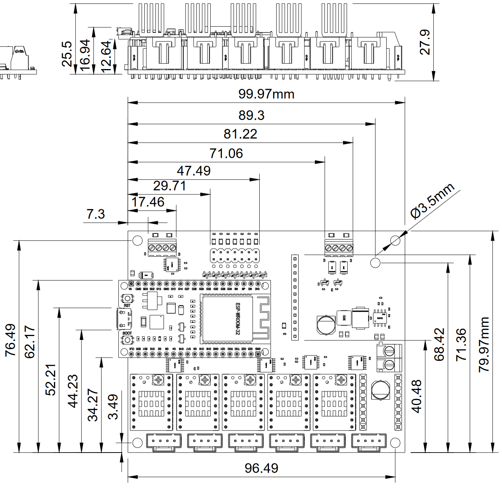
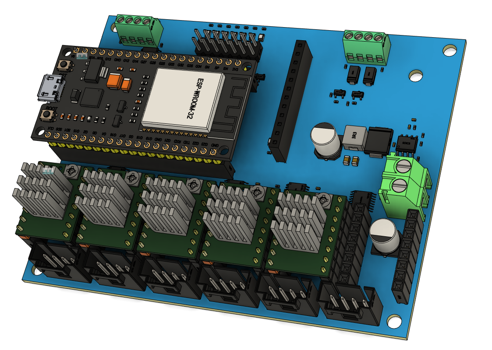
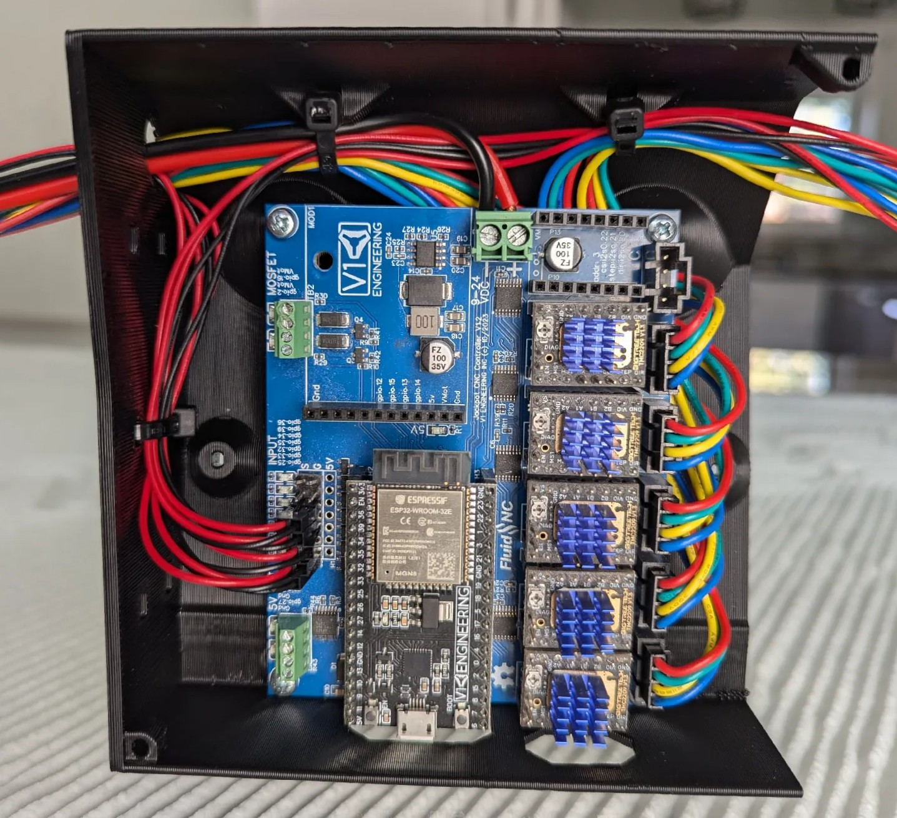
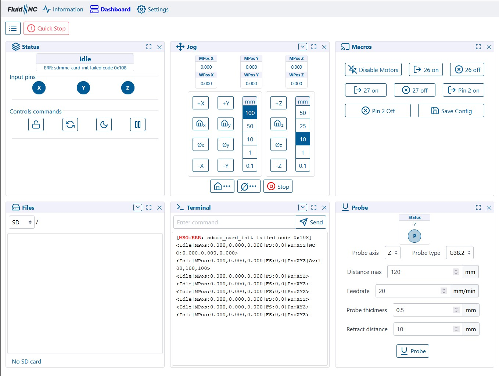
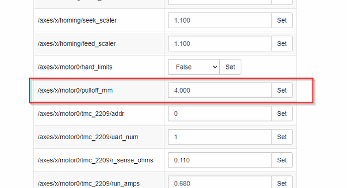

# Jackpot CNC Controller

## Jackpot Basics

The Jackpot CNC Controller is a 32bit dual-core 240mhz control board.

- WiFi, Bluetooth, or hardwired capable (esp32). 
- 6x TMC2209 driver ports
- 7 inputs, 2x 5V outputs, 2x input level (9-24V) outputs.
- one expansion module socket.
- MicroSD card slot. 

The Jackpot CNC Control board runs FluidNC which is fully GRBL compatible with extended features and easy configuration and flashing.

??? abstract "Click here for full specifications"

    + ESP32-wroom-32 Based control board
        * 32bit dual-core 240mhz board.
        * WiFi, USB Direct connection, or Bluetooth (rarely used).
        * Can have Onboard or external antenna
        * Micro USB, or USB-C
        * Socket based for easy swapping if anything were to ever go wrong, or you want to quickly change configs.
        * 38 pin - [ESP32-DevKitC CP2102 - MicroUSB](https://amzn.to/4766q7B), These seem to be the most reliable.
        * 25.4mm header width
    
    + 9-24VDC
        * Current required is a minimum of 19W (24Vx0.8A).
        * If you plan on using the high current outputs adjust accordingly.

    + 6x Stepper driver sockets
        * This controller is designed for use with TMC2209 drivers in UART control mode only
        * Typically, TMC2209 drivers are limited to 4 addresses. This controller uses a CS (chip select) pin for 3 of the drivers to allow 6 drivers to be individually controlled.
        * The sockets are labeled XYZABC, but you can use any socket for any axis or motor number. The letters are just for reference only.
        * **No Stallguard**

    + 7x Inputs
        * All switch inputs are active low, the LED goes on when ground is connected to the pin.
        * They have a 10k pullup external to the ESP32. The signal pin (S) should be connected to the ground pin (G) to activate the switch. 
        * The 5V Rail is optional and is used for external switches that require 5V. 
        * The input pins can be pins in the config file to use Normally Open or Normally Closed inputs.

    + 2x Line level outputs (same as input voltage)
        * PWM Capable
        * The MOSFETs switch to ground. You can use any voltage up to the VMot max as the positive, as long as it uses the same ground reference.
        * Can be used to drive 2.5A continuously before they overheat. You can use them intermittently up to 3.5A.
        * They can be used with inductive loads (solenoids, relays, DC fans/motors)

    + 2x 5V outputs
        * PWM Capable
        * These will source and sink about 25mA each.
        * Most commonly used for tool SSR's and Lasers.
        * See the "Spindle" section of the FluidNC wiki for common uses.

    + 1x Expansion Module socket
        * [6 PACK expansion module source](https://oshwlab.com/bdring?tab=project&page=1)
        * [Buy Them](https://www.tindie.com/stores/33366583/)
        * This should be able to use any CNC I/O module. Use an 11mm standoff or a 3D printed support in the mounting hole provided.
        * These Modules can be just about anything you need, pendant, more inputs, outputs, relays, spindle, VFD, Servo, OLED...

    + 1x MicroSD card slot
        * larger than 2gb needed
        * Fat32
        * 30 character or less file names, 100 character or less file location

    + Firmware
        * [FluidNC](https://github.com/bdring/FluidNC)
        * Text based config file for simple firmware edits.
        * No compiling to flash a board or change the configuration.
        * ~100% GRBL compatible
        * ESP3D-UI
    

    + Dimensions
        * [CAD/Step link](https://a360.co/3KchBBL)
        * 80mmx100mm Board footprint
        * [Dimensions](../img/jackpot/Jackpot_2023-07-08 Drawing.pdf)
     {: loading=lazy width="400"}
        * ISO View
     {: loading=lazy width="400"}


**Want to buy one?** Jackpot CNC Controller is available [here](https://www.v1e.com/products/jackpot-cnc-controller) in the shop.

<figure markdown="span">
{: width="800"}
</figure>


### Thanks
First and foremost, thank you, Bart Dring, for the amazing design and custom firmware required to make this happen. This is based off the [6 Pack Universal CNC Controller Development Board](https://www.tindie.com/products/33366583/6-pack-universal-cnc-controller/), changes were made to accommodate all the use cases I have seen with the V1 CNC Machines except for 3D printing. 

Also, Bart Dring and Mitch Bradley many thanks for GRBL-ESP32 and now [FluidNC](https://github.com/bdring/FluidNC).

## Initial Setup

### Wiring

Click on the images to enlarge them.

<figure markdown="span">
{: loading=lazy  width="400"}
<figcaption>MPCNC = X0, Y0, Z, X1(A), Y1(B)</figcaption>
</figure>

<figure markdown="span">
{: loading=lazy  width="400"}
<figcaption>LR = X, Y0, Z0, Y1(A), Z1(B)</figcaption>
</figure>

The probe/touchplate plugs into the last port (gpio.36), on either configuration.

If you choose to use a case fan to cool your drivers you will typically wire the fan directly into the Jackpot main power so when the board is energized so is the fan. This means you need to get a fan that uses the same voltage as your power supply. We use a 24V power supply in the kit and sell a [24V fan](https://www.v1e.com/products/5015-12v-fan-blower) in the shop.

#### Running the wires.

{: loading=lazy  width="380"}

Wires should always be ran beside or under the board. Always secure all connections to the board before they leave the board box so they do not wiggle or vibrate loose.

{: loading=lazy  width="380"}

Never cross wires over the top of the Jackpot, this blocks the antenna signal and impedes cooling of the drivers and ESP32.

### Onboard Controls
If you bought your Jackpot CNC Controller from the [V1E.com](https://www.v1e.com/) store it should be ready to go. You should be able to log in directly to the WiFi SSID "FluidNC" and the password = 12345678 

{: loading=lazy  width="380"}

(some browsers will then need to be pointed to http://192.168.0.1, best to bookmark that address). If you get a drop down message about no internet just hit "use this network anyway".

{: loading=lazy width="500"}

This Interface is from the [ESP3D WebUI project](https://github.com/luc-github/ESP3D-WEBUI). This interface allows for wireless machine jogging, custom macros, quick buttons for any of the Jackpot’s outputs, terminal control, file system control, UI and board configs, all in one place. You can update the firmware, GUI, and board settings all from the WebUI.You can wirelessly transfer your gcode files, but manually using the MicoSD card is still preferred. Most will probably never even plug the USB port in.

??? example "Control Options"
    The Jackpot Control board can use most any control software that supports GRBL such as CNC.js or Lightburn, although most people will likely use the built in WebUI's wireless connection. This can be used from most any device that has a web browser. If you are using a small touchscreen you can even zoom in so the buttons are easier to hit.

We typically use the Jackpot board in AP mode (access point), this is a direct connection between your web enabled device and the board itself. No internet conenction is used in this case, this is a direct connection to the Jackpot only. Touch screens work (with zoom), or keyboard and mouse will work just as well.

??? Info "Other Networking Options"
    You can also configure your device in STA mode, http://fluid.local, if you have a strong signal to your home WiFi network. This will get your board connected to your local network. This is advanced and not reccomended unless you are very confident in your networking setup. It is not reccomended to use STA mode until you are familiar with how the firmware and your machine work as it is very difficult to support and troubleshoot network issues. Please stick to AP mode until everything is stable with your workflow.

### Tests

#### Motion

You can now use the control in the manual tab to move the machine. The arrows allow for .1, 1, 10, 100mm movements. Start small 1 mm at a time. The arrows should move it in that direction.

* X positive (Right arrow) should move Right, X negative should move Left,
* Y positive (up arrow) is back or away from you, Y negative is towards you.
* Z positive (Z up arrow) moves the z axis up, meaning the tool away from the work surface.

If it doesn’t move as expected hit disconnect, unplug the power and USB, any axis that is moving the wrong way simply flip the plug. If one stepper is moving the wrong way power down and flip it’s plug. Power back up and test again.

#### Endstops

The onboard LED's test the wiring connections to your end stops. Our CNC standard is Normally Closed (NC) endstop wiring. This means you will have a lit LED when not triggered and not lit when triggered. The Probe is the opposite, lit when triggered.

You can also test the firmware by running "$Limits" in the terminal windows of the WebUI, this will show a real time trigger display. "!" to exit that mode.

It is important to note the endstops are only active during the homing procedure for that axis, they will not stop a machine in motion or running g-code. You can set them to do that but that is an advanced topic.

### Auto Square

Auto Square on this board is as easy as editing each endstop indivdually directly from the "Config" section of the WebUI (or directly to the yaml file).

{: loading=lazy width="400"}

From there you have a "pulloff_mm" setting for each endstop. This setting is how far the machine backs away from the endstop after it triggers it. This needs to be far enough to reset the trigger at a minimum and if your values should be within 3mm of each other. If they are not it is best to move the endstop triggers.

{: loading=lazy width="400"}

Be sure to **save** your edits at the bottom of the config screen, and then by also using the red save button (macro) on the homescreen!

### Terminal Commands
Here are some other useful terminal commands, for a full list please see the [FluidNC Wiki](http://wiki.fluidnc.com/).

`$SS` - Startup messages, if you have any info we will ask to see this output.

`$H` - Equivalent to Marlin's "Home All" or G28. $HX, $HY, $HZ for individual axes.

`$MD` - Disables the steppers, power them down.

`~` - Resume from a Pause (M0), feedhold, or safety trigger. Can be a input button, "cycle_start_pin:".

`$CD=config.yaml` - saves any config changes you make to the file. To allow it to be there after a reboot.

`$S` - This shows all the settings values.


## CAM Settings

The [estlcam](../software/estlcam-basics.md) page has more detailed instructions on what to do after your board is wired and tested.

This section is setting up estlcam for GRBL/FluidNC

...

{: loading=lazy width="400"}

Change the basic settings to GRBL.

Some screen shots needed here.

#### Gcode

Start, tool change, and ending gcode are all listed on the milling basics page, [here](../tools/milling-basics.md#gcode-start-tool-change-and-ending).

## Laser Tips

For the fastest raster etching, the most resource intensive thing we can do. Either use AP mode with a microSD card, or turn off the wifi and use only the USB with [Lightburn](https://lightburnsoftware.com/).

**$Wifi/Mode=off** - if you are using the USB connection to Lightburn to use some of the built-in tools it has use this command to turn off the radio. It will come back after a power cycle. 

If you have a laser defined in the config you are always in "laser" mode (M4). So you can either leave it defined and use M5 (turn off laser mode) in your starting gcode for non-laser CNC use, or just comment out the laser in the config. The Jackpot can have multiple config files stored on it. So the best way to do this is have config.yaml, and configlaser.yaml, if you want to use both. Then select the proper config and power cycle the board.

Raster speed depends on dot size, for a 0.19mm resolution I am getting 70-120mm/s depending on the type of raster.

### Laser Config.yaml Edits

Replace the following section in your yaml file. Change any settings you need to, this scales the output from 1-1000 and must match lightburn's settings.

```
user_outputs:
  analog0_pin: NO_PIN
  analog1_pin: NO_PIN
  analog2_pin: NO_PIN
  analog3_pin: NO_PIN
  analog0_hz: 5000
  analog1_hz: 5000
  analog2_hz: 5000
  analog3_hz: 5000
  digital0_pin: gpio.26
  digital1_pin: NO_PIN
  digital2_pin: NO_PIN
  digital3_pin: NO_PIN

Laser:
  pwm_hz: 5000
  output_pin: gpio.27
  enable_pin: NO_PIN
  disable_with_s0: false
  s0_with_disable: true
  tool_num: 0
  speed_map: 0=0.000% 1000=100.000%
  off_on_alarm: true
```
Quick note, **gpio.26** can have a quick pulse when starting. If you are using a 5V pin for your laser pin 27 is the better option for your enable pin.

## Firmware
If you bought it from the V1E.com store it should be ready to go. This section is in case you want to update or start fresh.

V1 Engineering specific files - Keep an eye on this page or you can even subscribe to updates to know anytime the configuration files have changed, [Config and macros are here](https://github.com/V1EngineeringInc/FluidNC_Configs). **The Current tested and confimed files are in the V2 folder for your machine type** You need to download these to load them after flashing.

FluidNC Firmware - **The Current tested and confimed FluidNC version is 3.9.1**, use anything newer than this with caution. 11/1/2024- Configs updated as well, good idea to update them as well. Be sure to test homing after updates as some of the numbers have changed, also take note of your pull off values to keep things level and square after an update.

### Updating / Installing Firmware

1- **Preferred method - Browser Based** 

If the ESP32 is mounted to a Jackpot, then ensure Jackpot's main 24V power supply is powered **OFF** before connecting a USB cable between the ESP32 and computer.  The ESP32 can be updated while mounted, or removed from the Jackpot board.  

If/when removing the ESP32 from Jackpot for flashing, be careful to not bend, or apply force to the ESP32's integrated antenna.

Browse to [FluidNC Web Installer](https://installer.fluidnc.com/) ( created by [Joacim](https://github.com/breiler/fluid-installer) ) using Chrome, or another [browser that supports Serial API](https://caniuse.com/web-serial).  

Within FluidNC Web Installer, select _Connect_, and follow the prompts. It is best to always start fresh by using the erase option.

Some PC's will need USB drivers if your ESP32 is not recognized by the computer. If needed the ESP32 USB drivers are here [Silabs CP2012 drivers](https://www.silabs.com/developers/usb-to-uart-bridge-vcp-drivers?tab=downloads).

After you have loaded the firmware you can use the file browser to load our configs and macros from here, [Config and macros are here](https://github.com/V1EngineeringInc/FluidNC_Configs).

??? example "More installing and update options"
    2- **OTA** - you can update the UI or the firmware in the interface itself. [FluidNC Wiki - Update](http://wiki.fluidnc.com/en/installation#upgrading-firmware)
   
    3- **Manually** -
    [Firmware files are here](https://github.com/bdring/FluidNC/releases) , [Config and macros are here](https://github.com/V1EngineeringInc/FluidNC_Configs)
   
    Detailed instructions [FluidNC WIKI Install](http://wiki.fluidnc.com/en/installation#using-pre-compiled-files)

    Some ESP32 boards require you to hold the boot button to start flashing them, then you can release it when it starts. This is the button closest to pin D0. 
   
    When you download the files you can unzip the folder and run erase.bat (unless you are purposely updating only one part), install-wifi.bat, then install-fs.bat. Run FluidTerm from that same folder and hit ctrl+u to select the config.yaml for your machine (linked above), hit enter to accept the name.    After that is done uploading, you can hit ctrl+r to reset. The Fluid term is a crazy good tool If you ever have any issues, this is how we will check it. When you are all wired and powered up, I suggest using it to reset the board and check to see everything is working.
   
    You can also load the preferences.json, and macrocfg.json files using CTRL+U. After you log in you can more quickly load the "macro**.g" files
   
    4- **Compile from source** - You can also download the source files and compile and flash it directly from something like platform.io.


### Input / Output / Module notes

- **gpio.26** can have a quick pulse when starting. If you are using a 5V pin for your laser **gpio.27** is the better option for your enable pin.

- If you use an expansion module that needs UART you will need to add;

```markdown
uart2:
  txd_pin: gpio.14
  rxd_pin: gpio.15
  rts_pin: gpio.13
  baud: 9600
  mode: 8N1
```

## FluidNC Details

The [FluidNC Wiki](http://wiki.fluidnc.com/) has all the details of this firmware, with an excellent search bar. If you still get stuck you can of course turn to the [V1E.com forum](https://forum.v1e.com/) or there are links to a FluidNC specific discord in the wiki.


## Troubleshooting
Some issues we have seen.

-No USB connection - Charge only USB cable? Make sure yours is data capable.

-Flashing issues - Remove the ESP32 from the Jackpot and try the web based installer again. Pressing the boot button is needed on some boards. If that does not work use the manual method described above.

-No memory card showing up - Try a [class 6 card](https://amzn.to/3t4lVgF), or slower formatted in fat32. New fancy high speed cards are hit or miss. [A1 rated cards](https://amzn.to/3PRpYpx) seem particularly troublesome.

-Some PC's will need USB drivers, if needed the ESP32 USB drivers are here [CP2012 drivers](https://www.silabs.com/developers/usb-to-uart-bridge-vcp-drivers?tab=downloads).

-If you use STA mode and lose your Jackpot on the network you can find it's IP on your router, use the web installer's wifi tools.

-If you made any changes to the config use the web based tool, or fluid term, to watch the boot messages. You can also view them by typing $SS. If you do not understand it cut and paste the first half into the V1 forums.

-If you switch from the V2 to V3 of the interface, all the files need to be wiped and uploaded again from the V1 github repo.


## Jackpot VS The SKR Pro

This can be a tough topic. It goes very deep but lets keep it simple, here are the basics.

#### Jackpot
* Is roughly half the cost.
* Has better performance in dots per second in laser raster etching. Everything else in terms of motion is nearly identical since we use the same drivers.
* [The expansion slot](https://www.tindie.com/stores/33366583/) allows for many extended options, or even DIY modules.
* Can have the config edited on screen or with a text editor and be live with a reboot, as well as OTA firmware updates and file transfers. No recompile and flash needed.
* Has a smaller footprint so it is less obtrusive.
* Uses any web enabled device as its wireless screen. This is how you will move the machine, start cuts, change tools, and do calibrations. 
* It can make its own network, use your home network, or Bluetooth (or wired if you really really prefer).
* Uses FluidNC a ~95% GRBL compatible firmware (or Marlin thanks Jamie!). GRBL does not have any of the 3D Printer overhead of Marlin and was designed for CNC.
* Can easily use macros for all sorts of special use cases. Want to home your machine, Probe for zero, move to Z max and then move to the far side of the table all in one click, easy.

#### SKR Pro
* Has more onboard IO, this lets you plug more things in without an expansion port, but firmware edits, a recompile, and flash will be needed to use them.
* When ordered from V1E.com comes with a wired LCD screen instead of using a web capable device.
* Uses Marlin Firmware, tried and true, but a bit more complcated to edit if needed.

The Jackpot CNC Controller was developed by Bart Dring (FluidNC) and myself, with the biggest notable change being TMC2209 drivers using less I/O in FluidNC. The new board and FluidNC firmware revision were further refined with help from a lot of great community member here in the V1E.com forums. It has everything we need in one package with a few sensible extra ports. This is how you get the best bang for the buck in a 
small footprint. If you ask me, I will honestly recommend the Jackpot, by far. The main feature people seem to buy the SKR for anymore is the wired LCD screen. The Jackpot can also have 
a stand-alone controller, there is a wired pendant, a wireless custom tablet, your cell phone, or any computer, but yes the SKR screen is just kinda easy and comfortable to those that came 
from an older Marlin 3D printer.


## Changelog
```
V1.2.1 - Change a few components for more common versions. Adjust the header holes for better alignment.
V1.2 - Pull up resistor added for more robust boot on more ESP32 boards.
V1.1 - Added OSHWA Logos
V1 - 8/10/23 - Just a graphics change from RC2.
RC2 - Power & output headers, smaller holes for cleaner assembly, logo change on the back, Stepper header labels.
RC1 - Initial release
```

## License and Source

This project is released under the [GPLv3 license](https://www.gnu.org/licenses/gpl-3.0.en.html)

[V1 Source](https://oshwlab.com/allted/4layer-desktop-rc1_copy)
