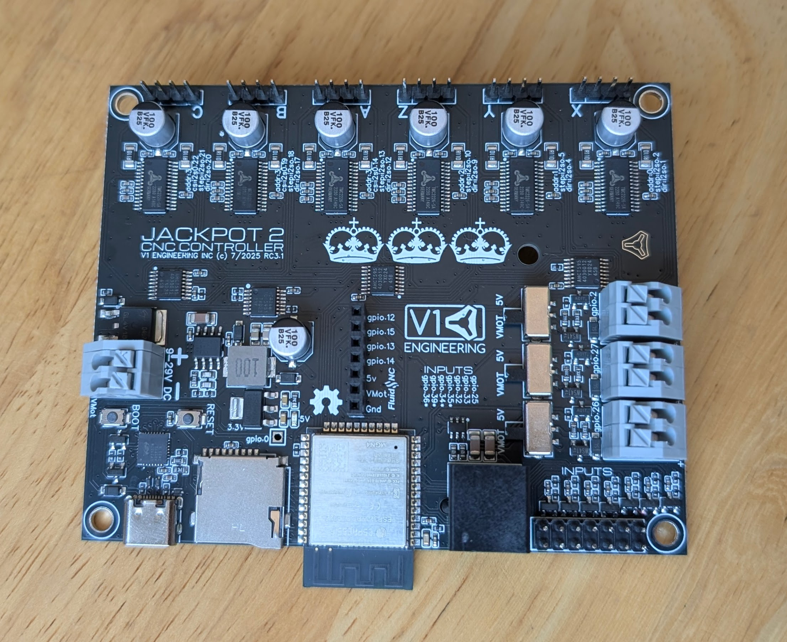
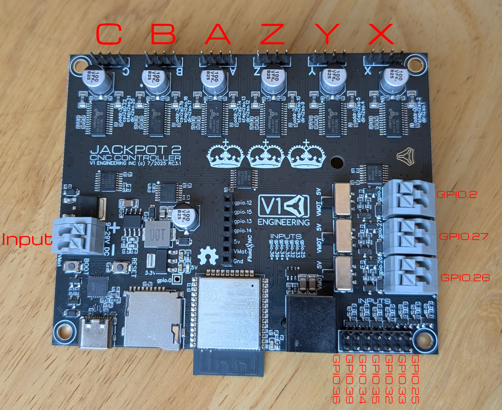
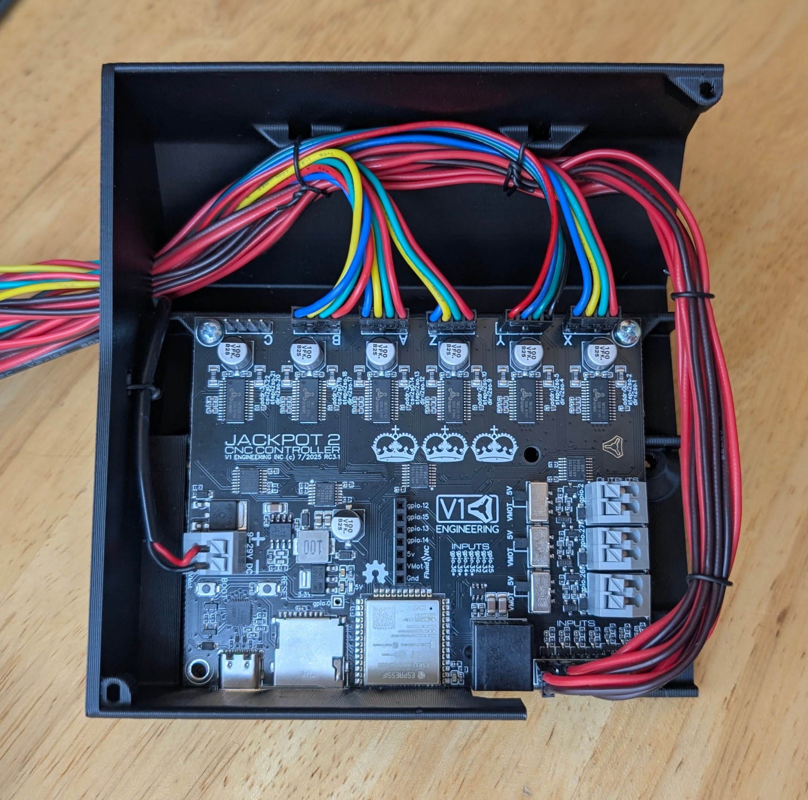

# Jackpot2 CNC Controller

## Jackpot2 Basics

The Jackpot2 CNC Controller is a 32bit dual-core 240mhz control board.

- Built in wireless control software
- WiFi, Bluetooth, or hardwired capable (esp32). 
- 6x TMC2226 drivers
- 7 inputs, 3x 5V or 24V(PS input level) outputs. *NO PWM*
- One expansion FluidNC module socket (more IO, or other specialty add on cards).
- MicroSD card slot.
- Integrated RJ11 socket.

The Jackpot2 CNC Control board runs FluidNC which is fully GRBL compatible, with extended features featuring easy configuration and updating or GRBLHal.

??? abstract "Click here for full specifications"

    + ESP32-wroom-32 Based control board
        * 32bit dual-core 240mhz board.
        * WiFi, USB Direct connection, or Bluetooth (rarely used).
        * Can have Onboard antenna
        * USB-C
    
    + 9-24VDC
        * Current required is a minimum of 19W (24Vx0.8A).
        * If you plan on using the high current outputs adjust accordingly.

    + 6x Integrated Stepper drivers
        * TMC2226 drivers in UART control mode only
        * The sockets are labeled XYZABC, but you can use any socket for any axis or motor number. The letters are just for reference only.
        * **No Stallguard**

    + 7x Inputs
        * All switch inputs are active low.
        * They have a 10k pullup external to the ESP32. The signal pin (S) should be connected to the ground pin (G) to activate the switch. 
        * The input pins can be pins in the config file to use Normally Open or Normally Closed inputs.

    + 3x 5V or Line level outputs (same as input voltage)
        * Can be used to drive 2.5A continuously before they overheat. You can use them intermittently up to 3.5A.
        * They can be used with inductive loads (solenoids, relays, DC fans/motors)
        * See the "Spindle" section of the FluidNC wiki for common uses
        * No PWM, I made a mistake on teh circuit, the Jackpot3 will be PWM capable.
        
    + 1x Expansion Module socket
        * [6 PACK expansion module source](https://oshwlab.com/bdring?tab=project&page=1)
        * [Buy Them](https://www.tindie.com/stores/33366583/)
        * This should be able to use any CNC I/O module. Use an 11mm standoff or a 3D printed support in the mounting hole provided.
        * These Modules can be just about anything you need, pendant, more inputs, outputs, relays, spindle, VFD, Servo, OLED...

    + 1x MicroSD card slot
        * larger than 2gb needed
        * Fat32
        * 30 character or less file names, 100 character or less file location

    + Firmware
        * [FluidNC](https://github.com/bdring/FluidNC)
        * Text based config file for simple firmware edits.
        * No compiling to flash a board or change the configuration.
        * ~100% GRBL compatible
        * ESP3D-UI
        * Or GRBLHal
    

    + Dimensions
        * [CAD/Step link - needed](https://)
        * 80mmx100mm Board footprint - same footprint as the Jackpot CNC Controller


**Want to buy one?** Jackpot2 CNC Controller is available [here](https://www.v1e.com/products/the-jackpot2-cnc-controller) in the shop.

<figure markdown="span">
{: width="700"}
</figure>


### Thanks
First and foremost, thank you, Bart Dring, for the amazing design and custom firmware required to make this happen. This is based off the [6 Pack Universal CNC Controller Development Board](https://www.tindie.com/products/33366583/6-pack-universal-cnc-controller/), changes were made to accommodate all the use cases I have seen with the V1 CNC Machines except for 3D printing. Also, Bart Dring and Mitch Bradley many thanks for GRBL-ESP32 and now [FluidNC](https://github.com/bdring/FluidNC).

## Initial Setup

### Wiring

Click on the image to enlarge it.

<div class="grid" markdown>

<figure markdown="span">
{: loading=lazy  width="400"}
<figcaption>LR = X, Y0, Z0, Y1(A), Z1(B) MPCNC = X0, Y0, Z, X1(A), Y1(B)</figcaption>
</figure>

</div>

The probe/touchplate plugs into the last port (gpio.36), on either configuration.

If you choose to use a case fan to cool your drivers you will typically wire the fan directly into the Jackpot2 main power so when the board is energized so is the fan. This means you need to get a fan that uses the same voltage as your power supply. We use a 24V power supply in the kit and sell a [24V fan](https://www.v1e.com/products/5015-12v-fan-blower) in the shop.

#### Running the wires.

{: loading=lazy  width="380"}

Wires should always be ran beside the board never over, proper airflow is essential to a stable experience. Always secure all connections to the board before they leave the board box so they do not wiggle or vibrate loose.

Never cross wires over the top of the Jackpot2 antenna, this blocks the antenna signal.

### Onboard Controls
If you bought your Jackpot2 CNC Controller from the [V1E.com](https://www.v1e.com/) store it should be ready to go. You should be able to log in directly to the WiFi SSID "FluidNC" and the password = 12345678 

{: loading=lazy  width="380"}

Some browsers will then need to be pointed to http://192.168.0.1, best to bookmark that address. If you get a drop down message about no internet just hit "use this network anyway".

{: loading=lazy width="500"}

This Interface is from the [ESP3D WebUI project](https://github.com/luc-github/ESP3D-WEBUI). This interface allows for wireless machine jogging, custom macros, quick buttons for any of the Jackpot2’s outputs, terminal control, file system control, UI and board configs, all in one place. You can update the firmware, GUI, and board settings all from the WebUI.You can wirelessly transfer your gcode files, but manually using the MicroSD card is still preferred. Most will probably never even plug the USB port in. This can be used from most any device that has a web browser. If you are using a small touchscreen you can even zoom in so the buttons are easier to hit.

We typically use the Jackpot2 board in AP mode (access point), this is a direct connection between your web enabled device and the board itself. No internet connection is used in this case, this is a direct connection to the Jackpot2 only. 

??? Info "Other Networking Options"
    You can also configure your device in STA mode, http://fluid.local, if you have a strong signal to your home WiFi network. This will get your board connected to your local network, meaning you will be connected to the Jackpot2 and the internet at the same time. This is advanced and not recommended unless you are very confident in your networking setup. It is not recommended to use STA mode until you are familiar with how the firmware and your machine work as it is very difficult to support and troubleshoot network issues. Please stick to AP mode until everything is stable with your workflow.

#### Other Control Options

The Jackpot2 Control board can use most any control software that supports GRBL such as CNC.js or Lightburn, although most people will likely use the built in WebUI's wireless connection. 

 * The default is to use the Jackpot2 with a direct wifi connection to a device with a web browser.
 * You can use STA mode if you have a good signal to your home wifi network
 * For either of the previous two options you can add a bluetooth joypad (or keyboard if your device does not have one) to your device if you prefer some buttons. Button mapping is built in to the WebUI.
 * You can add a hardwired always connected pendant for the basics, moving, starting a file, resuming. This would be a "FluidNC CYD pendant" or M5 Pendant
 * You can also use a USB Direct connection to a computer to use one of the many GCode senders available that supports GRBL such as CNC.js or Lightburn. Or even switch to GRBLHal to use Gsender.

### Tests

#### Motion

You can now use the control in the manual tab to move the machine. The arrows allow for .1, 1, 10, 100mm movements. Start small 1 mm at a time. The arrows should move it in that direction.

* X positive (Right arrow) should move Right, X negative should move Left,
* Y positive (up arrow) is back or away from you, Y negative is towards you.
* Z positive (Z up arrow) moves the z axis up, meaning the tool away from the work surface.

If it doesn’t move as expected hit disconnect, unplug the power and USB, any axis that is moving the wrong way simply flip the plug. If one stepper is moving the wrong way power down and flip it’s plug. Power back up and test again.

#### Endstops

The onboard LED's test the wiring connections to your end stops. Our CNC standard is Normally Closed (NC) endstop wiring. Probe is Normally Open.

You can also test the firmware by running "$Limits" in the terminal windows of the WebUI, this will show a real time trigger display. "!" to exit that mode.

!!! note

    It is important to note the endstops are only active during the homing procedure for that axis, they will not stop a machine in motion or running g-code. You can set them to do that but that is an advanced topic.

### Auto Square

Auto Square on this board is as easy as editing each endstop individually directly from the Settings/Config section of the WebUI (or directly to the yaml file).

{: loading=lazy width="400"}

From there you have a "pulloff_mm" setting for each endstop. This setting is how far the machine backs away from the endstop after it triggers it. This needs to be far enough to reset the trigger at a minimum and if your values should be within 3mm of each other. If they are not it is best to move the endstop triggers.

{: loading=lazy width="400"}

Be sure to **save** your edits at the bottom of the config screen, and then by also using the save button (macro) on the home screen!

### Terminal Commands
Here are some other useful terminal commands, for a full list please see the [FluidNC Wiki](http://wiki.fluidnc.com/).

`$SS` - Startup messages, if you have any info we will ask to see this output.

`$H` - Equivalent to Marlin's "Home All" or G28. $HX, $HY, $HZ for individual axes.

`$MD` - Disables the steppers, power them down.

`~` - Resume from a Pause (M0), feedhold, or safety trigger. Can be a input button, "cycle_start_pin:".

`$CD=config.yaml` - saves any config changes you make to the file. To allow it to be there after a reboot.

`$S` - This shows all the settings values.


## CAM Settings

The [estlcam](../software/estlcam-basics.md) page has more detailed instructions on what to do after your board is wired and tested.

This section is setting up estlcam for GRBL/FluidNC

...

{: loading=lazy width="400"}

Change the basic settings to GRBL.

Some screen shots needed here.

#### Gcode

Start, tool change, and ending gcode are all listed on the milling basics page, [here](../tools/milling-basics.md#gcode-start-tool-change-and-ending).

## Firmware
If you bought it from the V1E.com store it should be ready to go. This section is in case you want to update or start fresh. 

#### If you need to refresh or update

FluidNC Firmware - **The Current tested and confirmed FluidNC version is {==3.9.9==}, and WebUI V3**, use anything newer than this with caution. Take note of all your pull off values to keep things level and square after an update.

V1 Engineering specific files - Keep an eye on this page or you can even subscribe to updates to know anytime the configuration files have changed, [Releases page](https://github.com/V1EngineeringInc/FluidNC_Configs/releases). 

### Updating / Installing Firmware

1- **Preferred method - Browser Based** 

Ensure Jackpot2's main 24V power supply is powered **OFF** before connecting a USB cable between the ESP32 and computer.  

Browse to [FluidNC Web Installer](https://installer.fluidnc.com/) using Chrome, or another [browser that supports Serial API](https://caniuse.com/web-serial). 

If you are updating you need to take note of your pull_off values to keep your auto-squaring and/or auto-leveling.

Within FluidNC Web Installer, select _Connect_, select your com port, _Install_, select the current firmware version listed above, _esp32_, _wifi_, _fresh install_, select the WebUI version from above. You might need to hold the boot button to get to the next step.

Some PC's will need USB drivers if your ESP32 is not recognized by the computer. If needed, the ESP32 USB drivers are here [Silabs CP2012 drivers](https://www.silabs.com/developers/usb-to-uart-bridge-vcp-drivers?tab=downloads).

After you have loaded the firmware you can use the file browser to load our configs and macros from here, [Releases page](https://github.com/V1EngineeringInc/FluidNC_Configs/releases).

A great write-up with pictures can be found here: https://forum.v1e.com/t/setting-up-fluidnc/47097

??? example "More installing and update options"
    2- **OTA** - you can update the UI or the firmware in the interface itself. [FluidNC Wiki - Update](http://wiki.fluidnc.com/en/installation#upgrading-firmware)
   
    3- **Manually** -
    [Firmware files are here](https://github.com/bdring/FluidNC/releases) , [Config and macros are here](https://github.com/V1EngineeringInc/FluidNC_Configs)
   
    Detailed instructions [FluidNC WIKI Install](http://wiki.fluidnc.com/en/installation#using-pre-compiled-files)

    Some ESP32 boards require you to hold the boot button to start flashing them, then you can release it when it starts. This is the button closest to pin D0. 
   
    When you download the files you can unzip the folder and run erase.bat (unless you are purposely updating only one part), install-wifi.bat, then install-fs.bat. Run FluidTerm from that same folder and hit ctrl+u to select the config.yaml for your machine (linked above), hit enter to accept the name.    After that is done uploading, you can hit ctrl+r to reset. The Fluid term is a crazy good tool If you ever have any issues, this is how we will check it. When you are all wired and powered up, I suggest using it to reset the board and check to see everything is working.
   
    You can also load the preferences.json, and macrocfg.json files using CTRL+U. After you log in you can more quickly load the "macro**.g" files
   
    4- **Compile from source** - You can also download the source files and compile and flash it directly from something like platform.io.


### Input / Output / Module notes

- **gpio.26** can have a quick pulse when starting.

- If you use an expansion module that needs UART you will need to add;

```markdown
uart2:
  txd_pin: gpio.14
  rxd_pin: gpio.15
  rts_pin: gpio.13
  baud: 9600
  mode: 8N1
```
GPIO 25, 33, 32 are inputs but can be changed to outputs if you need to. GPIO 35, 34, 39, 36 are input only.

GPIO 12 and 15 are shared with the RJ11 socket. If you use the socket make sure to only use gpio 13 & 14 on the module port.

## FluidNC Details

The [FluidNC Wiki](http://wiki.fluidnc.com/) has all the details of this firmware, with an excellent search bar. If you still get stuck you can of course turn to the [V1E.com forum](https://forum.v1e.com/) or there are links to a FluidNC specific discord in the wiki.


## Troubleshooting
Some issues we have seen.

-No USB connection - Charge only USB cable? Make sure yours is data capable.

-Flashing issues - Pressing the boot button is needed on some boards. If that does not work use the manual method described above.

-No memory card showing up - Try a [class 6 card](https://amzn.to/3t4lVgF), or slower formatted in fat32. New fancy high speed cards are hit or miss. [A1 rated cards](https://amzn.to/3PRpYpx) seem particularly troublesome.

-Some PC's will need USB drivers, if needed the ESP32 USB drivers are here [CP2012 drivers](https://www.silabs.com/developers/usb-to-uart-bridge-vcp-drivers?tab=downloads).

-If you use STA mode and lose your Jackpot2 on the network you can find it's IP on your router, use the web installer's wifi tools.

-If you made any changes to the config use the web based tool, or fluid term, to watch the boot messages. You can also view them by typing $SS. If you do not understand it cut and paste the first half into the V1 forums.

-If you switch from the V2 to V3 of the webui interface, all the files need to be wiped and uploaded again from the V1 github repo.

-If this does not solve your issue, please make a new thread in the forums and if possible let us see the $SS output from the webui terminal.

## Changelog
```
RC3.1 - The only release because of the PWM output mistake.
```


