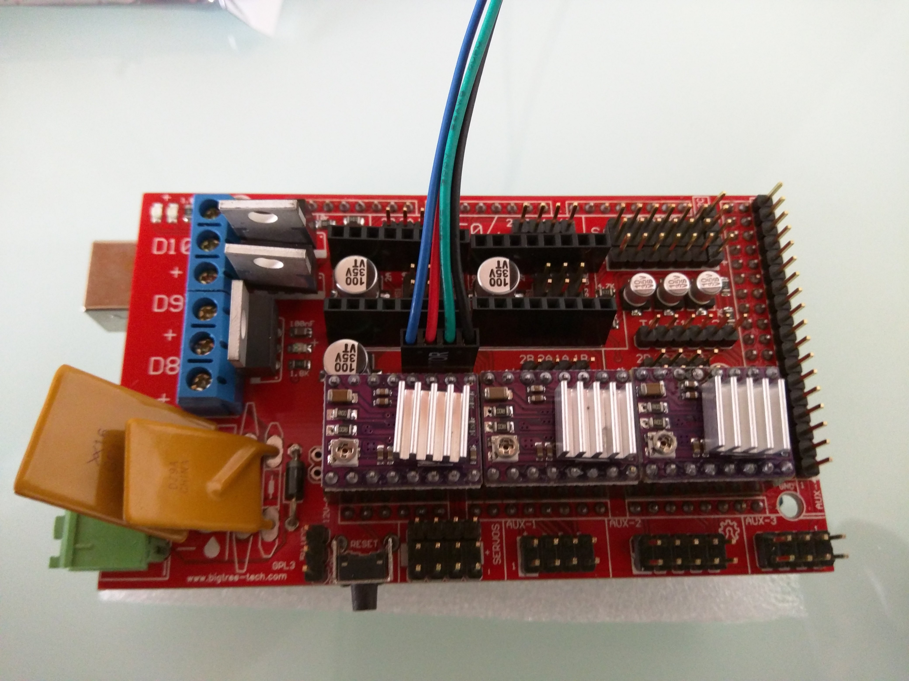
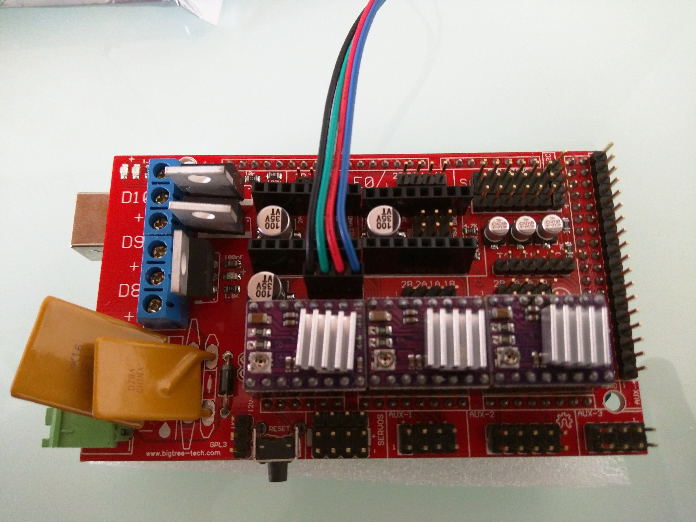
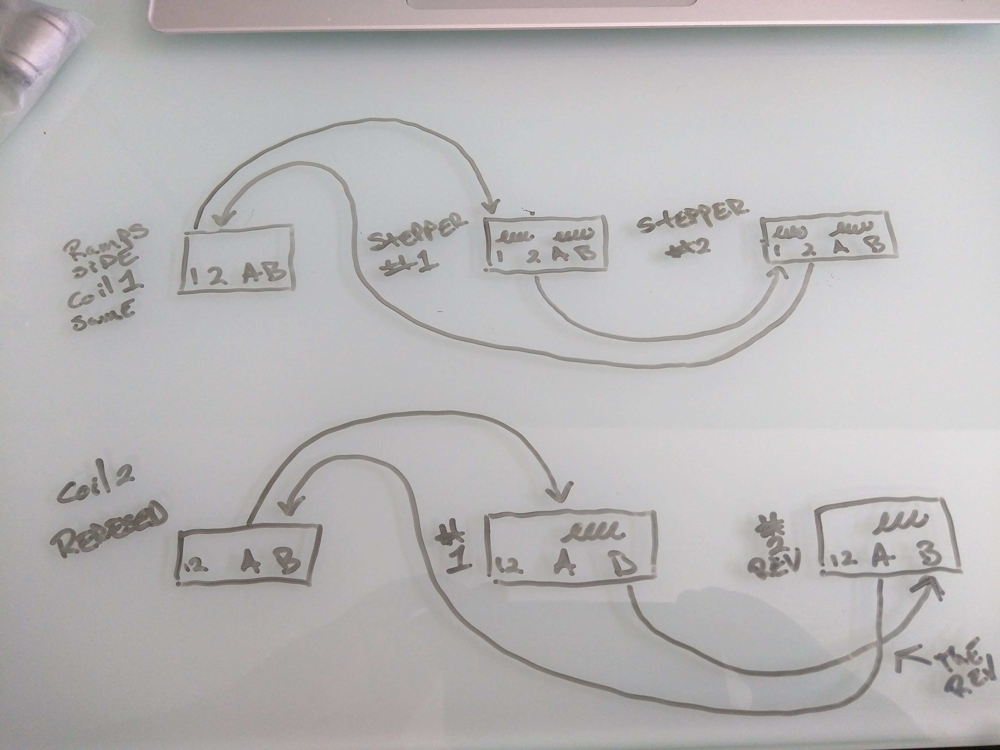

# Wiring the steppers

{: loading=lazy width="400"}

Using [this wiring kit](https://www.v1e.com/collections/parts/products/wiring-kit-1),
you really just need to plug in the motors and endstops, tape or otherwise secure the connection, and go.

{: loading=lazy width="400"}

**Make sure to always secure the connections with tape.**

More info on which ports to plug in your wires is found in the next instructions section "Some Control Board Options" here are the current [Skr Pro](../electronics/skrpro.md), [Rambo](../electronics/ultimachine.md) links.

# Reversing the Axis Direction

If one of the steppers is going the wrong way when testing, no worries, flip it’s plug over to reverse it.

If your stepper is moving the wrong way just unplug the power and USB then flip
over the stepper plug (turn around).

{: loading=lazy width="400"}

{: loading=lazy width="400"}
___

## The DIY way

If you do not want to buy the fancy custom cable, you would just cut the plugs and
splice in some 6/24 shielded cable.

___

### Archived series and Parallel wiring info 

??? Archive
    Old info, LR2 and MPCNC Burly.

    ### Series (For 4 driver boards)-

    Same amp draw as a single stepper (heat), twice the power, slightly less top speed. We do not need
    to worry about top speed, delta’s maybe cnc’s, no. There are plenty of online resources to see how
    this is done, here is a quick sketch just in case you can’t find a clear one.

    RigidWiki
    {: loading=lazy width="400"}
    {: loading=lazy width="400"}

    Hand drawn diagram

    {: loading=lazy width="400"}

    Modified parallel harness

    {: loading=lazy width="400"}
 
    ### Parallel (don’t do it this way) –

    Twice the amp draw as series (heat) less power, slightly higher top speed.

    The steppers for the X and Y axis are wired in parallel, with the far motor getting one coil wired in reverse.

    {: loading=lazy width="400"}

    In this picture the yellow and blue are a pair/coil, and the green and red are a pair/coil. So to reverse this stepper you would wire this blue to the other yellow, and this yellow to the other blue. Do not get caught up in my colors, the position on the plug tells you what 2 wires are pairs.

    {: loading=lazy width="400"}
    {: loading=lazy width="400"}

    To wire in parallel you connect all the like colors and plug it into the ramps board, then on the far stepper change on pair/coil.

