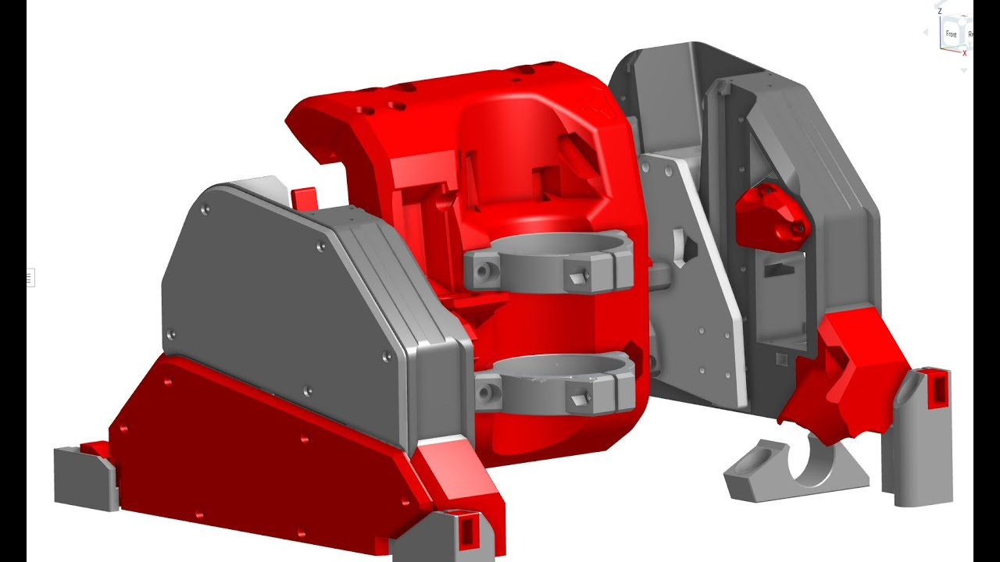

# Low Rider CNC v4

The LowRider CNC v4 is the V1 Engineering version of a CNC router that can handle up to full sheet material. If the MPCNC is not big enough for you this picks up where that left off. 

{: loading=lazy width="600"}

### Key Points

 * Foams, wood and plastic are no problem, aluminum and brass are no problem for an experinced user.

 * Most parts can be 3D printed. To save from shipping or printing large parts the machine can be partially assembled to cut them itself.

 * Easily Removable from the table for storage.

 * Inexpensive hardware store conduit is the recommended rail. Rails ranging from 29.5mm to 32mm will work.

 * Many tool options, in terms of functionality and brands. Blank DIY mount files are available.

 * Full Y axis squaring, Z axis leveling, and Z probing are standard for excellent precision and accuracy.

 * Works with any 5 driver board.

 * Can be used with most any firmware Marlin, RepRap firmware, GRBL, FluidNC, or others.

 * The Average total build cost is under $TED!!

 .jpg){: loading=lazy width="600"} 
 
### Geometry

 * A Typical full sized Build has a working volume of 2440mmx1220mmx100mm (8x4'x4"), of course the smaller you can build it the faster it will be.

 * This CNC router can handle any length (within reason), the Y direction is only bound by your table length (or your shop floor).

 * The single Y rail keeps the machine properly constrained while maintaining ease of use. Two rails are extremely difficult to align, and fully constrained rails do not allow for easy removal of the machine.

 * Width (X axis or "Beam") should always be the shorter axis.

 * The Z direction (height) is 100mm (4") of travel. A standard build would give you 50mm of Z cutting depth, or you can use a drop table to use all 100mm. 

 * This router is most rigid when working near the table surface, opposite of most conventional gantry CNC machines. So the lower the axis the more rigid the machine.

.jpg){: loading=lazy width="600"}
 
### Tool Options

This is a CNC platform so just about any tool can easily be mounted to the LowRider CNC. The most typical is a router or spindle, Diode laser, pen or even a drag knive. The [Makita 700](https://amzn.to/3NgdqGg) series is available world wide and highly reccomended. Here is a link to the current tool mount collection on [Printables](TED)

### License

This work is licensed under a [Creative Commons Attribution-NonCommercial-ShareAlike 4.0 International License](https://creativecommons.org/licenses/by-nc-sa/4.0/).

More details to my loosened restrictions can be found here on [the home page](https://www.v1e.com/pages/trademark-and-file-licenses). 

.jpg){: loading=lazy width="600"}

### Files

Printed parts files can be found at the links below:

Printables.com
:   [Printables.com Link](https://www.printables.com......TED){:target="_blank"}

Thingiverse Printed parts files:
:   [Thingiverse.com Link](https://www.thingiverse.com/......TED){:target="_blank"}

.jpg){: loading=lazy width="600"}

!!! info Previous build "LR V3"
    Version 3 instructions are [here](../lowrider/lowrider3.md)

## Parts Needed

### Printed Parts

Rather not spend the time printing all the parts, you can buy a set here, [V1 Shop](https://www.v1e.com/collections/lowrider-parts/products/....TED){:target="_blank"}.

Or print your own. No supports needed, keep the default orientation. PLA is recommended for ultimate rigidity, other 
filaments should be evaluated for rigidity (PET-GF/CF and PC-GF/CF are great alternatives). 

3 walls rectilinear or cubic infill for most parts. Thicker layers since these are large parts, no more than 80% nozzle diameter to layer thickness ratio to keep steep walls working.

!!! info 

    Printer Skew calibration is highly reccomended, [Vector3D](https://vector3d.shop/products/calilantern-calibration){:target="balnk"}, makes a wonderful tool. Skew calibration is enough size calibration should not be needed.

!!! warning
    Cura based slicers seem to work a little different. Make sure the parts are aligned on your bad as they apprear in the Printables thumbnails. Bridging also seems to be a bit of an issue for some of the internal overhangs. It is best to check the "Dust Skirt" and "YZ_Plate" internal features after slicing to be certain the bridges are bridging the short way, not the long way.
    Repetier\PrusaSlicer based slicers have been tested to work as expected.

|QTY |File Name                   |Infill |Comment                              |Link                                     | 
|----|----------------------------|-------|-------------------------------------|-----------------------------------------|
|1   |Core                        |30%    |                                     |                                         |
|1   |YZ_Plate_Min                |25%    |                                     |                                         |
|1   |YZ_Plate_Max                |25%    |                                     |                                         |
|1   |FrontWheel_Min              |20%    |                                     |                                         |
|1   |FrontWheel_Max              |20%    |                                     |                                         |
|1   |BackWheel_Min               |20%    |                                     |                                         |
|1   |BackWheel_Max               |20%    |                                     |                                         |
|1   |Y_Belt_MinF                 |30%    |                                     |[Link][Wheels]                           |
|1   |Y_Belt_MinB                 |30%    |                                     |[Link][Wheels]                           |
|1   |Y_Belt_MaxF                 |30%    |                                     |                                         |
|1   |Y_Belt_MaxB                 |30%    |                                     |                                         |
|1   |Y_Belt_Max_Lock             |30%    |                                     |                                         |
|1   |Y_Belt_Min_Tension          |30%    | |                                         |
|1   |Y_Belt_Min_Lock             |30%    |                                     |                                         |
|1   |Y_Belt_Max_Tension          |30%    |                                     |[Shop][xz1] - [DXF](#xz-plates)|
|1   |ZStop_Min                   |30%    |                                     |[Shop][xz1] - [DXF](#xz-plates)|
|1   |ZStop_Max                   |30%    |                                     |                                         |
|2   |Z_Nut                       |30%    |                                     |                                         |
|1   |Z_Stub_Min                  |30%    |                                     |                                         |
|1   |Z_Stub_Max                  |30%    |                                     |                                         |
|1   |X_Belt                      |30%    |                                     |                                         |
|4-6 |Brace_###                   |30%    | * See Brace note below              |                                         |
|1   |Brace_Max_###               |60%    | * See Brace note below              |                                         |
|4-6 |Hose_Hook_##                |30%    | Print one for each Brace            |                                         |
|7-10|Y_Clip_###                  |30%    | No more than 300mm center to center |                                         |
|    |Tool Mount Set              |       |                                     |                                         |
|1   |Makita, DeWalt, Kobalt      |30%    | Print info in the part description  |[Makita][mak] [DeWalt][dew] [Kobalt][kob]|
|1   |Board Box                   |20%    |                                     |[Jackpot][jac] [SKR Pro][skr]            |
 
[mak]: https://www.printables.com/model/TED
[dew]: https://www.v1e.com/products/TED
[kob]: https://www.v1e.com/collections/TED
[jac]: TED
[skr]: TED

 * "###" = various Sizes

 * Brace note- Print Brace_Max_### and one Brace_### at 60% infill. These will be the end braces and benefit from added rigidity.

## Flat Parts

#### Strut Plates

!!! warning 
    NEED INFO

#### XZ Plates

!!! warning 
    NEED INFO

### Specialty Parts

You can buy most of the Specialty Parts and hardware here, [V1 Shop](https://www.v1e.com/collections/lowrider-parts/products/TED){:target="_blank"}

|QTY  |Description             |Comment                                        |Link                        | 
|-----|------------------------|-----------------------------------------------|----------------------------|
|1    |Control Board           |5 driver minimum -Jackpot Suggested            |[Shop][sh1] – [Elecrow][az1]|
|5    |Steppers, Nema17        |20mm+ shaft length                             |[Shop][sh2] – [Amazon][az2]|
|3    |stepper wire extenders  |                                               |[Shop][sh3] – [Amazon][az3]|
|3    |Pulleys 16T 10mm        |10mm GT2 16 Tooth                              |[Shop][sh4] – [Amazon][az4]|
|6    |Idlers Smooth 20T       |20T Smooth 5mm Bore                            |[Shop][sh5] – [Amazon][az5]|
|8M   |Belt GT2 10mm           |See [Calculator](calculator.md), no steel belt |[Shop][sh6] – [Amazon][az6]|
|5    |Endstops                |                                               |[Shop][sh7] – [Amazon][az7]|
|14   |608-2RS Bearings        |                                               |[Shop][sh8] – [Amazon][az8]|
|2    |T8 Leadscrew & nut      |145mm or larger                                |[Shop][sh9] – [Amazon][az9]|
|2    |Coupler                 |8mm to 5mm                                     |[Shop][sh10] – [Amazon][az10]|
|4    |Linear rails MGN        |MGN12H 150mm                                   |[Shop][sh11] – [Amazon][az11]|
|1    |Power Supply            |9-24V Board dependant 36W+                     |[Shop][sh12] – [Amazon][az12]|
|*    |Thread locker           |Optional for grubs screws                      |[Shop][sh13] – [Amazon][az13]|
|*    |Lube                    |Optional for idlers and linear rails           |[Shop][sh14] – [Amazon][az14]|
|*    |Vac Hose                |Optional 2.5" (70mm) OD Vacuum hose steel rib  | – [Amazon][az15]|

[sh1]: https://www.v1e.com/products/jackpot-cnc-controller
[sh2]: https://www.v1e.com/collections/3dprinter-parts/products/nema-17-76oz-in-steppers
[sh3]: https://www.v1e.com/products/wiring-kit-1
[sh4]: https://www.v1e.com/collections/3dprinter-parts/products/pulley-16-tooth-gt2-10mm
[sh5]: https://www.v1e.com/collections/3dprinter-parts/products/20t-idler-gt2-10mm 
[sh6]: https://www.v1e.com/collections/3dprinter-parts/products/gt2-10mm-belt
[sh7]: https://www.v1e.com/collections/parts/products/limit-switch-endstop
[sh8]: https://www.v1e.com/collections/lowrider-parts/products/bearings-608-2rs 
[sh9]: https://www.v1e.com/collections/lowrider-parts/products/TED
[sh10]: https://www.v1e.com/collections/lowrider-parts/products/5mm-to-8mm-flex-coupler
[sh11]: https://www.v1e.com/products/150mm-mgn12h-linear-guides
[sh12]: https://www.v1e.com/products/24v-power-supply
[sh13]: https://www.v1e.com/collections/3dprinter-parts/products/0-5ml-threadlocker-242
[sh14]: https://www.v1e.com/collections/3dprinter-parts/products/super-lube-silicone-lubricating-grease-with-syncolon-ptfe 

[az1]: https://www.elecrow.com/jackpot-cnc-controller.html
[az2]: https://amzn.to/3FcxGlE
[az3]: https://amzn.to/3BJMgov
[az4]: https://amzn.to/3n9mUGM
[az5]: https://amzn.to/4dRxh9L 
[az6]: https://amzn.to/48cO4mt
[az7]: https://amzn.to/396oRzi
[az8]: https://amzn.to/3FDI8EI 
[az9]: https://amzn.to/4eDgHLN
[az10]: https://amzn.to/4etRhjC 
[az11]: https://amzn.to/3PyAujr
[az12]: https://amzn.to/3TXtjoM
[az13]: https://amzn.to/3GhaKmx
[az14]: https://amzn.to/31H7yS6
[az15]: https://amzn.to/47V20Ba

As an Amazon Associate, I earn from qualifying purchases.

### Hardware

This is what is needed for a 4' x 8' (1.2m x 2.4m) build. You will need more or less depending on what size you build.

|QTY  |Description             |US Equivalent                                  | 
|-----|------------------------|-----------------------------------------------|
|14   |M8 x 40mm               |5/16" x 1.5"                                   |
|14   |M8 Nylock nuts          |5/16" Nylock                                   |
|60   |M5 x 30mm               |Machine Screws                                 |
|60   |M5 Nylock               |None                                           |
|83   |M3 x 10mm               |Machine Screws                                 |
|10   |M2.5 x 12mm             |Machine Screws                                 |
|*18  |M4 x 12mm+ Wood/metal   |#8 x 1/2"+ Screws to mount things to your table|

* Not included in the hardware kit. 

### LR2 to LR3 hardware differences for updating your build
|QTY  |Description             |US Equivalent                                  | 
|-----|------------------------|-----------------------------------------------|
|39   |M3 x 10mm               |None                                           |
|2    |145mm+ Leadscrews       |                                               |
### Table

Your table needs only be as fancy as a sheet of wood on a relatively flat, smooth surface. A CNC can self correct many of its own imperfections if needed. Typically, our tables only support the CNC and some material, so nothing heavy duty is typically required.

Any existing table that is large enough is fine. You can use its surface directly, or a more popular option is to add a waste board of some sort that is replaceable as it gets used and cut into.

Next would be to build a basic table with any material that is easy to source for you. Accuracy is not super important, but the more square and flat you make it, the better.

If you have a table saw, circular saw with a guide, or a CNC machine, a Torsion Box table is pretty easy to make and can lead to a very stable surface that will last a long time. Here is a basic parametric set of plans that are easily configurable [V1 LR Table](https://forum.v1e.com/t/parametric-table/37698){:target="_blank"}.

{: loading=lazy width="600"}

[Calculator for table, rail, and belt lengths.](calculator.md){:target="_blank"}

## Assembly

### YZ Plate Assemblies

 * Mount Back Whhels
 * Mount Z End Stop
 * Mount Y Stepper
 * Mount Front Wheels
 * Mount Linear Rails and XZ Plates
 * Mount Y Belt, and End Stop
 * Mount Z Axis
 * Mount Rail Rollers
 * Snug Z Endstop
 * Snug steppers (tighten just right)

### Core Assembly
 * X Drive
### Beam Assembly
### X Belt
### Y Rail
### Wire routing
### Y Belt

---

#### Initial Squaring

To square the machine you need to mark 4 points and measure the diagonal. This is how we set the Y axis homing to square the machine relative to the rail. You will probably need to repeat this a couple times to get it under 1mm difference.

You can cable tie a pen to the vacuum mount as shown below, or here is a pen mount that fits on most router bodies. [V1 Printables](https://www.printables.com/model/237997-basic-lr3-pen-mount){:target="_blank"}

You can also automate this process with Jamie's ["Squareness Marks"](https://vector76.github.io/gcode_tpgen/){:target="_blank"} test. 
 * Start with G92 X0 Y0 Z0 - Check this box and where the pen tip is will be 0,0,0. I suggest starting the pen just above the paper.
 * Z level for pen-down - Make this number more negative if you find some of your marks are not hitting the paper, but you want as light a touch as possible.
 * Z level for pen-up - You can go as high as you need to not drag the pen tip.
 * Feedrate - This is set at a safe travel rate.
 * Extents - This is where you set the dimensions of your table. The further apart the marks the more accurate your table will be.

.jpg){: loading=lazy width="400"}

 * I use tape, so I can be sure I am using the correct mark.
 * Home the X and Y axis.
 * Use the Z axis to mark a small dot at 0,0.

.jpg){: loading=lazy width="400"}

 * Now drive the machine to your X axis furthest point (or very close to it).
 * Use the Z to mark the dot.

.jpg){: loading=lazy width="400"}

 * Drive to the Y extreme and repeat the process for the back two corners.

.jpg){: loading=lazy width="400"}

 * Now measure the diagonals to the best of your ability. Note the longer one, and subtract to find the difference. Under 1mm is very good.

If you are over 1mm in difference you can use the terminal on your SKR Pro or a USB 
connection and repetier host to add a homing offset. "M666 Y0.5" will move your Y1 
stepper 0.5mm away from the stop block after it homes. "M666 Y-0.5" will move your 
Y2 stepper away instead. You want to move the longer dimension side away from the 
block. A good first guess is the difference in your measurements (or you can use a 
trig calculator and add a bit because your end stops are further away than the 
dots). Now Use "M500" to save it to the EEPROM. Re-home X and Y and test it again.

---

#### Z Leveling

.jpg){: loading=lazy width="400"}

 * Z leveling is a bit easier than the Y axis if you have a touch plate. You can also use any sort of block or piece of paper as a feeler gauge. 
 * We are only looking for the difference here.

.jpg){: loading=lazy width="400"}

 Steps
 
 1. Home all three of your axis.

 2. Get Readings
   * Touch plate
     * If you are using the touch plate, you probe by using G38.2 Z0. When it gets there, take note of the current Z position (M114). Then move it up and over to your X axis extreme and probe again, taking note of the Z axis position. Take the difference and adjust the side that moved furthest.
     * The way I have started to do this is Home and probe twice on each side. So G28 Z0, G38.2 Z0, M114, G28 Z0, G38.2 Z0, M114, Then move over G0 X1250, G28 Z0, G38.2 Z0, M114, G28 Z0, G38.2 Z0, M114. From there subtract the average of both sides, M666 Z0.5, M500. Then test again. G28 Z0, G38.2 Z0, M114, G28 Z0, G38.2 Z0, M114, Then move over G0 X1250, G28 Z0, G38.2 Z0, M114, G28 Z0, G38.2 Z0, M114.

   * Feeler Gauge
     * You will drive your Z axis down until you just make contact with the touch plate and take note of the current Z axis position. Repeat this for the other end of the X axis. Take the difference and adjust the side that moved furthest.

.jpg){: loading=lazy width="400"}

 3. Make adjustments
   * You adjust by running "M666 Z0.5" the number is in millimeters. These numbers are counting down from 200, so 120 is further away than than 130. Start by adjusting 0.2mm more than your difference.
   * Save with M500 after each adjustment
   * Home all three axis and check your work (go back to Step #2). 

---

#### Making the Strut plates

!!! warning 
   NEED INFO
At this point you should be ready to make some cuts. To be certain it all goes as planned, you can 
make a test cut in high density foam, or simply making an air cut. To make an air cut you, just home 
your machine above the table and run the gcode. This lets you watch that it moves as you would 
expect it to and doesn't snag or have any faults in the code.

[Basic software setup](../software/estlcam-basics.md){:target="_blank"}

[Basic CAM settings](../tools/milling-basics.md){:target="_blank"}

Gcode making - TODO

The three strut plates should be 6.35mm (1/4") or thinner MDF or similarly rigid material.
You will want to cut each plate as close to the side of your build as you can to assure your build has the rigidity to do so.

.jpg){: loading=lazy width="400"}

 * Getting ready to make your first cuts all starts with loading the material.

 * Make sure the edge is behind your Endmill in the Y direction and parallel with the edge in the X direction. 
 
.jpg){: loading=lazy width="400"}

 * Checking the front and back edges relative to the table. (To the rail would be a more proper measurement)

.jpg){: loading=lazy width="400"}

 * Secure the material and make sure your means will not interfere with the core as it passes over. I use screws with large heads.

.jpg){: loading=lazy width="400"}

 * This is what a finished cut looks like. All parts are held in place with small tabs of material that can be cut with a saw or utility knife.
 * Do this two more times.

---

#### Disassembly

.jpg){: loading=lazy width="400"}
.jpg){: loading=lazy width="400"}
.jpg){: loading=lazy width="400"}
.jpg){: loading=lazy width="400"}
.jpg){: loading=lazy width="400"}
.jpg){: loading=lazy width="400"}
---

#### Final Assembly

.jpg){: loading=lazy width="400"}

* Measure the heel and toe distances across your machine, make sure they are equal. If not adjust the end clamps. Problems can arrise if your rails are too long after you install the strut plates.

.jpg){: loading=lazy width="400"}
.jpg){: loading=lazy width="400"}
---

### Vacuum
.jpg){: loading=lazy width="600"}

Size, options, routing, grounding.  *to do

[Quick release coupler](https://www.printables.com/model/168405-vacuum-hose-coupler){:target="_blank"} for 1.5" hose.

### Wiring

Next step is [wiring the steppers](../electronics/steppers.md){:target="_blank"}.

### Using the machine.

### Firmware

TED

[Firmware page.](../electronics/marlin-firmware.md){:target="_blank"}

### Build experience poll

[How did it go for you?](https://forum.v1engineering.com/t/lr3-how-many-hours-to-build-lr3/34307){:target="_blank"}

## Go get it dirty, be safe, have fun!
