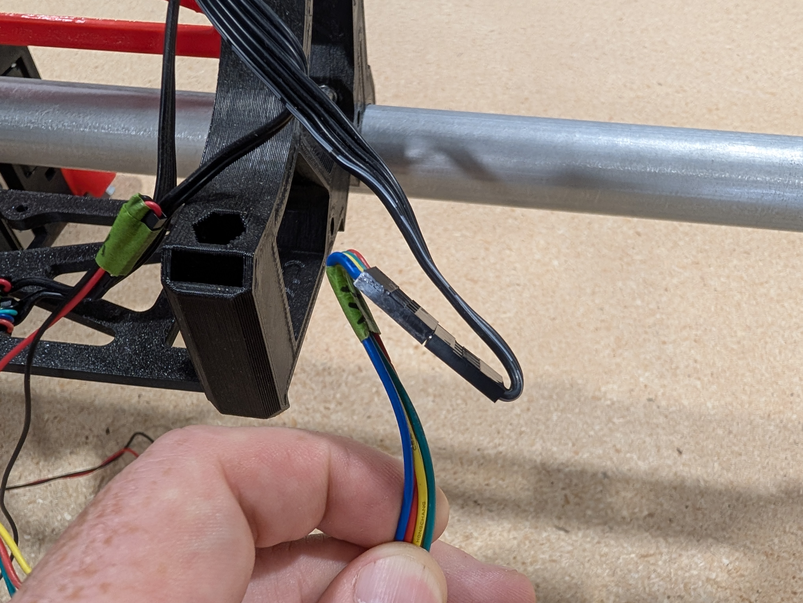
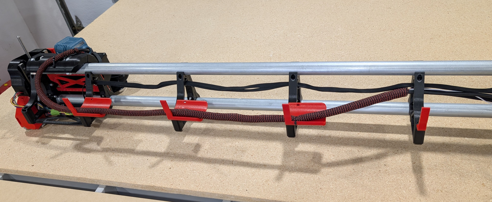

# Low Rider CNC v4

The LowRider CNC v4 is the V1 Engineering version of a CNC router that can handle up to full sheet material. If the MPCNC is not big enough for you, this picks up where that left off. 

{: width="600"}

The Beta team put in months of effort helping to refine and improve all aspects of this design. Countless prints were made only to be scrutinized, revised, and remade. Debates were had, caps lock was used, it was not easy for any of us, but it was very fun. I am sure I can speak for the whole team, we are proud of what we accomplished, and I am confident it will outperform your expectations.

### Key Points

 * Foams, wood, and plastic are no problem, aluminum and brass are no problem for an experienced user.

 * Most parts can be 3D printed. To save from shipping or printing large parts, the machine can be partially assembled to cut them itself.

 * Easily Removable from the table for storage.

 * Inexpensive hardware store conduit is the recommended rail. Rails ranging from 29.5mm to 32mm will work.

 * Many tool options, in terms of functionality and brands. Blank DIY mount files are available.

 * Full Y axis squaring, Z axis leveling, and Z probing are standard for excellent precision and accuracy.

 * Works with any 5 driver board.

 * Can be used with almost any firmware Marlin, RepRap firmware, GRBL, FluidNC, or others.

 * The average total build cost is easily under $800!!

 * Want an idea of how long things take from [actual users?](https://forum.v1e.com/t/lr4-how-many-hours-to-build-lr4/45641/1){:target="_blank"}

 {: width="600"} 
 
### Geometry

 * A Typical full sized Build has a working volume of 2440mmx1220mmx100mm (8x4'x4"), of course the smaller you can build it the faster it will be.

 * This CNC router can handle any length (within reason), the Y direction is only bound by your table length (or your shop floor).

 * The single Y rail keeps the machine properly constrained while maintaining ease of use. Two rails are extremely difficult to align, and fully constrained rails do not allow for easy removal of the machine.

 * Width (X axis or "Beam") should always be the shorter axis.

 * The Z direction (height) is 100mm (4") of travel. A standard build would give you 50mm of Z cutting depth, or you can use a drop table to use all 100mm. 

 * This router is most rigid when working near the table surface, opposite of most conventional gantry CNC machines. So the lower the axis, the more rigid the machine.

{: loading=lazy width="600"}
 
### Tool Options

This is a CNC platform, so just about any tool can easily be mounted to the LowRider CNC. The most typical is a router or spindle, Diode laser, pen or even a drag knife. The [Makita 700](https://amzn.to/3NgdqGg) series is available worldwide and highly recommended. Here is a link to the current tool mount collection on [Printables](https://www.printables.com/@V1Engineering/collections/1752399)

### License

This work is licensed under a [Creative Commons Attribution-NonCommercial-ShareAlike 4.0 International License](https://creativecommons.org/licenses/by-nc-sa/4.0/).

More details to my loosened restrictions can be found here on [the home page](https://www.v1e.com/pages/trademark-and-file-licenses). 

{: loading=lazy width="600"}

### Files

Printed parts files can be found at the links below:

Printables.com
:   [Printables.com Link](https://www.printables.com/model/1034840-lowrider-cnc-v4){:target="_blank"}

Thingiverse Printed parts files:
:   [Thingiverse.com Link----soon](https://www.thingiverse.com/......Blank){:target="_blank"}

{: loading=lazy width="600"}

!!! info Previous build "LR V3"
    Version 3 instructions are [here](../lowrider/lowrider3.md)

## Parts Needed

### Rails

You are looking for either 29.5mm, 30mm, or 32mm Outside Dimension steel tubes. In the U.S. and parts of Canada this will be 1" EMT Conduit, off the shelf hardware store conduit (not rigid conduit). In other countries if you use metal conduit it same thing but you will either be 30mm or 32mm OD.

 * You want the right OD +-0.2mm.
 * At least 1.3mm thick wall.
 * Steel, Stainless Steel, DOM Steel (aluminum and carbon fiber will not work)

 If your country does not use metal conduit things to look for are metal supply companies, closet rods, or boat suppliers tend to have stainless tubes.

 Super thick walls, solid rods, and filled tubes will gain little to no rigidity and just add mass.

### Printed Parts

Rather not spend the time printing all the parts, you can buy a set here, [V1 Shop](https://www.v1e.com/products/lowrider-v4-printed-parts-with-aluminum-xz-plates){:target="_blank"}.

Or print your own. No supports needed, keep the default orientation. PLA is recommended for ultimate rigidity, other 
filaments With great rigidity and added heat resistance are PET-GF/CF and PC-GF/CF.  You will need about 2.7kg of filament for a full set with tool mount and a board box.

3 walls rectilinear or cubic infill for most parts. Thicker layers, since these are large parts, no more than 80% nozzle diameter to layer thickness ratio to keep steep walls working.

200mmx200mmx190mm available build volume is needed to print these parts.

!!! info 

    Printer Skew calibration is suggested, we are trying to make sure parts are vertical and not tilted, this can be done easily with a carpenters square and a tall printed part. Or [Vector3D](https://vector3d.shop/products/calilantern-calibration){:target="balnk"}, makes a wonderful tool. Skew calibration is enough size calibration should not be needed.
    You can also print the two small parts, Z_Stub and Z_Nut to make sure they fit togher easily and you can get the m5 nuts insertes before printing the larger parts.

|QTY |File Name                   |Infill |Comment                              |Link                                     | 
|----|----------------------------|-----|-------------------------------------|-----------------------------------------|
|1   |Core                        |30%  |                                     |                                         |
|1   |YZ_Plate_Min                |25%  |                                     |                                         |
|1   |YZ_Plate_Max                |25%  |                                     |                                         |
|1   |FrontWheel_Min              |20%  |                                     |                                         |
|1   |FrontWheel_Max              |20%  |                                     |                                         |
|1   |BackWheel_Min               |20%  |                                     |                                         |
|1   |BackWheel_Max               |20%  |                                     |                                         |
|1   |Y_Belt_MinF                 |30%  |                                     |                                         |
|1   |Y_Belt_MinB                 |30%  |                                     |                                         |
|1   |Y_Belt_MaxF                 |30%  |                                     |                                         |
|1   |Y_Belt_MaxB                 |30%  |                                     |                                         |
|1   |Y_Belt_Max_Lock             |30%  |                                     |                                         |
|1   |Y_Belt_Min_Tension          |30%  |                                     |                                         |
|1   |Y_Belt_Min_Lock             |30%  |                                     |                                         |
|1   |Y_Belt_Max_Tension          |30%  |                                     |                                         |
|1   |ZStop_Min                   |30%  |                                     |                                         |
|1   |ZStop_Max                   |30%  |                                     |                                         |
|2   |Z_Nut                       |30%  |                                     |                                         |
|1   |Z_Stub_Min                  |30%  |                                     |                                         |
|1   |Z_Stub_Max                  |30%  |                                     |                                         |
|1   |X_Belt                      |30%  |                                     |                                         |
|4-6 |Brace_###                   |30%  | * See Brace note below              |                                         |
|1   |Brace_Max_###               |60%  | * See Brace note below              |                                         |
|4-6 |Hose_Hook_##                |30%  | Print one for each Brace            |                                         |
|7-10|Y_Clip_###                  |30%  | No more than 300mm center to center |                                         |
|4   | Temp Strut                 |15%  |                                     |                                         |
|    |Tool Mount Set              |     |                                     |                                         |
|1   |Makita, DeWalt, Kobalt      |30%  | Print info in the part description  |[Makita][mak] \| [DeWalt][dew] \| [Kobalt][kob]|
|1   |Board Box                   |20%  |                                     |[Jackpot][jac] \| [SKR Pro][skr]            |
 
[mak]: https://www.printables.com/model/1033926-makita-701-tool-mount-and-dust-shoe-for-the-lowrid
[dew]: https://www.printables.com/model/1034374-dewalt-611-tool-mount-and-dust-shoe-for-the-lowrid
[kob]: https://www.printables.com/model/1034828-kobalt-tool-mount-and-dust-shoe-for-the-lowrider-c
[jac]: https://www.printables.com/model/1037842-jackpot-cnc-control-box-for-the-lowrider-4-cnc
[skr]: https://www.printables.com/model/1051517-skr-pro-box-for-the-lowrider-4-cnc

 * "###" = various Sizes

 * Brace note- Print Brace_Max_### and one Brace_### at 60% infill. These will be the end braces and benefit from added rigidity.

 * If a part name if followed by a verion number use the highest one. V1, V2, V3... Means there was a fix or edit.

!!! warning
    Cura based slicers seem to work a little different. Make sure the parts are aligned on your bed as they appear in the Printables thumbnails. Bridging also seems to be a bit of an issue for some of the internal overhangs. It is best to check the "Dust Skirt" and "YZ_Plate" internal features after slicing to be certain the bridges are bridging the short way, not the long way.
    Repetier\PrusaSlicer based slicers have been tested to work as expected.

## Flat Parts

#### Strut Plates

You can assemble the machine using the printed temp strut plates and then use the machine to cut its own strut plates. You will need a rigid material 6.35mm (1/4") or thinner. MDF or hardboard is a great easy to find option, plastics or metals are a premium option. Jamie, Vector76, made this easy to use site so you can have any size plates you can dream of. His site has all sorts of other helpful things linked on other Docs pages.

[Vector76 Strut Generator](https://vector76.github.io/Web_OpenSCAD_Customizer/strut_plate.html){:target="_blank"}.

The strut length comes from the calculator, but it will cut slightly smaller (0.5mm) by design.The Wings are refering to the parts that make the plate nearly touch the rails to fill in the gaps.

{: loading=lazy width="600"}

#### XZ Plates

The Metal XZ plates can be purchased in the [V1E.com shop](https://www.v1e.com/products/lowrider-4-aluminium-xz-plates), or you can find the DXF to cut your own with the printed parts files linked above. Aluminum or steel 1/4" (6.35mm) thick material is suggested to work well with the hardware as is. If you want to use thicker or thinner material you will need to adjust the 16 M3x10mm screws to compensate. There is currently no printed option this time.

### Specialty Parts

You can buy most of the specialty parts and hardware here, [V1 Shop](https://www.v1e.com/products/lowrider-v4-hardware-kit){:target="_blank"}

|QTY  |Description             |Comment                                        |Link                        | 
|-----|------------------------|-----------------------------------------------|----------------------------|
|1    |Control Board           |5 driver minimum, Jackpot suggested *Info below|[Shop][sh1] – [Elecrow][az1]|
|5    |Steppers, Nema17        |20mm+ shaft length                             |[Shop][sh2] – [Amazon][az2]|
|3    |stepper wire extenders  |                                               |[Shop][sh3] – [Amazon][az3]|
|3    |Pulleys 16T 10mm        |10mm GT2 16 Tooth                              |[Shop][sh4] – [Amazon][az4]|
|6    |Idlers Smooth 20T       |20T Smooth 5mm Bore                            |[Shop][sh5] – [Amazon][az5]|
|8M   |Belt GT2 10mm           |See [Calculator](calculator.md), no steel belt |[Shop][sh6] – [Amazon][az6]|
|5    |Endstops                |                                               |[Shop][sh7] – [Amazon][az7]|
|14   |608-2RS Bearings        |                                               |[Shop][sh8] – [Amazon][az8]|
|2    |T8 Leadscrew & nut      |145mm or larger                                |[Shop][sh9] – [Amazon][az9]|
|2    |Coupler                 |8mm to 5mm                                     |[Shop][sh10] – [Amazon][az10]|
|4    |Linear rails MGN        |MGN12H 150mm                                   |[Shop][sh11] – [Amazon][az11]|
|1    |Power Supply            |9-24V Board dependent 36W+                     |[Shop][sh12] – [Amazon][az12]|
|*    |Thread locker           |Optional for grubs screws                      |[Shop][sh13] – [Amazon][az13]|
|*    |Lube                    |Optional for idlers and linear rails           |[Shop][sh14] – [Amazon][az14]|
|*    |Vac Hose                |Optional 2.5" (70mm) OD Vacuum hose steel rib  | – [Amazon][az15]|

[sh1]: https://www.v1e.com/products/jackpot-cnc-controller
[sh2]: https://www.v1e.com/collections/3dprinter-parts/products/nema-17-76oz-in-steppers
[sh3]: https://www.v1e.com/products/wiring-kit-1
[sh4]: https://www.v1e.com/collections/3dprinter-parts/products/pulley-16-tooth-gt2-10mm
[sh5]: https://www.v1e.com/collections/3dprinter-parts/products/20t-idler-gt2-10mm 
[sh6]: https://www.v1e.com/collections/3dprinter-parts/products/gt2-10mm-belt
[sh7]: https://www.v1e.com/collections/parts/products/limit-switch-endstop
[sh8]: https://www.v1e.com/collections/lowrider-parts/products/bearings-608-2rs 
[sh9]: https://www.v1e.com/collections/lowrider-parts/products/TED
[sh10]: https://www.v1e.com/collections/lowrider-parts/products/5mm-to-8mm-flex-coupler
[sh11]: https://www.v1e.com/products/150mm-mgn12h-linear-guides
[sh12]: https://www.v1e.com/products/24v-power-supply
[sh13]: https://www.v1e.com/collections/3dprinter-parts/products/0-5ml-threadlocker-242
[sh14]: https://www.v1e.com/collections/3dprinter-parts/products/super-lube-silicone-lubricating-grease-with-syncolon-ptfe 

[az1]: https://www.elecrow.com/jackpot-cnc-controller.html
[az2]: https://amzn.to/3FcxGlE
[az3]: https://amzn.to/3BJMgov
[az4]: https://amzn.to/3n9mUGM
[az5]: https://amzn.to/4dRxh9L 
[az6]: https://amzn.to/48cO4mt
[az7]: https://amzn.to/396oRzi
[az8]: https://amzn.to/3FDI8EI 
[az9]: https://amzn.to/4eDgHLN
[az10]: https://amzn.to/4etRhjC 
[az11]: https://amzn.to/3PyAujr
[az12]: https://amzn.to/3TXtjoM
[az13]: https://amzn.to/3GhaKmx
[az14]: https://amzn.to/31H7yS6
[az15]: https://amzn.to/47V20Ba

* Vac Hoses need to be grounded at one end. Using a steel ribbed hose makes this very easy to use the ground port from your power source. If you use a non-conductive vac hose you can run a bare wire through the hose secure at one end and ground at the other. If you do not ground your hose static will build up and can damage your control board or other components.

* [Jackpot Versus SKR Pro link](https://docs.v1e.com/electronics/jackpot/#jackpot-vs-the-skr-pro)

As an Amazon Associate, I earn from qualifying purchases.

### Hardware

This is what is needed for a 4' x 8' (1.2m x 2.4m) build. You will need more or less depending on what size you build.

|QTY  |Description             |US Equivalent                                  | 
|-----|------------------------|-----------------------------------------------|
|14   |M8 x 40mm               |5/16" x 1.5"                                   |
|14   |M8 Nylock nuts          |5/16" Nylock                                   |
|60   |M5 x 30mm               |Machine Screws                                 |
|60   |M5 Nylock               |None                                           |
|83   |M3 x 10mm               |Machine Screws                                 |
|10   |M2.5 x 12mm             |Machine Screws                                 |
|*18  |M4 x 12mm+ Wood/metal   |#8 x 1/2"+ Screws to mount things to your table|

*Not included in the hardware kit. 

### Update and conversion info
??? abstract "Click here for required hardware for converting older LowRiders or your MPCNC to an LR4"

    **LR3 to LR4 hardware differences for updating your build**

    Lr3 to Lr4 Upgrade kit is available here in the [V1E.com shop](https://www.v1e.com/products/lowrider-v3-to-lowrider-v4-hardware-upgrade-kit){:target="_blank"}.

    |QTY  |Description             |Notes                                 | 
    |-----|------------------------|-----------------------------------------------|
    |39   |M3 x 10mm               |                                               |
    |2    |145mm+ Leadscrews       |                                               |
    |set  |XZ Plates               |                                               |
    |~8m  |10mm belt               |Use the calc for accurate length for your build |

    ---

    **LR2 to LR4 hardware differences for updating your build**

    |QTY  |Description             |Notes                                 | 
    |-----|------------------------|-----------------------------------------------|
    |14   |5/16x1.5" (8mm bolts)   |                                               |
    |14   |5/16 (8mm) nuts         |                                               |
    |54   |M5x30mm screws          |                                               |
    |54   |M5 nut                  |                                               |
    |10   |M2.5x12mm               |                                               |
    |59   |M3 x 10mm               |                                               |
    |5    |endstops                |                                               |
    |4    |linear rails            |                                               |
    |set  |XZ Plates               |                                               |
    |~8m  |10mm belt               |Use the calc for accurate length for your build |
     
    * 5 driver board is reccomended
    * Updating to a 24v Power supply is also reccomended if you only have a 12V.
    ---
    
    **MPCNC Primo to LR4 hardware differences for converting your build**

    |QTY  |Description             |Notes                                 | 
    |-----|------------------------|-----------------------------------------------|
    |61   |M3 x 10mm               |                                               |
    |2    |M2.5 x 12mm             |                                               |
    |1    |Endstop                 |                                               |
    |1    |145mm+ Leadscrews       |You can use the one you have and add one       |
    |1    |Coupler                 |8mm to 5mm                                     |
    |4    |Linear rails MGN        |MGN12H 150mm                                   |
    |set  |XZ Plates               |                                               |
    |~8m  |10mm belt               |Use the calc for accurate length for your build |
    
    * 5 driver board is reccomended
    * Updating to a 24v Power supply is also reccomended if you only have a 12V.
    ---

### Table

Your table needs only be as fancy as a sheet of wood on a relatively flat, smooth surface. A CNC can self correct many of its own imperfections if needed. Typically, our tables only support the CNC and some material, so nothing heavy duty is required.

Any existing table that is large enough is fine. You can use its surface directly, or a more popular option is to add a waste board of some sort that is replaceable as it gets used and cut into.

Next option would be to build a basic table with any material that is easy to source for you. Accuracy is not super important, but the more square and flat you make it, the better.

If you have a table saw, circular saw with a guide, or a CNC machine, a Torsion Box table is pretty easy to make and can lead to a very stable surface that will last a long time. Here is a basic parametric set of plans that are easily configurable [V1 LR Table](https://forum.v1e.com/t/parametric-table/37698/156?u=vicious1){:target="_blank"}.

{: loading=lazy width="600"}

[Calculator for table, rail, and belt lengths.](calculator.md){:target="_blank"}

## Assembly

### YZ Plate Assemblies

Start the assembly with the YZ plate. 

{: loading=lazy width="600"}

 * This is what the finished assembly will look like.

{: loading=lazy width="600"}

 * Start by doing yourself a favor by labeling all the wires before you run them.
 * As small and as tight to the wire as you can get makes things the easiest.
 * Label the wires and not the plugs so they still fit in the control board and you can read them without unplugging.
 * Typically, as you face the machine, the left side is Y0 and Z0, and the right side is Y1 and Z1.

{: loading=lazy width="600"}

 * Use the M2.5 screws to secure the crimped or soldered endstop to the Z_Stop_Min/Max part

{: loading=lazy width="600"} 

 * Notice what way the lever faces, away from the flat side.

{: loading=lazy width="600"} 
 
 * The nut gets pressed in from the YZ plate face.
 * If your nut is not tight you can use a flat head screw driver to hold it in place while tightening in a few steps.

{: loading=lazy width="600"} 

 * Run the wire through the channel

{: loading=lazy width="600"} 

 * Lightly secure the Z stop part with an M5 Screw and nut.
 * Start with the assembly in the low position, this will get adjusted later.
 
{: loading=lazy width="600"} 

 * Run the endstop wire all the way out of the bottom of the YZ plate.

{: loading=lazy width="600"}  

 * Insert both M5 idler nuts into place

{: loading=lazy width="600"}  

 * Add the M5 Screws to hold the nuts into place until later.
 * If you have a hard time with the nuts moving a flat head screw driver can help push them into place.

{: loading=lazy width="600"} 

 * Use the alignment gauge on the top of the YZ plate to align the pulley.
 * Secure the pulley with the set/grub screw on the flat face first, then the other screw.
 * The little black fasteners are set screws or grub screws.
 * Notice the stepper is on the chamfered / endstop side.

{: loading=lazy width="600"}

 * make sure to label the wire, Y0 or Y1.
 * Feed the wire through the channel, make sure you are on the larger side of the hole.

{: loading=lazy width="600"}

 * Use two M3 screws to hold the stepper in place lightly, the other two screws come later.

{: loading=lazy width="600"}

 * Build the front wheel, both are similar. The heads face outside the machine or down.
 * Snug up the large bolts do not crush the part.

{: loading=lazy width="600"}

 * Two M3 screws will secure the front wheel and the rest of the Y stepper.

{: loading=lazy width="600"}

 * Snug up all 4 stepper screws.
 * Make sure the outer faces of the YZ plate and Wheel are flush with each other. You can lay the parts on a flat table with the wheels hanging off the edge to align them before snugging it up.

{: loading=lazy width="600"}

 * Load your Y axis belt around the pulley, tweezers or a small screwdriver can help guide it.
 * Cut it to length according to the calculator
 * You can remove the M5 screws to make this easier

{: loading=lazy width="600"}

 * Add the idlers and M5 screws back into place.
 * Seat the screws, but do not crush the plastic or the idler bearings.
 * A drop of light oil or lube from the hardware kit inside these bearings can help to extend the life of them. 

{: loading=lazy width="600"}

 * Wire labeled as Y0 or Y1
 * Run the wires through the first channel.

{: loading=lazy width="600"}

* Use the M2.5 screws to secure the endstop with the arm facing out.
* 99% of builds are going to use this endstop, homing to Ymin. The locations for the endstops located at the back are only for those who want to home to Ymax (not recommended for beginners, needs changes to the config).

!!! warning

    From this point on, be cautious not to snag the little lever on anything.
    You can hang the wheels and lever off the edge of the table if needed.

{: loading=lazy width="600"}

 * Run the small wires through the wire keeper first
 * Then run the stepper wire to hold them all in.
 * If you are having a hard time do not pry the tab, simply push the wires in with your pulley allen key or a flat head screwdriver.

{: loading=lazy width="600"}

 * All the wires should be to the back of the plate.
 * Feed them one at a time out of the slot in the slot in the back.
 * Some people are finding it easier to run the Z stepper wire first.

{: loading=lazy width="600"} 
 
 * When you get all the wires through, it is best to bundle them.

{: loading=lazy width="600"}

 * Use the guide on the top of the YZ plate to align the coupler.
 * Use the small furthest line
 * Make sure the stepper is on the endstop side of the plate.
 * Tighten the set/grub screw on the flat first, the other.

{: loading=lazy width="600"} 

 * Run the wire out the back channel.
 * Notice what side of the hole this goes in from.
 * You might need to jiggle the other wires to let it feed through.
 * Bundle for safety.
 * Some find it easier to do this wire first then the rest.

{: loading=lazy width="600"} 

 * M3 screws to secure the stepper, start all 4 first, then final snug.

{: loading=lazy width="600"}

 * Use the sharp edge of the Linear rail to chisel the rail bed smooth.
 * Any print artifacts, blobs, or rough spots, should just come right off.
 * This simple step makes both rails sit on the printed parts better preventing twists of any kind.

{: loading=lazy width="600"}

 * Notice the Y endstop hanging off the table as to not bother the small lever.
 * Loosely add all the M3 screws to the linear rails, get the heads just under the rail surface.
 * Keep an eye out for off center M3 screw heads, they can be sneaky and make this next step harder. 

{: loading=lazy width="600"}

 * Add XZ plate using M3 screws to the bearing blocks. Snug.
 * XZ max has the large hole.
 * XZ Min has the slot at the top, the one that is shown in this picture.

{: loading=lazy width="600"}

 * Snug all the rail screws 
 * Move the XZ plate the full range of motion for each screw to assure there is no binding and everything stays smooth.
 * After the rails are tight, it is a good idea to loosen up the each bearing block and snug it back up.
 * That little step always seems to gain a little more smooth action.

{: loading=lazy width="600"}

 * Add the T8 Leadscrew to the coupler. Make sure the leadscrew is fully seated and touching the stepper shaft.
 * Snug both grub screws.

{: loading=lazy width="600"}

 * Add the brass nut to the Z_Nut
 * 1-2 M3 screws is all that is needed.
 * This can be a snug fit, use pliers to press fit if needed. 
 * Thread this on to the leadscrew brass face down

{: loading=lazy width="600"}

 * The Z stubs get 2 hidden nuts and are secured to the XZ plates with M5 screws.

{: loading=lazy width="600"}

 * The hidden M5 nuts get pressed in and fully seated.

{: loading=lazy width="600"}

 * If you have trouble seating the nuts, you can;
 * Press them in with a flat head as shown here (loose print)
 * Or you can thread the M5 through the XZ plate and use it to pull them into place (tight print).

{: loading=lazy width="600"}

 * Snug in the Z stubs using the two M5 screws.
 * Leave out the cross tensioner screws for now.
 * Make sure the Z_nut is already in place.

{: loading=lazy width="600"}

 * Assemble the back wheel.
 * Bolt heads facing out or down.
 * Snug up the bolts.

{: loading=lazy width="600"}

 * Be sure to pre-thread the nut on to the screw to loosen up the lock nut before assembly. More than once can help as well.
 * Slow and easy on the next step. Make sure not to cross thread the nut is it gets moved and ends up crooked.

{: loading=lazy width="600"}

 * Again, be sure to pre-thread the nut on to the screw to loosen up the lock nut before assembly. More than once can help as well.
 * Insert the "hidden" M5 Nut. This picture shows how to make sure it is aligned if you want to add a drop of glue to hold the nut.
 * Snug up the wheel assembly with the M5, if there is any resistance make certain it is not cross threaded. 
 * Make sure the outer faces of both parts are flush.
 * Sloppy wheel alignment can lead to the whole beam not being very square to the table If your finished build is sitting crooked this is one place to check.

{: loading=lazy width="600"}

 * Make sure the outer faces of both parts are flush.
 * Sloppy wheel alignment can lead to the whole beam not being very square to the table If your finished build is sitting crooked this is one place to check.

{: loading=lazy width="600"} 

 * Take the time to set your Z endstops.
 * You want them to trigger just before the bearing blocks hit the top stop block. On both sides.
 * You can measure the trigger position from a fixed point to get them really close, this can make Z leveling a bit faster later on.
 
{: loading=lazy width="600"}

 * How did you do, wanna yell at me or did you have fun?
 * Now is a great time to take a photo and share it on some social media.
 * You are building a robot that will hold a power tool, everyone needs to hear about that.

### Core Assembly

{: loading=lazy width="600"}

 * Insert the M5 Tool Holder nuts one at a time.
 * Get some filament ready

{: loading=lazy width="600"}

 * When you insert the filament it can help to cut it at an angle.
 * The angle is different for each side.

{: loading=lazy width="600"}

 * Make sure it is fully seated all the way into the lower hole.

{: loading=lazy width="600"}

 * Clip the filament just above the core's surface, so it can not snag on anything.

{: loading=lazy width="600"}

 * Insert the bearings, one at a time with its bolt
 * Snug up all but the two bolts that cross the seam at the top.
 * The top seam controls the core to rail tension, this stays loose for now.

{: loading=lazy width="600"}

 * The 4 bottom bolts have to have the heads up like shown
 * The top bolts can face whichever way you prefer, heads showing is favorable if you are using a vac hose.

{: loading=lazy width="600"}

 * Set the X pulley depth
 * Tighten the flat grub screw first then the other.

{: loading=lazy width="600"}

 * Optional Touch plate
 * Run the wires through 
 * 140mm - 5.5" hanging out is minimum.

{: loading=lazy width="600"}

 * Optional
 * Run the touch plate wires across

{: loading=lazy width="600"}

 * Run the Endstop wire though
 * Did you label both wires?

{: loading=lazy width="600"}

 * Optional
 * Run the touch plate wires through to the front

{: loading=lazy width="600"}

 * Secure the endstop, using M2.5x12mm screws, notice the trigger direction.
 * 99% of builds are going to use this endstop, homing to Xmin. The location for the endstop located at the left side of the core (when looking at it from behind) are for homing to Xmax (not recommended for beginners, needs changes to the config).

{: loading=lazy width="600"}

 * Snug up the X Stepper

{: loading=lazy width="600"}

 * Run the X belt

{: loading=lazy width="600"}

 * Insert the X idlers

{: loading=lazy width="600"}

 * Well, does it look like this?
 * If so preceed to the next step
 * If not, take a break, take some pictures, head to the V1E.com forums. 

### Beam Assembly

{: loading=lazy width="600"}

 * Gather your Beam parts.
 * If you bought the V1 printed parts set you will notice the two end Braces have a differnt surface pattern.
 * If you printed your own, make sure to use the heavy infill on the ends.

{: loading=lazy width="600"}

 * Equally space your braces and snap in the rails.
 * Make sure the rails do not stick out bast your braces.
 * If you use the temp struts space the end 4 braces to fit.
 * If you already have your strut plate cut, now is your time to shine.
 * If you just finished cutting your own strut plate, you have already done this, you don't need my help.

{: loading=lazy width="600"}

 * Install the (temp)strut plates.
 * Do not crush the front rail clamps.
 * As you tighten the screws you will feel the clamps start to engage, that is all you need.
 * Tubes will still be able to rotate, if you try hard enough you can pull them out.
 * Trust, just a tiny bit of tension is all you need. 
 * The rails carry no sideways loads, do not overtioghten them, it only causes issues.

{: loading=lazy width="600"}

 * Notice the orientation, there is a screw head cutout.

{: loading=lazy width="600"}

 * Only one way this side fits

{: loading=lazy width="600"}

 * Install the bottom temp struts as well.
 * No specific orientation here.

{: loading=lazy width="600"}

 * Install and fully seat the X belt tensioner nut

{: loading=lazy width="600"}

 * If you need to you can use the screw to fully seat it.
 * Take the screw back out.

{: loading=lazy width="600"}

 * If you use a V1 board box you can use it to mark and then drill the holes in your strut plate
 * M3x10 to secure.
 * For the temp strut users you can set the box in place with the screws partially installed and it should not move while you cut your permanent strut plates.

{: loading=lazy width="600"}

 * Position is not critical, center is probably best though.

### Main Assembly

{: loading=lazy width="600"}

 * Screw together the YZ max assembly to the beam.
 * These 3 screws get snugged down.
 * It tends to be easier to hold them with the screwdriver and use a wrench to tighten the nuts.
 * Snug....don't crush. It is very easy to leave them a bit light and check them again later.

{: loading=lazy width="600"}

 * Looking good right, like you almost have a machine!

{: loading=lazy width="600"}

 * Slide on the core, be sure not to snag any wires.
 * Now is the best time to tension the top two core tension bolts.
 * You want these bolts seated and the core not to rattle when you wiggle it.
 * If you are too tight you will actually start to feel the core get tighter and looser as you cross over the braces.
 * The right tension is better than too tight or too loose.

{: loading=lazy width="600"}

 * Now you can add the YZ min assembly

{: loading=lazy width="600"}

 * Easy section, admire your work. Some people like to make robot sounds as they drive it around the table at this point.

{: loading=lazy width="600"}

 * Okay now is a good time to make sure your heal toe measurements are equal.
 * Simply measure across the front of your machine

{: loading=lazy width="600"}

 * Now measure across the back
 * The two numbers should be identical.
 * If they are not the machine can wander when not under power.
 * The adjustment would be to check your end braces to rail connection and to verify your lower X rail is not actually touching the XZ plate. If it is trim or file your rail a bit shorter. 

### Wire routing

{: loading=lazy width="600"}

 * It is easy to run your wires from the YZ assembly to the beam with the beam at full height.
 * Make sure the travel is free, clear, and smooth. The wires should have slack at all positions.
 * Cable ties to the braces work well.

{: loading=lazy width="600"}

 * Add the extensions from the end furthest from the control board and the Core wires.
 * Fold the wires and get ready for tape.

{: loading=lazy width="600"}

 * Taping them like this takes all the strain off the connectors

{: loading=lazy width="600"}

 * This is an easy way to deal with the extra wire.
 * Run it all the way to the board, plug it in.
 * Secure all wires at each brace.
 * All the slack at the furthest section

{: loading=lazy width="600"}

 * Fold up on itself and make a nice bundle. Most builds will have much less extra than this.

{: loading=lazy width="600"}

 * Get ready to run the Core wires.
 * Secure them to the top of the core.

{: loading=lazy width="600"}

 * Wire cover is nice but not needed.
 * Leave a small loop at the far end of travel.
 * You will be securing it the the brace just past halfway.

{: loading=lazy width="600"}

 * Move the core to the far end to make sure your wires travel easily.
 * Run it back and forth to make sure it sits well.
 * If you use a vac hose you can try this again after that is installed. 

{: loading=lazy width="600"}

 * Run the YZ Min assembly wires.
 * The slack can get bundled on the side or ran behind the board box and bundled on the other side.
 * Leave the board box as open to breathe as possible, do not bundles wires inside.

### Belts

{: loading=lazy width="600"}

 * First step to mounting the CNC to the table is setting the Y rail
 * Do your best to make a perfectly rectangular table, but once the rail is set that becomes your referenceand the table edges mean nothing.
 * The belt holders and Y_Clips all share the outer edge
 * No more than 300mm gap is reccomended.
 
{: loading=lazy width="600"}

 * Pre-drilling is highly reccomended so your parts lay flat on the table when screwed down.
 * You can draw a centerline down the table to make this easy.
 * There is +-1.5mm so it has a little wiggle room if you are not perfect.
 * Best to set both Y Max belt ends and the first and last Y clips.
 * Then measure the remaining gap and equally divide the rest of your clips.

{: loading=lazy width="600"}

 * Make sure both Y Min belt holders get a M3 screw fully inserted
 * This is for coarse Y squaring adjustment

{: loading=lazy width="600"}

 * Both ends set and predrilled.

{: loading=lazy width="600"}

 * Put the clips on your rail
 * Snug each clip to the table one at a time.
 * Use the table edge or any straight surface you might have (a level work well as a straight edge)

{: loading=lazy width="600"}

 * Loop the belt around an M3 screw

{: loading=lazy width="600"}

 * Pull the belt to set the screw and lock the belt
 * Notice the end of the belt does come through and has a couple extra teeth showing
 * This is the same for all the belts

{: loading=lazy width="600"}

 * Set the Y Min into place
 * This is a quick release for removing from the table

{: loading=lazy width="600"}

 * Prepare the Y_Max belt tensioner.

{: loading=lazy width="600"}

 * Sink the nut and insert the screw

{: loading=lazy width="600"}

 * Secure the belt with an M3 just as before
 * This ends sets the initial tension so it can take a few tries to get the distance right
 * Make sure the belt is on the pulley and in both idlers correctly.

{: loading=lazy width="600"}

 * You want the tension to hold the belt taut, but not crazy
 * You want 7lbs (3.2kg) tension, it is not as much as you think.
 * It will NOT pluck like a guitar. 
 * Always best to start loose, if all your parts come out several milimeters small, then you might be too loose
 * If you overtighten you can prevent the steppers from turning, you will certainly break parts.
 * The parts will break long before the belt does.

{: loading=lazy width="600"}

 * Setting the Y min distance can be done from the calculator, or
 * Using a piece of belt on the table to set a one belt gap width.
 * Mark and predrill all your holes.
 * I used a pencil sharpened by hand to get into the deep holes

{: loading=lazy width="600"}

 * Set the Y stop screw so the endstop triggers just before the LowRider hits the end
 * If the endstop gets past the screw there is a good chance you will pop or bend the endstop lever.
 * Take your time here. I get a trigger and about 4mm more travel.

{: loading=lazy width="600"}

 * Finish this belt just like the max side
 * M3's to secure, correct tension
 * Y axis squaring gets set later.

{: loading=lazy width="600"}

 * If you are using a vacuum hose, it is best to set it before attaching the X belt.
 * Plug in the tool end
 * Route the hose up and cable tie / secure it to the top of the core

{: loading=lazy width="600"}

 * Arrange the hose and wires starting at X max
 * Best to leave a slight curve even all the way at the end
 * If you work up against a wall make sure your hose does not touch the wall
 * Secure the hose again at just past the halfway point

{: loading=lazy width="600"}

 * Move to X min, and back and forth to get the hose to behave for the entore range of motion
 * You may need to add a bit of a twist one way or the other
 * Make sure the hose is never pulled tight

{: loading=lazy width="600"}

 * The hose should sit relaxed and always fall back in to the cradle.
 * Keep an eye on your wires as well, typically they move differnt from the hose so you can not attach them to each other.

{: loading=lazy width="600"}

 * Now the X belt
 * Wrap around an M3 screw

{: loading=lazy width="600"}

 * Push the belt and screw to the bottom with a screw driver

{: loading=lazy width="600"}

 * Load the belt into the X Belt tensioner
 * Make sure to get the distance right
 * Move the core back and forth SLOWLY to make sure the belt is on teh pulley and idlers properly

{: loading=lazy width="600"}

 * Tension to ~7lbs (3.2kg) same as before. Loose is better than breaking things. 

That is nearly it...You are ready to plug it in and take it for a test ride. No more making noises, it will do that itself!!

Setting the Z stub distance......coming soon
---

#### Initial Squaring

To square the machine, it is easiest to mark 4 points and measure the diagonal. This is how we set the Y axis homing to square the machine relative to the rail. You will probably need to repeat this a couple of times to get it under 1mm difference. This is a multiplied error, so 1mm or less is very very good.

You can cable tie a pen to the vacuum mount Or even easier is use a [V-Bit](https://www.v1e.com/products/1-8-45-degree-v-bit) in your router to pop a tiny hole into some tape.

You can also automate this process with Jamie's ["Squareness Marks"](https://vector76.github.io/gcode_tpgen/){:target="_blank"} test. 
 * Home the X and Y axis.
 * Start with G92 X0 Y0 Z0 - Check this box and where the tip is will be 0,0,0. I suggest starting the tip just above the paper.
 * Z level for tip-down - Make this number more negative if you find some of your marks are not hitting the paper, but you want as light a touch as possible.
 * Z level for tip-up - You can go as high as you need to not drag the pen tip.
 * Feedrate - This is set at a safe travel rate. The Default is safe.
 * Extents - This is where you set the dimensions of your table. The further apart the marks, the more accurate your table will be.

.jpg){: loading=lazy width="400"}

 * I use tape, so I can be sure I am using the correct mark.
 * Home the X and Y axis. This step is important.
 * Use the Z axis to mark a small dot at 0,0.

.jpg){: loading=lazy width="400"}

 * Now drive the machine to your X axis furthest point (or very close to it).
 * Use the Z to mark the dot.

.jpg){: loading=lazy width="400"}

 * Drive to the Y extreme and repeat the process for the back two corners.

.jpg){: loading=lazy width="400"}

 * Now measure the diagonals to the best of your ability. Note the longer one, and subtract to find the difference. Under 1mm is very good.

JackPot CNC Controller - In the WebUI you can add to your Y axis pull-off distance to correct any skew. Scroll all teh way down and hit save. Back on the main screen use the "Save" macro to make the changes stick after a re-boot.

SKR Pro / Marlin - If you are over 1mm in difference you can use the terminal on your SKR Pro or a USB 
connection and repetier host to add a homing offset. "M666 Y0.5" will move your Y1 
stepper 0.5mm away from the stop block after it homes. "M666 Y-0.5" will move your 
Y2 stepper away instead. You want to move the longer dimension side away from the 
block. A good first guess is the difference in your measurements (or you can use a 
trig calculator and add a bit because your end stops are further away than the 
dots). Now Use "M500" to save it to the EEPROM. Re-home X and Y and test it again.

Old Video of this on an SKR Pro
<iframe width="560" height="315" src="https://www.youtube.com/embed/w5H1AZ40YHk?si=GJcbqE_V3bhuVvV1" title="YouTube video player" frameborder="0" allow="accelerometer; autoplay; clipboard-write; encrypted-media; gyroscope; picture-in-picture; web-share" referrerpolicy="strict-origin-when-cross-origin" allowfullscreen></iframe>

---

#### Z Leveling

.jpg){: loading=lazy width="400"}

 * Z leveling is a bit easier than the Y axis if you have a touch plate. You can also use any sort of block or piece of paper as a feeler gauge. 
 * We are only looking for the difference here.

.jpg){: loading=lazy width="400"}

 Steps
 
 1. Home all three of your axis.

 2. Get Readings
    * Touch plate  
     * If you are using the touch plate, You can use the probe tab for the Jackpot CNC controller or for the SKR Pro / Marlin- you probe by using G38.2 Z0 in the terminal window.
     * When it gets there, take note of the current Z position (top of the Jackpot screen or terminal-M114). Then move it up and over to your X axis extreme and probe again, taking note of the Z axis position. Take the difference and adjust the side that moved furthest.
     * The way I have started to do this is Home and probe twice on each side. So G28 Z0, G38.2 Z0, M114, G28 Z0, G38.2 Z0, M114, Then move over G0 X1250, G28 Z0, G38.2 Z0, M114, G28 Z0, G38.2 Z0, M114. From there subtract the average of both sides, M666 Z0.5, M500. Then test again. G28 Z0, G38.2 Z0, M114, G28 Z0, G38.2 Z0, M114, Then move over G0 X1250, G28 Z0, G38.2 Z0, M114, G28 Z0, G38.2 Z0, M114.

   * Feeler Gauge
     * You will drive your Z axis down until you just make contact with the touch plate and take note of the current Z axis position. Repeat this for the other end of the X axis. Take the difference and adjust the side that moved furthest.

.jpg){: loading=lazy width="400"}

 3. Make adjustments

   * Jackpot CNC Controller / FluidNC
     * Adjust the Z pulloff in the settings tab.
     * Save at the bottom of the screen
     * Save macro on the home screen.

   * SKR Pro / Marlin
     * You adjust by running "M666 Z0.5" the number is in millimeters. These numbers are counting down from 200, so 120 is further away than 130. Start by adjusting 0.2mm more than your difference.
     * Save with M500 after each adjustment
     * Home all three axis and check your work (go back to Step #2). 

---

#### Making the Strut plates

!!! warning 
   NEED INFO

At this point you should be ready to make some cuts. To be certain it all goes as planned, you can 
make a test cut in high density foam, or simply make an air cut. To make an air cut you, just home 
your machine above the table and run the gcode. This lets you watch that it moves as you would 
expect it to and doesn't snag or have any faults in the code.

[Basic software setup](../software/estlcam-basics.md){:target="_blank"}

[Basic CAM settings](../tools/milling-basics.md){:target="_blank"}

TED-----Gcode making - TODO

The two strut plates should be 6.35mm (1/4") or thinner MDF or similarly rigid material. Plastic or metal are fine.
You will want to cut each plate as close to the side of your build as you can to assure your build has the rigidity to do so. Meaning in the center of your table is NOT the best place to make cuts before you have strut plates.

.jpg){: loading=lazy width="400"}

 * Getting ready to make your first cuts all starts with loading the material.

 * Make sure the edge is behind your Endmill in the Y direction and parallel with the edge in the X direction. 
 
.jpg){: loading=lazy width="400"}

 * Checking the front and back edges relative to the table. (To the rail would be a more proper measurement)

.jpg){: loading=lazy width="400"}

 * Secure the material and make sure your means will not interfere with the core as it passes over. I use screws with large heads.

.jpg){: loading=lazy width="400"}

 * This is what a finished cut looks like. All parts are held in place with small tabs of material that can be cut with a saw or utility knife.
 

---

#### Temp to Custom Strut Plates

{: loading=lazy width="600"}

 * Swapping to the custom strut plates is pretty easy.
 * Start by removing the X belt, and both Y belts.

{: loading=lazy width="600"}

 * Loosen and remove all the front plate X rail screws.
 * Remove all four temp strut plates.
 * Raise the gantry up so the rail will clear the YZ plate

{: loading=lazy width="600"}

 * Slide the Top X rail out one section

{: loading=lazy width="600"}

 * Remove the core.
 * Add the custom strut plates keeping the screws loose.
 * Put the Core back on
 * Slide the top rail back into place
 * Snug up all the plate screws.

{: loading=lazy width="600"}

 * Okay now is a good time to double check your heal toe measurements are equal.
 * Simply measure across the front of your machine

{: loading=lazy width="600"}

 * Now measure across the back
 * The two numbers should be identical.
 * If they are not the machine can wander when not under power.
 * The adjustment would be to check your end braces to rail connection and to verify your lower X rail is not actually touching the XZ plate. If it is trim or file your rail a bit shorter. 

It is best practice to verify your XY square and you Z beam level, they should not have changed unless something got bumped so always run a quick check. 

At this point you are done, you have a fully functional machine! How cool is that!?!

---

### Build experience 

[How did it go for you?](https://forum.v1e.com/t/lr4-how-many-hours-to-build-lr4/45641/1){:target="_blank"}

Now that you have a V1 Engineering CNC Machine how about you put a [little pin in our map](https://www.v1e.com/blogs/news/user-map)!?!

## Go get it dirty, be safe, have fun!
