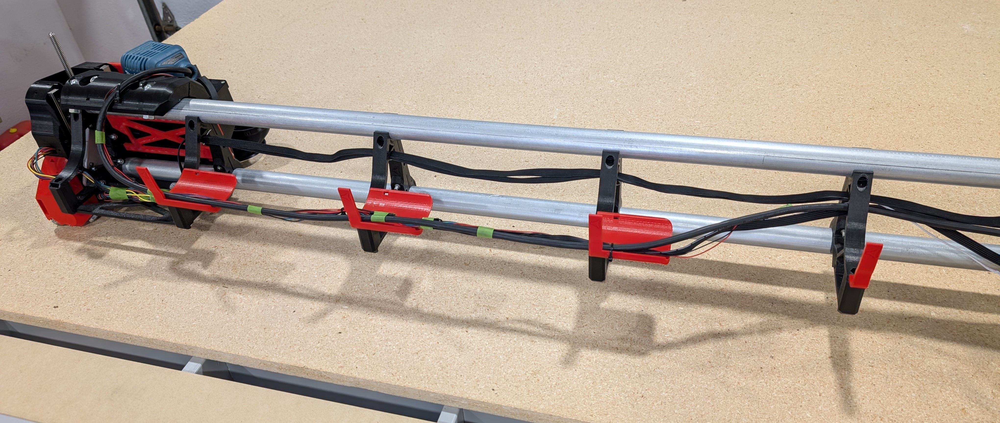
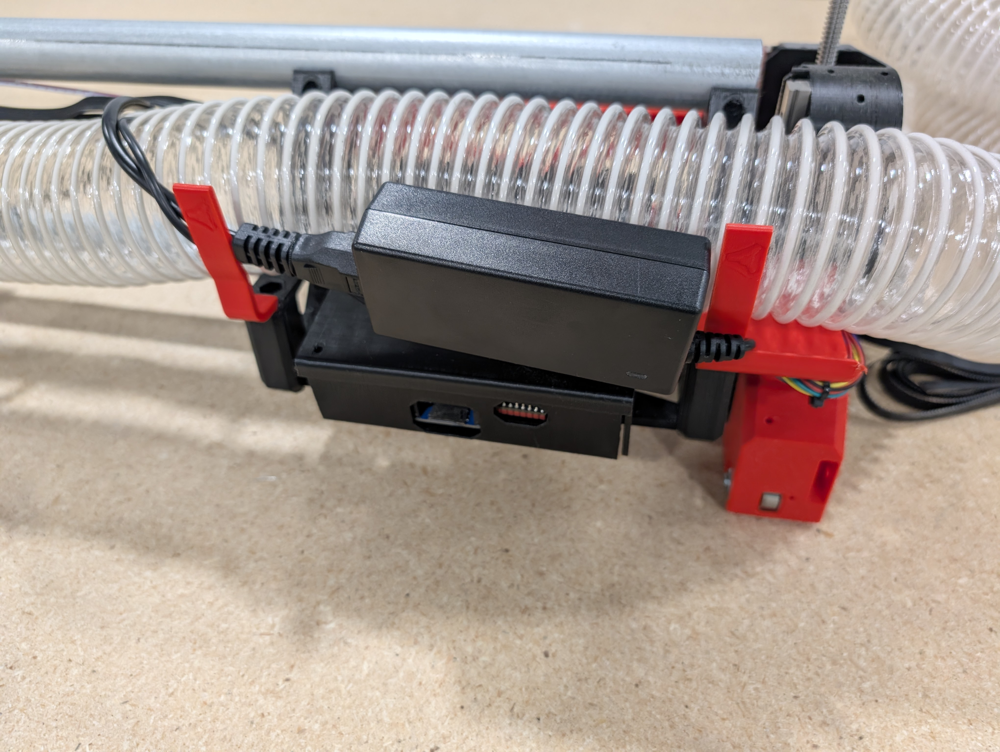
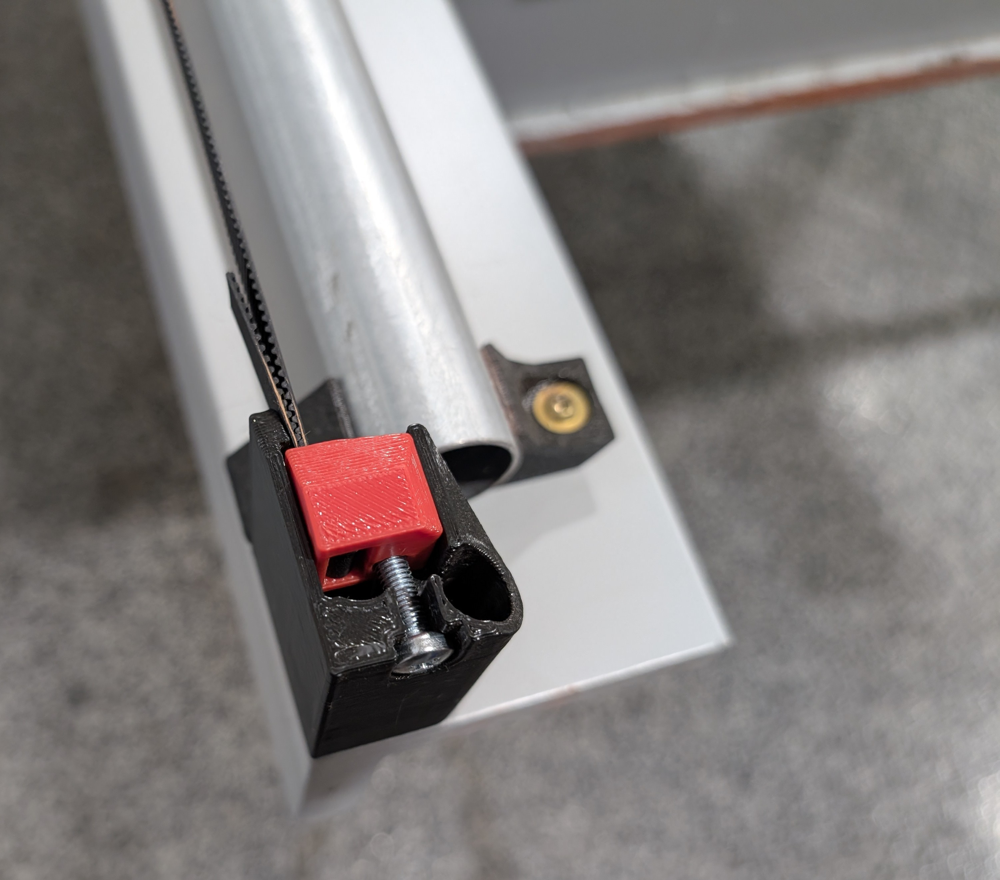

# Low Rider CNC v4

The LowRider CNC v4 is the V1 Engineering version of a CNC router that can handle up to full sheet material, or down to a small bench top material removal monster! 


The Beta team put in months of effort helping to refine and improve all aspects of this design. Countless prints were made only to be scrutinized, revised, and remade. Debates were had, caps lock was used. It was not easy for any of us, but it was very fun for all of us. I am sure I can speak for the whole team when I say: we are proud of what we accomplished, and I am confident it will outperform your expectations.

## Key Points

* The average total build cost is about $650, if you buy the full kit from the shop. The only thing not included in that price is a ~$120 router and a table to work on. If you print your own parts you can lower that price to just over $400. Most people can get cutting for under $800 USD.
* Foams, wood, and plastic are easy, aluminum and other soft metals are no problem for an experienced user. A few users have even machined steel.
* A lot of the parts are 3D printed. To save from shipping large parts, the machine can be partially assembled to cut them itself.
* Easily removable from the table for storage.
* Inexpensive hardware store conduit is the recommended rail. Rails ranging from 29.5mm (1" EMT) up to 32mm OD will work.
* Many tool options, in terms of functionality and brands. Routers, laser, plasma, pens, etc. Blank DIY mount files are available to implement your own custom functionality.

* Full Y axis squaring, Z axis leveling, and Z probing are standard for excellent precision and accuracy.

* Works with any 5 driver board, though we have a purpose built Jackpot CNC Controller with excellent performance and usability.

* Can be used with almost any firmware; Marlin, RepRap firmware, GRBL, FluidNC, GRBLHal, or others.

* Want an idea of how long things take to build from [actual users?](https://forum.v1e.com/t/lr4-how-many-hours-to-build-lr4/45641/1)


### Size and Shape

* A typical build has a working volume of full sheet, 1/2 sheet, or quarter sheet. In the US that would be 8'x4', 4'x4', 4'x2'

* A standard build would give you 50mm of Z cutting depth, or you can use a drop table to use all 100mm.

* The CNC router can technically handle even larger sizes, but the smaller the build, the faster it can cut.

* The single Y rail keeps the machine properly constrained while maintaining ease of use.

* Two rails are extremely difficult to align. We made it so you don't have to mess with that.

* Width (X axis or "Beam") should always be the shorter axis.


  * This CNC router is most rigid when working near the table surface, opposite of most conventional gantry CNC machines. So as your cut progresses (the lower you go), the machines rigidity increases.

{: loading=lazy width="600"}
 
### Tool Options

This is a CNC platform, so just about any tool can easily be mounted to the LowRider CNC. The most typical is a router or spindle, Diode laser, pen, or even a drag knife. The [Makita 700](https://amzn.to/3NgdqGg) series is available worldwide and highly recommended. Here is a link to the current tool mount collection on [Printables](https://www.printables.com/@V1Engineering/collections/1752399)

### License

This is released with a [Creative Commons Attribution-NonCommercial-ShareAlike 4.0 International License](https://creativecommons.org/licenses/by-nc-sa/4.0/).

More details to the loosened restrictions can be found here on [the home page](https://www.v1e.com/pages/trademark-and-file-licenses).

{: loading=lazy width="600"}

## Parts Needed

There have three options for getting your own CNC machine. You can self source and print your own parts, you can buy full kits or individual parts from [V1E.com](https://www.v1e.com/collections/lowrider-parts), or you can even buy a fully assembled LowRider 4 from [North Woods Custom Creations](https://northwoodscustomcreations.com/)

#### Rails

You will need to self source the rails.

You are looking for either 29.5mm, 30mm, or 32mm Outside Dimension (OD) steel tubes. In the U.S. and parts of Canada this will be 1" EMT Conduit (29.5mm), off the shelf hardware store conduit (not "rigid" conduit). In other countries you will either be 30mm or 32mm OD.

If you want to find a different material for rails, look for:

* OD +-0.2mm of 29.5mm, 30mm, or 32mm.
* At least 1.3mm thick wall.
* Steel, Stainless Steel, DOM Steel (aluminum and carbon fiber will not work).
* Super thick walls, solid rods, and filled tubes will gain little to no rigidity and just add mass and cost.

If your country does not use metal conduit, things to look for are: metal supply companies, closet rods, or boat suppliers tend to have stainless tubes.

#### Printed Parts

DIY or Buy?

#### Buy

Rather not spend the time printing all the parts? You can buy a set here, [V1 Shop](https://www.v1e.com/products/lowrider-v4-printed-parts-with-aluminum-xz-plates)

If you are in Germany or the EU, you can buy a set from [HaWiWe](https://hawiwe.de/produkt/lowrider-4-druckteile)

#### DIY

Printed parts files can be found at the links below 

[Printables.com](https://www.printables.com/model/1034840-lowrider-4-cnc){:target="_blank"}

[Thingiverse](https://www.thingiverse.com/thing:6907717){:target="_blank"}

[Maker World](https://makerworld.com/en/models/976448-lowrider-4-cnc?from=search#profileId-1438932){:target="_blank"}

* Do not use supports, keep the default orientation.
* You will need about 2.7kg of filament for a full set with tool mount and a board box.
* PLA is recommended for ultimate rigidity. Other filaments with great rigidity and added heat resistance are PET-GF/CF and PC-GF/CF.
* 3 walls rectilinear or cubic infill for most parts. Thicker layers, since these are large parts, no more than 80% nozzle diameter to layer thickness ratio to keep steep walls working. For newbies: the printer files downloaded from the links above should have these settings by default, but its best to verify.
* 200mmx200mmx190mm available build volume is needed to print these parts.

!!! info 

    Printer Skew calibration is suggested, we are trying to make sure parts are true vertical (90 degrees) and not tilted, this can be done easily with a carpenters square and a tall printed part. Or [Vector3D](https://vector3d.shop/products/calilantern-calibration){:target="blank"}, makes a wonderful tool. Skew calibration is enough size calibration should not be needed.
    You can also print the two small parts, Z_Stub and Z_Nut to make sure they fit together easily and you can get the m5 nuts inserts before printing the larger parts.


|QTY |File Name                   |Infill |Comment                              |Link                                     | 
|----|----------------------------|-----|-------------------------------------|-----------------------------------------|
|1   |Core                        |30%  |                                     |                                         |
|1   |YZ_Plate_Min                |25%  |                                     |                                         |
|1   |YZ_Plate_Max                |25%  |                                     |                                         |
|1   |FrontWheel_Min              |20%  |                                     |                                         |
|1   |FrontWheel_Max              |20%  |                                     |                                         |
|1   |BackWheel_Min               |20%  |                                     |                                         |
|1   |BackWheel_Max               |20%  |                                     |                                         |
|1   |Y_Belt_MinF                 |30%  |                                     |                                         |
|1   |Y_Belt_MinB                 |30%  |                                     |                                         |
|1   |Y_Belt_MaxF                 |30%  |                                     |                                         |
|1   |Y_Belt_MaxB                 |30%  |                                     |                                         |
|1   |Y_Belt_Max_Lock             |30%  |                                     |                                         |
|1   |Y_Belt_Min_Tension          |30%  |                                     |                                         |
|1   |Y_Belt_Min_Lock             |30%  |                                     |                                         |
|1   |Y_Belt_Max_Tension          |30%  |                                     |                                         |
|1   |ZStop_Min                   |30%  |                                     |                                         |
|1   |ZStop_Max                   |30%  |                                     |                                         |
|2   |Z_Nut                       |30%  |                                     |                                         |
|1   |Z_Stub_Min                  |30%  |                                     |                                         |
|1   |Z_Stub_Max                  |30%  |                                     |                                         |
|1   |X_Belt                      |30%  |                                     |                                         |
|4-6 |Brace_###                   |30%  | * See Brace note below              |                                         |
|1   |Brace_Max_###               |60%  | * See Brace note below              |                                         |
|1-2 |Hose_Hook_##                |30%  | 1 or 2 depending on your build      |                                         |
|1-2 |Hose_Holder_Hook            |30%  | 1 or 2 depending on your build      |                                         |
|2   |Hose_Holder_Shorty          |30%  |                                     |                                         |
|7-10|Y_Clip_###                  |30%  | No more than 300mm center to center |                                         |
|4   | Temp Strut                 |15%  |                                     |                                         |
|    |Tool Mount Set              |     |                                     |                                         |
|1   |Makita, DeWalt, Kobalt      |30%  | Print info in the part description  |[Makita][mak] \| [DeWalt][dew] \| [Kobalt][kob]|
|1   |Board Box                   |20%  |                                     |[Jackpot][jac] \| [SKR Pro][skr]            |
 
[mak]: https://www.printables.com/model/1033926-makita-701-tool-mount-and-dust-shoe-for-the-lowrid
[dew]: https://www.printables.com/model/1034374-dewalt-611-tool-mount-and-dust-shoe-for-the-lowrid
[kob]: https://www.printables.com/model/1034828-kobalt-tool-mount-and-dust-shoe-for-the-lowrider-c
[jac]: https://www.printables.com/model/1037842-jackpot-cnc-control-box-for-the-lowrider-4-cnc
[skr]: https://www.printables.com/model/1051517-skr-pro-box-for-the-lowrider-4-cnc

 * Wire sleeve is nice but not needed [Shop](https://www.v1e.com/products/wire-sleeve?_pos=1&_sid=1a54ba9cd&_ss=r), [Amazon](https://amzn.to/3EDzb1H).

 * "###" = various Sizes

 * Brace note- Print Brace_Max_### and one Brace_### at 60% infill. These will be the end braces and benefit from added rigidity.

 * If a part name if followed by a version number use the highest one. V1, V2, V3... Means there was a fix or edit, a bigger number means newer part.

!!! Warning
     Repetier, Slic3r, Prusa Slicer, Orca, Bambu, all seem to slice normally. Cura based slicers seem to work a little different. Make sure the parts are aligned on your bed as they appear in the Printables thumbnails. Bridging also seems to be a bit of an issue for some of the internal overhangs. It is best to check the "Dust Skirt" and "YZ_Plate" internal features after slicing to be certain the bridges are bridging the short way, not the long way. Repetier\PrusaSlicer based slicers have been tested to work as expected.

{: loading=lazy width="600"}

### Flat Parts

### Strut Plates

Strut plates give the X axis beam it's rigidity. You are meant to assemble the machine using the printed temporary strut plates, and then use the machine to cut its own permanent strut plates.

* You will need a rigid material 6.35mm (1/4") or thinner for your plates.
* Common options include: MDF, hardboard, plastic, metal is a premium option and is not necessary.

[Vector76 Strut Generator](https://vector76.github.io/Web_OpenSCAD_Customizer/strut_plate.html) Jamie made this easy to use site so you can have any size plates you can dream of. The strut length comes from the [calculator](calculator.md), but it will cut slightly smaller (0.5mm) by design.

* `strut_length` = value from the [calculator](calculator.md)
* `num_braces` = leave at default
* `size of dogbone...` = leave at 3.5 for a 1/8" (3mm) endmill
* Check both `front_plate` and `bottom_plate`
* `front_wing_size` = 11.5 for 29.5 mm (1" EMT conduit), or your conduit size if different.
* Click `Render (Ctrl+Enter)` to create your strut plates
* Click the link to download `strut_plate.svg`. More on what to do with this later!
* His site has all sorts of other helpful things linked on other Docs pages.


{: loading=lazy width="600"}

Extra Info:  

The Wings are referring to the parts that make the plate nearly touch the rails to fill in the gaps. 

A full sheet build normally has 7 braces.

---

### XZ Plates

XZ Plates connect your X axis beam to your YZ plates.

The easiest option for most people, are the metal XZ plates from the [V1E.com shop](https://www.v1e.com/products/lowrider-4-aluminium-xz-plates).

Other options: 

You can cut your own metal plates with the DXF files found with the printed parts files linked above. Aluminum or steel 1/4" (6.35mm) thick material is suggested to work well with the hardware as is. If you want to use thicker or thinner material you will need to adjust the 16 M3x10mm screw length to compensate.

There is a file for [printable XZ plates](https://www.printables.com/model/1047962-printable-xz-plates-for-lowrider-4-consider-alu-in) by member Aza, the idea being that you would only use them temporarily to cut metal plates. This is only recommended if you have experience with Aluminum cutting on a V1 CNC.

### Specialty Parts

You can buy most of the specialty parts and hardware here, [V1 Shop](https://www.v1e.com/products/lowrider-v4-hardware-kit){:target="_blank"}

|QTY  |Description             |Comment                                        |Link                        | 
|-----|------------------------|-----------------------------------------------|----------------------------|
|1    |Control Board           |5 driver minimum, Jackpot variant suggested    |[Shop][sh1] – [Elecrow][az1]|
|5    |Steppers, Nema17        |20mm+ shaft length                             |[Shop][sh2] – [Amazon][az2]|
|3    |stepper wire extenders  |                                               |[Shop][sh3] – [Amazon][az3]|
|3    |Pulleys 16T 10mm        |10mm GT2 16 Tooth                              |[Shop][sh4] – [Amazon][az4]|
|6    |Idlers Smooth 20T       |20T Smooth 5mm Bore                            |[Shop][sh5] – [Amazon][az5]|
|8M   |Belt GT2 10mm           |See [Calculator](calculator.md), no steel belt |[Shop][sh6] – [Amazon][az6]|
|5    |Endstops                |                                               |[Shop][sh7] – [Amazon][az7]|
|14   |608-2RS Bearings        |                                               |[Shop][sh8] – [Amazon][az8]|
|2    |T8 Leadscrew & nut      |145mm or larger, 4 start 2mm pitch, 8mm/Rev    |[Shop][sh9] – [Amazon][az9]|
|2    |Coupler                 |8mm to 5mm                                     |[Shop][sh10] – [Amazon][az10]|
|4    |Linear rails MGN        |MGN12H 150mm                                   |[Shop][sh11] – [Amazon][az11]|
|1    |Power Supply            |9-24V Board dependent 36W+                     |[Shop][sh12] – [Amazon][az12]|
|*    |Thread locker           |Optional for grubs screws                      |[Shop][sh13] – [Amazon][az13]|
|*    |Lube                    |Optional for idlers and linear rails           |[Shop][sh14] – [Amazon][az14]|
|*    |Vac Hose                |Optional 2.5" (70mm) OD Vacuum hose steel rib  | – [Amazon][az15]|

[sh1]: https://www.v1e.com/products/jackpot3-cnc-controller
[sh2]: https://www.v1e.com/collections/3dprinter-parts/products/nema-17-76oz-in-steppers
[sh3]: https://www.v1e.com/products/wiring-kit-1
[sh4]: https://www.v1e.com/collections/3dprinter-parts/products/pulley-16-tooth-gt2-10mm
[sh5]: https://www.v1e.com/collections/3dprinter-parts/products/20t-idler-gt2-10mm 
[sh6]: https://www.v1e.com/collections/3dprinter-parts/products/gt2-10mm-belt
[sh7]: https://www.v1e.com/collections/parts/products/limit-switch-endstop
[sh8]: https://www.v1e.com/collections/lowrider-parts/products/bearings-608-2rs 
[sh9]: https://www.v1e.com/products/lowrider-v4-cnc-t8-leadscrews
[sh10]: https://www.v1e.com/collections/lowrider-parts/products/5mm-to-8mm-flex-coupler
[sh11]: https://www.v1e.com/products/150mm-mgn12h-linear-guides
[sh12]: https://www.v1e.com/products/24v-power-supply
[sh13]: https://www.v1e.com/collections/3dprinter-parts/products/0-5ml-threadlocker-242
[sh14]: https://www.v1e.com/collections/3dprinter-parts/products/super-lube-silicone-lubricating-grease-with-syncolon-ptfe 

[az1]: https://www.elecrow.com/jackpot-cnc-controller.html
[az2]: https://amzn.to/3FcxGlE
[az3]: https://amzn.to/3BJMgov
[az4]: https://amzn.to/3n9mUGM
[az5]: https://amzn.to/4dRxh9L 
[az6]: https://amzn.to/48cO4mt
[az7]: https://amzn.to/396oRzi
[az8]: https://amzn.to/3FDI8EI 
[az9]: https://amzn.to/4eDgHLN
[az10]: https://amzn.to/4etRhjC 
[az11]: https://amzn.to/3PyAujr
[az12]: https://amzn.to/3TXtjoM
[az13]: https://amzn.to/3GhaKmx
[az14]: https://amzn.to/31H7yS6
[az15]: https://amzn.to/47V20Ba

As an Amazon Associate, I earn from qualifying purchases.

* Vac Hoses need to be grounded at one end. Using a steel ribbed hose makes this very easy to use the ground port from your power source. If you use a non-conductive vac hose you can run a bare wire through the hose secure at one end and ground at the other. If you do not ground your hose static will build up and can damage your control board or other components.


### Hardware

This is what is needed for a 4' x 8' (1.2m x 2.4m) build. You will need more or less depending on what size you build.
M8 or 5/16 should be hex head bolts.


| QTY | Description                             | US Equivalent                                   |
| ----- | ----------------------------------------- | ------------------------------------------------- |
| 14  | M8 x 40mm Hex Head                      | 5/16" x 1.5"       Hex Head                     |
| 14  | M8 Nylock nuts                          | 5/16" Nylock                                    |
| 60  | M5 x 30mm Machine Screws, Button Head   | Must be metric                                  |
| 60  | M5 Nylock                               | Must be metric                                  |
| 83  | M3 x 10mm Machine Screws, Button Head   | Must be metric                                  |
| 10  | M2.5 x 12mm Machine Screws, Button Head | Must be metric                                  |
| *18 | M4 x 12mm+ Wood/metal                   | #8 x 1/2"+ Screws to mount things to your table |

_* Not included in the hardware kit. You might also want different lengths to accommodate different material thickness._ 

#### Table 

Your table needs only be as fancy as a sheet of wood on a relatively flat, smooth surface. A CNC machine can self correct many of its own imperfections if needed. Typically, our tables only support the CNC and some material, so nothing heavy duty is required. Stability is the main goal of your table.

Any existing table that is large enough is fine. You can use its surface directly, or a more popular option is to add a waste board of some sort on top that is replaceable as it gets used and cut into.

Next option would be to build a basic table with any material that is easy to source for you. Accuracy is not super important, but the more square and flat you make it, the better. A simple 2x4 table with an MDF/plywood/OSB table top is most common.

If you have a table saw, circular saw with a guide, or a CNC machine, a Torsion Box table is pretty easy to make and can lead to a very stable surface that will last a long time.

* ~$200-$400 basic table plans, from the V1E.com forums [LR4 tables](hhttps://forum.v1e.com/tag/parametric-table).

[Calculator for table, rail, and belt lengths](calculator.md)


#### Update and conversion info
??? abstract "Click here for required hardware for converting older LowRiders or your MPCNC to an LR4"

    **LR3 to LR4 hardware differences for updating your build**

    Lr3 to Lr4 Upgrade kit is available here in the [V1E.com shop](https://www.v1e.com/products/lowrider-v3-to-lowrider-v4-hardware-upgrade-kit){:target="_blank"}.

    |QTY  |Description             |Notes                                 | 
    |-----|------------------------|-----------------------------------------------|
    |39   |M3 x 10mm               |                                               |
    |2    |145mm+ Leadscrews       |                                               |
    |set  |XZ Plates               |                                               |
    |~8m  |10mm belt               |Use the calc for accurate length for your build |

    ---

    **LR2 to LR4 hardware differences for updating your build**

    |QTY  |Description             |Notes                                 | 
    |-----|------------------------|-----------------------------------------------|
    |14   |5/16x1.5" (8mm bolts)   |                                               |
    |14   |5/16 (8mm) nuts         |                                               |
    |54   |M5x30mm screws          |                                               |
    |54   |M5 nut                  |                                               |
    |10   |M2.5x12mm               |                                               |
    |59   |M3 x 10mm               |                                               |
    |5    |endstops                |                                               |
    |4    |linear rails            |                                               |
    |set  |XZ Plates               |                                               |
    |~8m  |10mm belt               |Use the calc for accurate length for your build |
     
    * 5 driver control board is recommended
    * Updating to a 24v Power supply is also recommended if you only have a 12V.
    ---
    
    **MPCNC Primo to LR4 hardware differences for converting your build**

    |QTY  |Description             |Notes                                 | 
    |-----|------------------------|-----------------------------------------------|
    |61   |M3 x 10mm               |                                               |
    |2    |M2.5 x 12mm             |                                               |
    |1    |Endstop                 |                                               |
    |1    |145mm+ Lead screws      |You can use the one you have and add one       |
    |1    |Coupler                 |8mm to 5mm                                     |
    |4    |Linear rails MGN        |MGN12H 150mm                                   |
    |set  |XZ Plates               |                                               |
    |~8m  |10mm belt               |Use the calc for accurate length for your build |
    
    * 5 driver control board is recommended
    * Updating to a 24v Power supply is also recommended if you only have a 12V.
    ---

## Assembling the Lowrider 4 CNC machine:

Ready to start your build? Relax, have fun, if you have issues just stop and ask in the forums. Taking a step back and asking a couple questions can save a ton of headaches. Hand tools only, power tools just get you into trouble here.

{: loading=lazy width="600"}

Step one will be building the Core.

### Core Assembly

<iframe width="560" height="315" src="https://www.youtube.com/embed/KLDDJx-OUmQ?si=oM2-10K-UGxsQ31P" title="YouTube video player" frameborder="0" allow="accelerometer; autoplay; clipboard-write; encrypted-media; gyroscope; picture-in-picture; web-share" referrerpolicy="strict-origin-when-cross-origin" allowfullscreen></iframe>

Here is a users build video showing this process.

{: loading=lazy width="600"}

* Bearings should drop into the pockets
* Bolts get inserted in the direction shown
* Snug these two up just enough to seat the bolt heads, no need to crush anything, these are just bearing axles.

---

{: loading=lazy width="600"}

* Same thing again
* Bearings should drop into the pockets
* Bolts get inserted in the direction shown
* Snug these two up just enough to seat the bolt heads, no need to crush anything, these are just bearing axles.

---

{: loading=lazy width="600"}

* Third time
* Bearings should drop into the pockets
* Bolts get inserted in the direction shown
* Snug these two up just enough to seat the bolt heads, no need to crush anything, these are just bearing axles.

---

{: loading=lazy width="600"}

* Okay this time it's different
* Insert the bolts in the direction shown.
* This time do not snug these down!!
* These two bolts control the tension of the Core on the X rails.
* Leave these loose we will slowly tighten these when the machine is fully assembled.

---

{: loading=lazy width="600"}

* This step is using a piece of filament to lock in the tool holder nuts

---

{: loading=lazy width="600"}

* Insert the M5 nuts with the nylock side facing the back, (the side shown in this picture).
* For each side I prefer to cut the filament with a little angle to make it easier to feed into the lower hole.
* Slide the filament in making sure it seats all the way to the bottom of the second hole.
* Snip the top off flush with the core surface to avoid snags.

---

{: loading=lazy width="600"}

* On this side the angle it the other way

---

{: loading=lazy width="600"}

* Repeat for all 4 screws
* Make sure they are all snipped flush.

---

{: loading=lazy width="600"}

* Now is a good time to add your tool mount.
* This lets you make sure your nuts get seated well and nothing pushes out or gets cross threaded

---

{: loading=lazy width="600"}

* Snug these up real good, but don't break anything.
* Not sure if it matters for tool tramming but I always get all 4 screws close then fully tighten the left screws first on both top and bottom mounts
* If you do need to tram your tool later usually a couple layers of tape as a shim under these mounts will do the trick

---

{: loading=lazy width="600"}

* Optional Touch plate
* This can be added later or just ran behind the router, it does not have to use this hole.

---

{: loading=lazy width="600"}

* Leave at least 140mm (5.5") of free touch plate wire
* Run the rest through the hole.

---

{: loading=lazy width="600"}

* Run that wire through the tunnel in the core

---

{: loading=lazy width="600"}

* From here you will want to run the X end stop wire as well.
* Some find it easier to run the thicker touchplate wire through first, some say the thinner wire first is easier.
* Take your time give it a little jiggle, they should slide right through
* Worst case you need to guide the black plug through the opening at the front side of the core.
* After you get the wires through to the front, you should label them.

---

{: loading=lazy width="600"}

* For these small end stop wires I like to actually fold the wire back and crimp them on this way.
* This is not "proper" form but for such small gauge wire it works very well.
* Testing these crimps for continuity is a good idea.

---

{: loading=lazy width="600"}

* Plug in the X endstop
* This uses the M2.5mm screws.

---

{: loading=lazy width="600"}

* Lever opens to the bottom
* Seat these tiny screws all the way but be very careful not to strip them out.

---

{: loading=lazy width="600"}

* Using the belt guide on the back of the core set the pulley on the X stepper shaft.
* Always tighten the set / grub screw on the shaft flat first, then the second screw.

---

{: loading=lazy width="600"}

* M3 screws will be used to attach the stepper
* If you insert the X belt now it saves a bit of work later
* Run all the wires together up from behind the stepper
* The wires should not be constricted

---

{: loading=lazy width="600"}

* Secure the wires up at the top of the core
* The next step is using the idlers and M5 hardware

---

{: loading=lazy width="600"}

* Insert the M5 nuts
* I can usually press them in with a flat headed screwdriver or needle nosed pliers.

---

{: loading=lazy width="600"}

* Add the idlers, and screws
* Using the holes in the top of the core drive the screws
* These just need to hit the Nylock, they do not need to be snug
* The idlers should be extremely free to rotate

---

{: loading=lazy width="600"}

* That's it, the core is ready for final assembly!
* Easy right?!

---

### YZ Plate Assemblies

Wonderful video showing the process here.

<iframe width="500" height="315" src="https://www.youtube.com/embed/p4FYVLI73Ss?si=-nDs4DK_aEjRvKrh" title="YouTube video player" frameborder="0" allow="accelerometer; autoplay; clipboard-write; encrypted-media; gyroscope; picture-in-picture; web-share" referrerpolicy="strict-origin-when-cross-origin" allowfullscreen></iframe>

Start the YZ plates.

{: loading=lazy width="600"}

* This is what the finished assembly will look like.

---

{: loading=lazy width="600"}

* Start by doing yourself a favor by labeling all the wires before you run them.
* As small and as tight to the wire as you can get makes things the easiest.
* Label the wires and not the plugs so they still fit in the control board and you can read them without unplugging.
* Typically, as you face the machine, the left side is Y0 and Z0, and the right side is Y1 and Z1.

---

{: loading=lazy width="600"}

* Use the M2.5 screws to secure the crimped or soldered endstop to the Z_Stop_Min/Max part

---

{: loading=lazy width="600"}

* Notice what way the lever faces, away from the flat side.

---

{: loading=lazy width="600"}

* The nut gets pressed in from the YZ plate face.
* If your nut is not tight you can use a flat head screw driver to hold it in place while tightening in a few steps.

---

{: loading=lazy width="600"}

* Run the wire through the channel

---

{: loading=lazy width="600"}

* Lightly secure the Z stop part with an M5 Screw and nut.
* Start with the assembly in the low position, this will get adjusted later.

---

{: loading=lazy width="600"}

* Run the endstop wire all the way out of the bottom of the YZ plate.

---

{: loading=lazy width="600"}

* Insert both M5 idler nuts into place

---

{: loading=lazy width="600"}

* Add the M5 Screws to hold the nuts into place until later.
* If you have a hard time with the nuts moving a flat head screw driver can help push them into place.

---

{: loading=lazy width="600"}

* Use the alignment gauge on the top of the YZ plate to align the pulley.
* Secure the pulley with the set/grub screw on the flat face first, then the other screw.
* The little black fasteners are set screws or grub screws.
* Notice the stepper is on the chamfered / endstop side.

---

{: loading=lazy width="600"}

* Make sure to label the wire, Y0 or Y1.
* Feed the wire through the channel, make sure you are on the larger side of the hole.
* You are mounting the stepper with the wires nearest the channel / hole.

---

{: loading=lazy width="600"}

* Use two M3 screws to hold the stepper in place lightly, the other two screws come later.

---

{: loading=lazy width="600"}

* Build the front wheel, both are similar. The heads face outside the machine or down.
* Snug up the large bolts do not crush the part.

---

{: loading=lazy width="600"}

* Two M3 screws will secure the front wheel and the rest of the Y stepper.

---

{: loading=lazy width="600"}

* Snug up all 4 stepper screws.
* Make sure the outer faces of the YZ plate and Wheel are flush with each other. You can lay the parts on a flat table with the wheels hanging off the edge to align them before snugging it up.

---

{: loading=lazy width="600"}

* Load your Y axis belt around the pulley, tweezers or a small screwdriver can help guide it.
* Cut it to length according to the [calculator](calculator.md){:target="_blank"}
* You can remove the M5 screws to make this easier

---

{: loading=lazy width="600"}

* Add the idlers and M5 screws back into place.
* Seat the screws, but do not crush the plastic or the idler bearings.
* A drop of light oil or lube from the hardware kit inside these bearings can help to extend the life of them.

---

{: loading=lazy width="600"}

* Wire labeled as Y0 or Y1
* Run the wires through the first channel.

---

{: loading=lazy width="600"}

* Use the M2.5 screws to secure the endstop with the arm facing out.
* 99% of builds are going to use this endstop, homing to Ymin. The locations for the endstops located at the back are only for those who want to home to Ymax (not recommended for beginners, needs changes to the config).

!!! warning

    From this point on, be cautious not to snag the little lever on anything.
    You can hang the wheels and lever off the edge of the table if needed.


---

{: loading=lazy width="600"}

* Run one wire at a time through the keeper, this makes it very easy.
* Run the small wires through the wire keeper first
* Then run the stepper wires to hold them all in.
* If you are having a hard time do not pry the tab, simply push the wires in with your pulley allen key or a flat head screwdriver.
* If you have any sort of wire covering on your stepper wires you will need to remove them. (some international direct kits)

---

{: loading=lazy width="600"}

* All the wires should be to the back of the plate.
* Feed them one at a time out of the slot in the slot in the back.
* Some people are finding it easier to run the Z stepper wire first.

---

{: loading=lazy width="600"}

* When you get all the wires through, it is best to bundle them.

---

{: loading=lazy width="600"}

* Use the guide on the top of the YZ plate to align the coupler.
* Use the small furthest line
* Make sure the stepper is on the endstop side of the plate.
* Tighten the set/grub screw on the flat first, the other.

---

{: loading=lazy width="600"}

* Run the wire out the back channel.
* Notice what side of the hole this goes in from.
* You might need to jiggle the other wires to let it feed through.
* Bundle for safety.
* Some find it easier to do this wire first then the rest.

---

{: loading=lazy width="600"}

* M3 screws to secure the stepper, start all 4 first, then final snug.

---

{: loading=lazy width="600"}

* Use the sharp edge of the Linear rail to chisel the rail bed smooth.
* Any print artifacts, blobs, or rough spots, should just come right off.
* This simple step makes both rails sit on the printed parts better preventing twists of any kind.

---

{: loading=lazy width="600"}

* Notice the Y endstop hanging off the table as to not bother the small lever.
* Loosely add all the M3 screws to the linear rails, get the heads just under the rail surface.
* Keep an eye out for off center M3 screw heads, they can be sneaky and make this next step harder.

---

{: loading=lazy width="600"}

* Add XZ plate using M3 screws to the bearing blocks. Snug.
* XZ max has the large hole.
* XZ Min has the slot at the top, the one that is shown in this picture.

---

{: loading=lazy width="600"}

* Snug all the rail screws
* Move the XZ plate the full range of motion for each screw to assure there is no binding and everything stays smooth.
* After the rails are tight, it is a good idea to loosen up the each bearing block and snug it back up.
* That little step always seems to gain a little more smooth action.

---

{: loading=lazy width="600"}

* Add the T8 Leadscrew to the coupler. Make sure the leadscrew is fully seated and touching the stepper shaft.
* Snug both grub screws.
* It is suggested to lubricate the leadscrew with a light lubricant at this time.  [Shop](https://www.v1e.com/products/super-lube-silicone-lubricating-grease-with-syncolon-ptfe)

---

{: loading=lazy width="600"}

* Add the brass nut to the Z_Nut
* 1-2 M3 screws is all that is needed.
* This can be a snug fit, use pliers to press fit if needed.
* Thread this on to the leadscrew brass face down

---

{: loading=lazy width="600"}

* The Z stubs get 2 hidden nuts and are secured to the XZ plates with M5 screws.

---

{: loading=lazy width="600"}

* The hidden M5 nuts get pressed in and fully seated.

---

{: loading=lazy width="600"}

* If you have trouble seating the nuts, you can;
* Press them in with a flat head as shown here (loose print)
* Or you can thread the M5 through the XZ plate and use it to pull them into place (tight print).

---

{: loading=lazy width="600"}

* Snug in the Z stubs using the two M5 screws.
* For some this is tricky, Z Binding, the Z stubs should be perpendicular to the lead screw. If you have a tilt/twist, the Z screw can have some binding.
* After you snug the Z stubs make sure the nut moves easy as you twist it up and down with your fingers with a little pressure on the metal plate.
* Leave out the cross tensioner screws, most people will not use these.
* Make sure the Z_nut is already in place.

---

{: loading=lazy width="600"}

* Assemble the back wheel.
* Bolt heads facing out or down.
* Snug up the bolts.

---

{: loading=lazy width="600"}

* Be sure to pre-thread the nut on to the screw to loosen up the lock nut before assembly. More than once can help as well.
* Slow and easy on the next step. Make sure not to cross thread the nut is it gets moved and ends up crooked.

---

{: loading=lazy width="600"}

* Again, be sure to pre-thread the nut on to the screw to loosen up the lock nut before assembly. More than once can help as well.
* Insert the "hidden" M5 Nut. This picture shows how to make sure it is aligned if you want to add a drop of glue to hold the nut.
* Snug up the wheel assembly with the M5, if there is any resistance make certain it is not cross threaded.
* Make sure the outer faces of both parts are flush.
* Sloppy wheel alignment can lead to the whole beam not being very square to the table If your finished build is sitting crooked this is one place to check.

---

{: loading=lazy width="600"}

* Make sure the outer faces of both parts are flush.
* Sloppy wheel alignment can lead to the whole beam not being very square to the table If your finished build is sitting crooked this is one place to check.

---

{: loading=lazy width="600"}

* Take the time to set your Z endstops.
* You want them to trigger just before the bearing blocks hit the top stop block. On both sides.
* You can measure the trigger position from a fixed point to get them really close, this can make Z leveling a bit faster later on.

---

{: loading=lazy width="600"}

* How did you do, wanna yell at me or did you have fun?
* Now is a great time to take a photo and share it.
* You are building a robot that will hold a power tool, everyone needs to hear about that.

---

### Beam Assembly

{: loading=lazy width="600"}

* Gather your Beam parts.
* If you bought the V1 printed parts set you will notice the two end Braces have a different surface pattern.
* If you printed your own, make sure to use the heavy infill on the ends.

---

{: loading=lazy width="600"}

* Install and fully seat the X belt tensioner nut

---

{: loading=lazy width="600"}

* If you need to you can use the screw to fully seat it.
* Take the screw back out.

---

{: loading=lazy width="600"}

* Position the end braces to fit the temp struts, equally space your remaining braces and snap in the rails.
* Make sure the rails do not stick out past your braces. Double check with your [calculator](calculator.md) values for total brace width.
* If you just finished cutting your own strut plate, you have already done this, you don't need my help.

---

{: loading=lazy width="600"}

* Install the temp strut plates, orientation is shown in the following two steps.
* Do not crush the front rail clamps.
* As you tighten the screws you will feel the clamps start to engage, that is all you need.
* Tubes will still be able to rotate, if you try hard enough you can pull them out.
* Trust me, just a tiny bit of tension is all you need.
* The rails carry no sideways loads, do not overtightened them, it only causes issues.

---

{: loading=lazy width="600"}

* Notice the orientation, there is a screw head cutout.

---

{: loading=lazy width="600"}

* Only one way this side fits

---

{: loading=lazy width="600"}

* Install the bottom temp struts as well.
* Pay attention to the small hole location.

---

### Main Assembly

{: loading=lazy width="600"}

* Screw together the YZ max assembly to the beam.
* These 3 screws get snugged down.
* It tends to be easier to hold them with the screwdriver and use a wrench to tighten the nuts.
* Snug....don't crush. It is very easy to leave them a bit light and check them again later.

---

{: loading=lazy width="600"}

* Looking good right, like you almost have a machine!

---

{: loading=lazy width="600"}

* Slide on the core, be sure not to snag any wires.
* Now is a good time to check the tension the top two core tension bolts.
* Start with the bolts loose, sometimes you do not need to tension them until after some use.
* You want these bolts seated and the core not to rattle when you wiggle it. Tiny adjustments if needed.
* If you are too tight you will actually start to feel the core get tighter and looser as you cross over the braces.
* Loose here is better than too tight. It is simple to add tension later, difficult to replace a broken core.

---

{: loading=lazy width="600"}

* Now you can add the YZ min assembly

---

{: loading=lazy width="600"}

* Easy section, admire your work.

---

{: loading=lazy width="600"}

* Double check that the lower X rail is not touching either metal XZ plate.
* If it touches your machine will most likely have driving or lifting issues.

---

{: loading=lazy width="600"}

* You can do a quick check with a square to see how your sides are angled.
* If you don't have a square this will get checked in the next section in another way.

---

{: loading=lazy width="600"}

* Okay now is a good time to make sure your heal toe measurements are equal.
* Roughly set the beam level by turning the Z axis leadscrews, one side is different so the side plates will be at different heights.
* Simply measure across the front of your machine from the side plates (not the wheels as those can move).

---

{: loading=lazy width="600"}

* Now measure across the back
* The two numbers should be nearly identical.
* If they are not the machine can wander when not under power.
* The adjustment would be to check your end braces and if needed you can loosen your temp struts and straighten the sides out.

---

### Wire Routing

{: loading=lazy width="600"}

* Find a good home for your control board. The YZ_Min side as shown here is recommended.
* The first bay makes wiring the easiest, as well as SD card access.
* [Jackpot Wiring](../electronics/jackpot.md/##wiring), Other boards will be similar. You will start routing the wires to your controller.

---

{: loading=lazy width="600"}

* Run your wires from the YZ assemblies to the beam with the beam at full height.
* Feed the wires from the YZ assembly into the beam and secure them to the brace.
* Make sure the travel is free, clear, and smooth. The wires should have slack at all positions, test this by moving the beam up and down.
* Cable ties, wire ties, or tape to the braces work well to hold the wires in place.
* Wire cover is nice but not needed [Shop](https://www.v1e.com/products/wire-sleeve?_pos=1&_sid=1a54ba9cd&_ss=r){:target="_blank"}, [Amazon](https://amzn.to/3EDzb1H){:target="_blank"}.

---

{: loading=lazy width="600"}

* Extensions are used from the YZ_Max side as well as from the Core, to reach the control board.
* The extension connections need to be secured to remove any strain.
* Fold the wires, leaving the connection straight, and get ready for tape.

---

{: loading=lazy width="600"}

* Taping them like this takes all the strain off the connectors.
* It is best to label this connection as well as the end of the extension.
* Repeat for Y1 and Z1 Stepper and endstops, as well as The Core's X and X endstop.

---

{: loading=lazy width="600"}

* This is an easy way to deal with the extra wire.
* Run it all the way to the control board and plug it in.
* Secure all wires at each brace. Shown at the top of the braces here, but the bottoms work just as well.
* Pull all the slack to the furthest section as shown.

---

{: loading=lazy width="600"}

* Fold each wire up on itself secure and make a nice bundle. 

---

{: loading=lazy width="600"}

* Extensions secured into place.
* Wires connected to the control board.
* You can run the wires along the top as show, helps with dust management, or along the bottom.


---

{: loading=lazy width="600"}

* Info on running the Core wires.
* You have several options here, for most builds bundling the wires with your Router power cord is the easiest.
* If you do not plan to use a vac hose, or are not using a router you will need some sort of wire loom or cover to give it more rigidity.[Shop](https://www.v1e.com/products/wire-sleeve?_pos=1&_sid=1a54ba9cd&_ss=r){:target="_blank"}, [Amazon](https://amzn.to/3EDzb1H){:target="_blank"}. The "tape measure trick" will also work here.
* Other options are split loom, split sleeve (show later), wire tape, or spiral wrap.

---

{: loading=lazy width="600"}

* Move the core all the way to X_Max, the YZ_Max plate.
* Secure your wires to the first position at the top of the Core.
* Add in the Hose_Hooks to hold the wires. (new hose hooks, the longer ones go where the hose moves, short ones ho on eth middle and end brace)
* The wires and hose get secured to your middle brace, the number of hose hooks vary depending on build size.
* Leave a small loop in the wires at the max position.
* You will be securing it the the brace just past halfway.
* If you are using a router set it in the tool mount and run the power cord along with the wires. Leave a little cord room for router adjustment in the tool mount.
* Later when the vac hose gets added the wires get secured to it.

---

{: loading=lazy width="600"}

* The Core wires get ran to the half way point and then into the braces with the other wires.
* They wires get plugged in and then bundled neatly.
* Carefully make sure the Core reaches both ends without pulling on the wires.
* You can add a little partial twist in the wire bundle to make them behave properly when the core moves.

---

{: loading=lazy width="600"}

* When adding in your vacuum hose connect it to your dust shoe, and up to the second mounting hole in the top of the Core.
* The hose gets secured to your middle brace and the Hose Hook. If needed add a partial twist so your hose tracks properly to both extremes and does not fall over the front or the back of the CNC.
* The picture shows an easy way to route the wires and hose together. The wires cross under the hose after the middle brace.
* Secure the wires to the hose just after each hose hook. You can secure them either just above the hose hook or in the corner. Both are shown in this picture.
* It is best to pass the wires under the hose at the middle position, not over as it can snag.
* The hose and wires are secured to the middle hose hook part, cable ties or tape will work. 

---

{: loading=lazy width="600"}

* Test the wire and hose routing at both extremes.
* This is much easier before the X belt is added.
* Take your time and get this tracking well.

---

{: loading=lazy width="600"}

* Run the YZ Min assembly wires.
* The slack can get bundled on either side of the board box.
* Leave the board box as open and uncluttered as possible for easy air flow.

---

{: loading=lazy width="600"}

* Leave the board box as open for air flow as possible.

---

{: loading=lazy width="600"}

* After the strut plates are cut the power supply will get mounted here.
* Size your wires to give you some room to work. Connect to your control board and run the power cable.

---

{: loading=lazy width="600"}

* For now just flip the power supply to hold it in place on your hose hooks.
* When the strut plates are done This will get more permanently mounted.

---

{: loading=lazy width="600"}

* Bonus tip!
* You can either run your power supply and Router cords out with the vacuum hose, or you can run a single extension cord into the beam.
* An extension cable makes Y motion cable management easier later, and if makes it easy to add an SSR for automated router control (advanced).

---

{: loading=lazy width="600"}

* All wired up and ready to move on!!!

---

### Belts

{: loading=lazy width="600"}

* First step to mounting the CNC to the table is setting the Y rail
* Do your best to make a perfectly rectangular table, but once the rail is set that becomes your reference, so do your best to make your rail parallel to your table edge.
* The belt holders and Y_Clips all share the outer edge, using the same reference.
* The [calculator](calculator.md){:target="_blank"} "table measurement" gives you the exact outside dimensions of the belt holders as the footprint.
* No more than 300mm gap is recommended between Y_Clips.

---

{: loading=lazy width="600"}

* Pre-drilling is highly recommended so your parts lay flat on the table when screwed down.
* You can draw a screw hole centerline down the table to make this easy.
* There is +-1.5mm so each clip has a little wiggle room if your holes are not perfect.
* Best to set both Y Max belt ends and the first and last Y clips on the table first.
* Then measure the remaining gap and equally divide the rest of your clips.

---

{: loading=lazy width="600"}

* Make sure both Y Min belt holders get an M3 screw fully inserted
* This is for coarse Y squaring adjustment screw

---

{: loading=lazy width="600"}

* Trick for marking the holes is an over sharpened pencil


---

{: loading=lazy width="600"}

* Both ends get set and pre-drilled.

---


{: loading=lazy width="600"}

* The first clip get attached directly next to the belt holders on both ends.

---

{: loading=lazy width="600"}

* Put the clips on your rail
* Snug each clip to the table one at a time.
* Use the table edge or any straight surface you might have (a level work well as a straight edge)

---

{: loading=lazy width="600"}

* Loop the belt around an M3 screw

---

{: loading=lazy width="600"}

* Pull the belt to set the screw and lock the belt
* Notice the end of the belt does come through and has a couple extra teeth showing
* This is the same for all the belts

---

{: loading=lazy width="600"}

* Set the Y Min into place
* This is a quick release for removing from the table

---

{: loading=lazy width="600"}

* Prepare the Y_Max belt tensioner.

---

{: loading=lazy width="600"}

* Sink the nut and insert the screw
* The Nylock is closest the thin end.

---

{: loading=lazy width="600"}

* Secure the belt with an M3 just as before
* This ends sets the initial tension so it can take a few tries to get the distance right
* Make sure the belt is on the pulley and in both idlers correctly.

---

{: loading=lazy width="600"}

* You want the tension to hold the belt taut, but not crazy
* You want 7lbs (3.2kg) tension, it is not as much as you think.
* It will NOT pluck like a guitar.
* Always best to start loose, if all your parts come out several millimeters small, then you might be too loose
* If you overtightened you can prevent the steppers from turning, you will certainly break parts.
* The parts will break long before the belt does.

---

{: loading=lazy width="600"}

* Setting the Y min distance can be done from the [calculator](calculator.md){:target="_blank"}, or
* Using a piece of belt on the table to set a one belt gap width, making sure your end to end brace gap is set to the calculated width so nothing changes when you add your strut plate.
* Mark and pre-drill all your holes.
* I used a pencil sharpened by hand to get into the deep holes

---

{: loading=lazy width="600"}

* Set the Y stop screw so the endstop triggers just before the LowRider hits the end
* If the endstop gets past the screw there is a good chance you will pop or bend the endstop lever.
* Take your time here. I get a trigger and about 4mm more travel.
* You can very easily bend the tab so it sticks out further to trigger easier.
* Some people have a hard time here, if you pull the LR all the way to the belt holders the endstop tab should not go past the screw. I suspect some endstop tabs are just more narrow, very easy to bend it out a little to catch the screw further out and earlier.
* (Pro tip, if you do not like this method you can use the YMAX endstop location instead and just make a few edits to your firmware to make it home to YMAX, back of the table, instead of YMIN, front of the table.)

---

{: loading=lazy width="600"}

* Finish this belt just like the max side.
* M3's to secure the belt, set the correct tension.
* Y axis squaring gets set later.

---

{: loading=lazy width="600"}

* Now the X belt
* Wrap around an M3 screw
* You can pinch the belt and hold it in the metal XZ plate as you work it in further.

---

{: loading=lazy width="600"}

* Push the belt and screw to the bottom with a screw driver

---

{: loading=lazy width="600"}

* Load the belt into the X Belt tensioner
* Make sure to get the distance right
* Move the core back and forth SLOWLY to make sure the belt is on the pulley and idlers properly

---

{: loading=lazy width="600"}

* Tension to ~7lbs (3.2kg) same as before. Loose is better than breaking things.

---

That is nearly it...You are ready to plug it in and take it for a test ride. No more making noises, it will do that itself!!

Making some moves with the [Jackpot CNC Controller](../electronics/jackpot.md/#onboard-controls), or a more [generic approach](../software/index.md/#testing). You are going to want to drive your machine around a bit, get a little familiar with it. You can do some test cuts in foam, or wood before any real calibration.

---

<iframe width="560" height="315" src="https://www.youtube.com/embed/TwWMBFpjfRU?si=-1p3vmnfCMOMpmL3" title="YouTube video player" frameborder="0" allow="accelerometer; autoplay; clipboard-write; encrypted-media; gyroscope; picture-in-picture; web-share" referrerpolicy="strict-origin-when-cross-origin" allowfullscreen></iframe>

## Initial Calibration

#### Belt Calibration

The first calibration you should run is a belt calibration. The GT2 belts actually very in pitch by a little bit. On smaller machines you might not even notice, on a full sheet machine it can show up more. Luckily it is a simple test and you only need to do it, on initial setup or if you change your belts. Over 2400mm it can vary up to +-6mm, or more rarely it will be perfect.

You just need to mark a spot near the closest position on your table, move a know distance, and mark another point at the furthest point of your table. With this information you can change your steps per millimeter to match your belts. You should only need to do this on one axis, your longest for the most accuracy, and it will apply to both X and Y, provided you are using the same belts on both.

The math looks like this, (Distance you told the machine to move / Distance it actually moved) * Steps per millimeter in your firmware = new steps per millimeter in your firmware.
Example (2400mm/2394.2mm)*50steps=50.121steps

In the Jackpot boards you can just go into the config.yaml and change both X and Y "steps_per_mm: 50.000" settings to the new value. Use the save macro, and reboot.

Make sure to test the new settings.

I prefer to use a [V-Bit](https://www.v1e.com/products/1-8-45-degree-v-bit) in the router, but you can use the pen mount to mark a small dot as well.

{: loading=lazy width="600"}

* I use tape at each end, so I can be sure I am using the correct mark. Swap out the tape with each test.
* Home the X and Y axis.
* Use the Z axis to mark a small dot at near your table edge.
* Move your machine to the far end of your table, keep track of how far you asked it to move, and make another mark.
* Move the CNC out of the way.
* Measure these marks to the best of your abilities.

---

{: loading=lazy width="600"}

* Here is what the dot looks like from a V-bit
* It is best to get a helper to hold one end while you read the other.
* Verify your new settings, usually one try is all it takes and this should not change.

---

#### Squaring

To square the machine, it is easiest to mark 4 points and measure the diagonal. This is how we set the Y axis to square the machine relative to the rail every time you home. You will probably need to repeat this a couple of times to get it under 1mm difference. This is a multiplied error, so 1mm or less is very very good.

You can use a [V-Bit](https://www.v1e.com/products/1-8-45-degree-v-bit) in your router to pop a tiny hole into some tape, or use the pen mount to mark some points/dots. You can easily move the router manually or here is a sample Gcode you can edit to suit your build size and speed up the tests.

```markdown
$H ;Home all three axes
G1 X30 Y30 F6000 ;Move to starting corner
G1 Z-98 F6000 ;Move down to mark first hole
G1 Z-78 F600 ;Lift Z axis up before it moves
G1 X1190 F6000 ;Move to right side
G1 Z-98 F600
G1 Z-78
G1 Y2400 F6000 ;Move to back right
G1 Z-98 F600
G1 Z-78
G1 X30 F6000 ;Move to back left
G1 Z-98 F600
G1 Z-78
G1 Y1200 Z0 F6000 ;Move out of the way so you can measure
```

---

{: loading=lazy width="600"}

* I use tape, so I can change it out to be sure I am using the correct mark each time.
* Home the X and Y axis. This step is important.
* Use the Z axis to mark a small dot at 0,0.

---

{: loading=lazy width="600"}

* Now drive the machine to your X axis furthest point (or close to it).
* Use the Z to mark the dot.

---

{: loading=lazy width="600"}

* Drive to the Y extreme and repeat the process for the back two corners.

---

{: loading=lazy width="600"}

* Now measure the diagonal to the best of your ability. 

---

{: loading=lazy width="600"}

* Now measure the other diagonal to the best of your ability. Note the longer one, and subtract to find the difference. Under 1mm is very good.

---

If you have a difference, you have a parallelogram, instead of a rectangle. Corrections should be made if you are over 2mm of difference, depending on your use case. A good first guess for your offset is half the difference in your measurements.  The corner nearest the endstop that is associated with the longer of the two diagonals needs to move further from the Y hard stop. You do this in the firmware.

Coarse adjustments can be made with the Y-axis endstop screws. Turning them too far in can lead to hitting the hard stops before the switches, too far out and you can run the risk of popping off the endstop levers.

=== "JackPot CNC Controller"

In the WebUI you can add to your Y axis pull-off distance to correct any skew. Back on the main screen use the "Save" macro to make the changes stick after a re-boot. This is a little different on the UI V2 and V3,
the important part is using the save macro.

=== "SKR Pro / Marlin"

Use the terminal on your SKR Pro or a USB connection and repetier host to add a homing offset. "M666 Y0.5" will move your Y1
stepper 0.5mm away from the stop block after it homes. "M666 Y-0.5" will move your Y2 stepper away instead. You want to move the longer dimension side away from the
block. Now Use "M500" to save it to the EEPROM. Re-home X and Y and test it again.

??? note "If you prefer to use a pen I suggest using Jamie's Automated "Squareness Marks""
    -You can also automate this squaring process with Jamie's ["Squareness Marks"](https://vector76.github.io/gcode_tpgen/){:target="_blank"} test gcode generator.
    
    -Home the X and Y axis.
    
    -Start with G92 X0 Y0 Z0 - Check this box and where the tip is will be 0,0,0. I suggest starting the tip just above the paper.
    
    -Z level for tip-down - Make this number more negative if you find some of your marks are not hitting the paper, but you want as light a touch as possible.
    
    -Z level for tip-up - You can go as high as you need to not drag the pen tip.
    
    -Feedrate - This is set at a safe travel rate. The Default is safe.
    
    -Extents - This is where you set the dimensions of your table. The further apart the marks, the more accurate your table will be.
    
    -Please know the V bit method is a bit moe accurate because a pen can deflect slightly.
  
Old Video of this on an SKR Pro  

<iframe width="560" height="315" src="https://www.youtube.com/embed/w5H1AZ40YHk?si=GJcbqE_V3bhuVvV1" title="YouTube video player" frameborder="0" allow="accelerometer; autoplay; clipboard-write; encrypted-media; gyroscope; picture-in-picture; web-share" referrerpolicy="strict-origin-when-cross-origin" allowfullscreen></iframe>

---

### Z Leveling

Z Leveling is just making sure the Beam is level with the work surface. The Z endstops are adjustable so there can be slight differences in each side's homing location. This adjustment lets you dial in the Z home location at each end of the beam as compared to your table. Most people do not need crazy Z accuracy but you do want to make sure it is pretty close. Getting under 0.1mm difference is pretty easy with this method.  To take this a bit further most Z accuracy critical projects have you surfacing your material so this step is not critical as that will get the surface as flat as possible. 

You will need to do this again after you rebuild your beam with the strut plates but most likely it will still be very close. When the beam gets rebuilt you can surface your entire work surface to level the entire thing, but most reasonably flat tables do not need this to be done.

The basics are take a few measurements at each end in the same place, average each side's position, then adjust the Z offset to account for the difference. The side with the more negative number gets adjusted. The more negative the number the higher that endstop is triggering. After the adjustments, save your config, reboot, and test it one more time. Again, this number is not as critical as it may seem to some.

This is a little gcode to automate some of this on the Jackpot board. Move to the x and Y location you want to probe at and run this to automate this a little. Run this several times at each position and average the position.

```markdown
$HZ
G10 L2 P0 Z0 ;set Z to zero
G1 Z-70 F800 ;move down fast
G38.2 Z-100 F60 ;probe slow
```

The advanced way to do this in FluidNC is run [Jason's Gcode script](https://forum.v1e.com/t/gcode-variables-and-loops/41588/17?u=vicious1).

---

{: loading=lazy width="600"}

* Z leveling is a bit easier than the Y axis if you have a touch plate. You can also use any sort of block or piece of paper as a feeler gauge.
* I move 30-50mm in from each edge when I test, front and sides.
* If you are using a touch plate you can tape it down to increase your accuracy.
* Home the z-axis.
* Set the Z position to 0, in FluidNC that is G10 L2 P0 Z0, in Marlin that is G92 Z0.
* Very slowly, Probe to the touch plate (or whatever feeler gauge you are using).
* In Fluid NC probe to a touchplate looks like this, G38.2 Z-100 F60, in Marlin it is G38.2 Z0
* Make note of the current Z position, do this at least 3 times on each side and average the position.

---

{: loading=lazy width="400"}

* In FluidNC this is your current Z position
* In marlin this will say on your LCD screen, or your gcode sender.

---

{: loading=lazy width="600"}

* Repeat this for the other side.
* Make sure to always hold or tape down your touch plate during this test for the best accuracy.
* Again, repeat 3 times and average your location.

---

At this point you take the difference and adjust the side that is more negative. If I got -97 for Z0, and -98 for Z1, The difference is 1mm. I would add 1mm to the pulloff setting for Z1. We use a 4mm pulloff in FluidNC as the default so in this case you would change that to 5mm. This will make the axis trigger and reverse 5mm from the endstop trigger point. We need at least 4mm for the trigger to reset so never make is smaller. Save your settings, power cycle your control board, then retest each side at the same locations one time to verify the settings are good (under 0.5mm difference for most common use).

For Marlin you adjust your settings with M666 Z1 This moves the right side down, or M666 Z-1 or this moves the left side down. Then you need to do an M500 to save your settings. Power cycle and retest each end at the same positions.

---


### Making the Strut plates


At this point you should be ready to make some cuts, you should have made your own gcode and done a few test cuts to get familiar with everything. 

Those links in case you need to reference them. [Basic software setup](../software/estlcam-basics.md){:target="_blank"}, [Basic CAM settings](../tools/milling-basics.md){:target="_blank"}

The two strut plates should be 6.35mm (1/4") or thinner of MDF or similarly rigid material, no 1/4" ply, that is just too soft. Plastic or metal are fine, just harder for a new CNC user to cut.

---

{: loading=lazy width="600"}

* Getting ready to make your first cuts all starts with loading the material.
* Check to make sure your material is relatively square on the machine, the larger your material the less you need to worry about this.
* Secure the material and make sure your endmill will not hit as it passes near it. I use screws with large heads.

---
{: loading=lazy width="600"}

* Use [calculator](calculator.md) and the [Vector76 Strut Generator](https://vector76.github.io/Web_OpenSCAD_Customizer/strut_plate.html) output to make your custom file.
* `strut_length` = value from the [calculator](calculator.md)
* `num_braces` = leave at default
* `size of dogbone...` = leave at 3.5 for a 1/8" (3mm) endmill
* Check both `front_plate` and `bottom_plate`
* `front_wing_size` = 11.5 for 29.5 mm (1" EMT conduit), or your conduit size if different.
* Click `Render (Ctrl+Enter)` to create your strut plates
* Click the link to download `strut_plate.svg`. More on what to do with this later!
* His site has all sorts of other helpful things linked on other Docs pages.

---

{: loading=lazy width="600"}

* In EstlCAM you can open that svg file using Millimeters.
* You will need to rotate the drawing layer 90 degrees
* Also move your Zero near the lower left corner.
* The zero position is where you will move the machine to after homing your CNC.

---

{: loading=lazy width="600"}

* Beginners should only cut one plate at a time, so you can adjust any settings if needed.
* Drill all the holes first
* Helical drill will get you those perfect larger diameter holes with the smaller endmill.

---

{: loading=lazy width="600"}

* Use "Part" to cut outside the line.
* Make sure to use several "tabs" to keep your part in the material after it has been cut out.

---

{: loading=lazy width="600"}

* You can use the "Select" tool to drag a rectangle around the entire project and select all the paths
* Now you can adjust all the setting to match. Depth of cut (at least 0.2mm further than your material), finishing path size and tool, and tab width and thickness.
* Export your program and cut those parts!

---

### Temp to Custom Strut Plates

Now to put the new strut plates on your CNC. I like this part as it gives you a second chance to clean up any sloppy wiring and finalizes the CNC.

{: loading=lazy width="600"}

* Swapping to the custom strut plates is pretty easy.
* Start by removing the X belt, and both Y belts.
* Bundle and rubber band them to help prevent them with snagging.

---

{: loading=lazy width="600"}

* Loosen and remove all the front plate X rail screws.
* Remove all four temp strut plates.

---

{: loading=lazy width="600"}

* To remove the Core, you can remove the whole side or just slide out the top rail enough to slip off the Core.
* You can also slide the Core to the far end and shimmy the strut plates under it, to me that is a little harder.

---

{: loading=lazy width="600"}

* Add the front strut plate, you will need to line up the braces.
* It can be tight, some tips are put the plate straight in, if you try to wedge it top to bottom it is harder.
* Do not push too hard or you can crack your plate.
* If you are having issues you can pop the two rails out and that gives you more room to put the plate in, put the rails back before the screws.
* Add the screws in. Keep them loose as you might need to shimmy things around a little. You will snug these later.

---

{: loading=lazy width="600"}

* Put the core back on.
* Add the last two screws.

---

{: loading=lazy width="600"}

* Add the bottom plate, same as the front.
* One tip here is to tip in the X min side first to get the edge under the M3 bearing block screws.
* Once you get all the bottom screws and nuts in lightly, you can go back and snug these up.

---

{: loading=lazy width="600"}

* If you use a V1 board box you can use it to mark and then drill the holes in your strut plate
* M3x10 to secure.

---

{: loading=lazy width="600"}

* Okay now is a good time to double check your heal toe measurements are equal.
* The last two screws on either side of the lower strut plate control your heal toe distance. This is just to make sure the front of your machine is the same width as the back of your machine.
* Measure the YZ Plate, not the front or back wheel mounts since those can move.
* Measure across the back of the yz Plates

---

{: loading=lazy width="600"}

* Now measure across the front of the YZ Plate.
* The two numbers should be as close as you can measure.
* The adjustment would be to loosen the 2 or 4 screws on the lower strut plate and shift the plate a little bit, re-snug the screws.
* The Pro-Tip here is if you can not get these right, chances are your lower X rail is too long. The lower X rail should not touch the metal XZ plate.

---

{: loading=lazy width="600"}

* Snug up all of the front plate screws. Remember not to crush the braces, there should be a visible gap in the brace clamp even when snug. These screws are just there to keep the plate snug to the braces, clamping the rails are not a big deal.
* Go ahead and put your X belt back on

---

{: loading=lazy width="600"}

* Similar to the heal toe adjustment, you need to check the Z axis. The width across the top and bottom should be the same.
* The adjustment is the front plate 2 screws on each end.

---

Now that your assembly and adjustments are done here is the last checklist.

* Check your Y belt endstop position. Sometimes the width changes just a little bit. If you need to move the Min Y belt holder a little a pro tip here is just drill out the screw holes to give yourself more wiggle room. 
* Recheck the machine square.
* Recheck the machine Z level.


At this point you are done, you have a fully functional machine! How cool is that!?! Before you go off into the wild world of CNC some advice I can give you is, make test cuts, all the included settings and instructions are extremely conservative, there is no such thing as perfect settings. Have fun and go get that thing dirty.

---

## Build experience

[How did it go for you?](https://forum.v1e.com/t/lr4-how-many-hours-to-build-lr4/45641/1){:target="_blank"}

Now that you have a V1 Engineering CNC Machine how about you put a [little pin in our map](https://www.v1e.com/blogs/news/user-map)!?!

### Go get it dirty, be safe, have fun!
