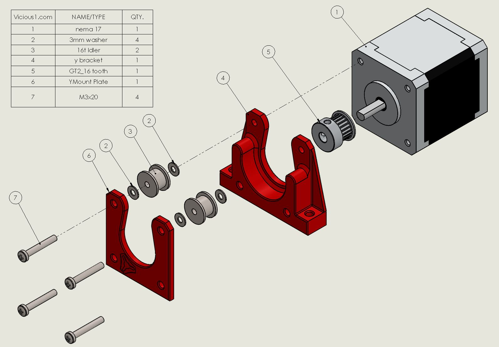
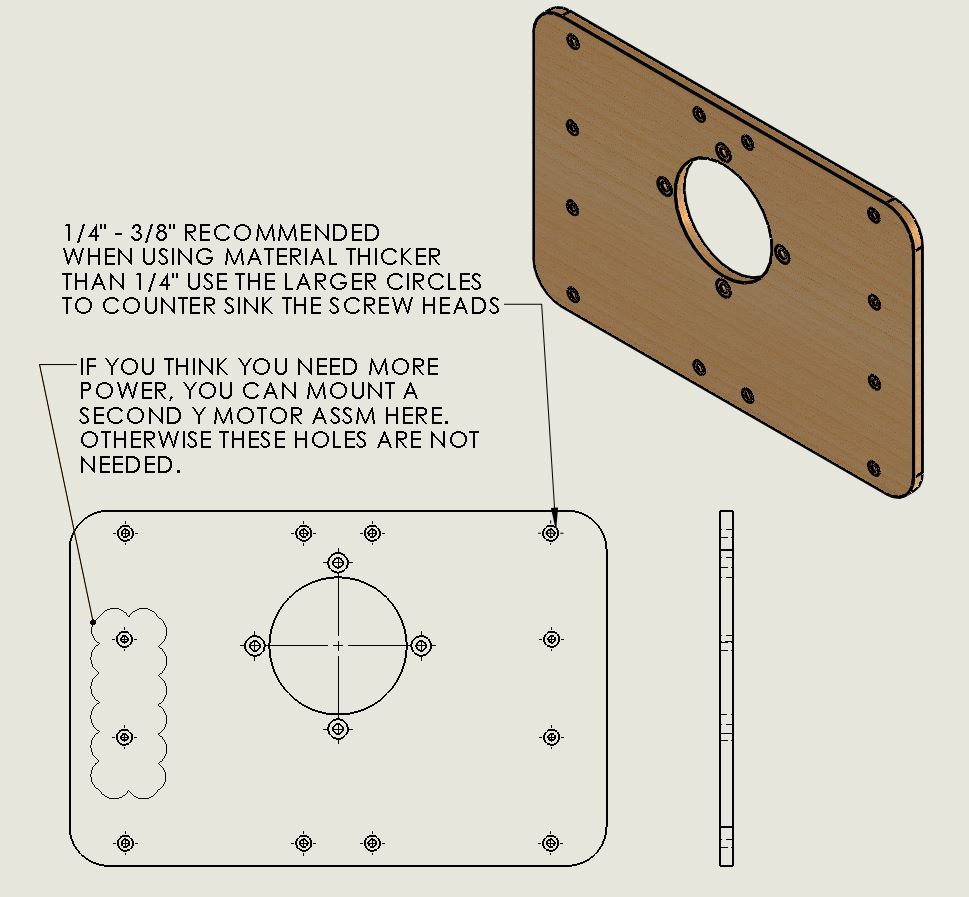
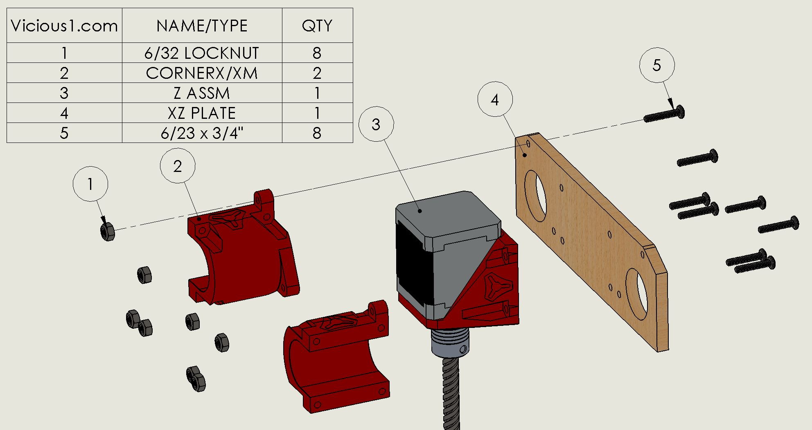
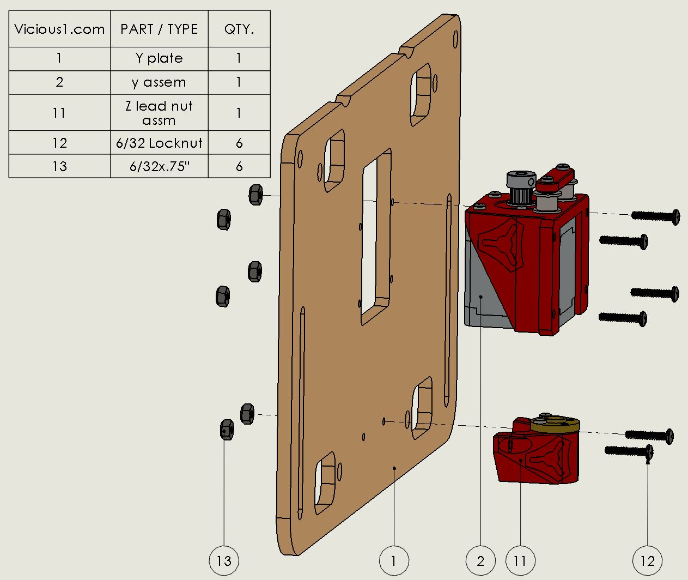
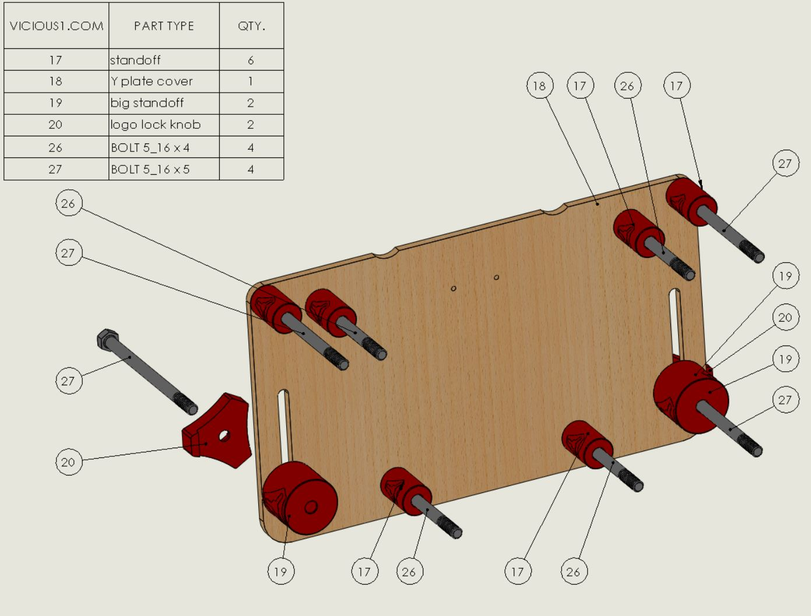

# The LowRider CNC

!!! warning
    This is for an old version of the Low Rider. The current version is [HERE](../index.md)

The LowRider CNC is my answer to you that want a full 4’x8′ sheet router, or of course you can go
smaller. If the MPCNC is not big enough for you this picks up where that left off.

Size Calculator

This CNC router can handle any length, the Y direction is only bound by your table length.

Width (X direction) seems to be just about maxed out at a little over 4′ using .065″ thick stainless
X rails. I see no reason to push it further if you try it out let us know how it goes and why you
did it.

The Z direction (height) is best kept to a 3″ maximum for wood, with that being said, you can make
the usable z length as much as you want you will be working from the bottom up, so go to town.

Feel free to round up to whole numbers.

[Calculator for table, rail, and belt lengths.](calculatorv2.md)

## Parts
Some links are affiliate links to illustrate the type of part that are not carried in the V1 Engineering store.

|QTY |Part                               |Store Link                                                                                |External Link                      | 
|----|-----------------------------------|:------------------------------------------------------------------------------------------:|:-----------------------------------:|
|5   |nema 17                            | [Shop](https://www.v1e.com/collections/lowrider-parts/products/nema-17-76oz-in-steppers) | [Amazon](http://amzn.to/2lDlzqg)  |
|44  |608-2rs                            | [Shop]()                                                                                 | [Amazon](http://amzn.to/2llXNh3)  |
|2   |lead screw and nut                 | [Shop](https://www.v1e.com/products/300mm-leadscrew-and-nut)                             | [Amazon](https://amzn.to/2LO5HRH) |
|1   |Lube for lead screw                | [Shop](https://www.v1e.com/products/super-lube-silicone-lubricating-grease-with-syncolon-ptfe)| [Amazon](https://amzn.to/2DVDIvI) |
|2   |coupler                            | [Shop](https://www.v1e.com/collections/lowrider-parts/products/5mm-to-8mm-flex-coupler)  | [Amazon](http://amzn.to/2lm0lvC)  |
|    |                                   |                                                                                          |                                   |
|3   |GT2 10mm_16tooth                   | [Shop](https://www.v1e.com/collections/lowrider-parts/products/pulley-16-tooth-gt2-10mm) | [Amazon](https://amzn.to/2AmhEJI) |
|6   |20t 10mm Idler                     | [Shop](https://www.v1e.com/collections/lowrider-parts/products/20t-idler-gt2-10mm)       | [Amazon](https://amzn.to/2v3MuBL) |
|7.5M (4'x8') |Belt 10mm GT2             | [Shop](https://www.v1e.com/collections/lowrider-parts/products/gt2-10mm-belt)            | [Amazon](https://amzn.to/2LHBKDL) |
|    |                                   |                                                                                          |                                   |
|4   |60mm wheel***                      | [Shop](https://www.v1e.com/collections/lowrider-parts/products/urethane-wheels)          | [Amazon](https://amzn.to/2OwEJMP) |
|4   |Wheel Spacer                       | [Shop](https://www.v1e.com/collections/lowrider-parts/products/axle-spacers)             | [Amazon](https://amzn.to/2XjjMbZ) |
|    |                                   |                                                                                          |                                   |
|2   |1" X ss tube Y, or DOM             |                                                         | [Amazon SS](https://amzn.to/2Y5daAX) [DOM](https://amzn.to/2CauGLH) |
|4   |1" Z ss tube Z, or DOM             |                                                         | [Amazon SS](https://amzn.to/2Y5daAX) [DOM](https://amzn.to/2CauGLH) |
|1   |Al Angle (optional for wires/hose) |                                                                                          | [Amazon](https://amzn.to/2nGiTds) |
|    |                                   |                                                                                          |                                   |
|1   |Dewalt DWP611                      |                                                                                          | [Amazon](https://amzn.to/2OvEIZC) |
|1   |Mini-Rambo                         | [Shop](https://www.v1e.com/collections/lowrider-parts/products/mini-rambo-1-3)           | [Amazon](https://amzn.to/2LNc1sE) |
|1   |lcd                                | [Shop](https://www.v1e.com/collections/lowrider-parts/products/full-graphic-smart-controller-big) | [Amazon](https://amzn.to/2LFgn5R) |
|25  |zip tie                            | [Shop](https://www.v1e.com/collections/lowrider-parts/products/25x-5-cable-ties)         | [Amazon](https://amzn.to/2LGm2IL) |
|1   |wiring harness (series)            | [Shop](https://www.v1e.com/collections/lowrider-parts/products/wiring-kit-1)             |                                   |
|1   |power supply 12v 6A                | [Shop](https://www.v1e.com/collections/lowrider-parts/products/12v-6a-power-supply)      | [Amazon](https://amzn.to/2vklRrz) |

As an Amazon Associate I earn from qualifying purchases.

***+/- 3mm is fine any larger and you will need to compensate by raising your work surface. These 59-60mm wheels are commonly called hockey wheels.

## Printed Parts
I prefer PLA but PETG can be used, 3 walls, 30-55% infill. Dimensions are a little less critical than the MPCNC. Total print time ≈ 64.5hrs. 1.2Kg of filament.

I recommend minimum .065″ wall thickness stainless steel tubing, If you are willing to keep rust away 1″ DOM is much less expensive and a tiny bit more rigid. Conduit will not work, “tubing” only stainless is preferred.

The parts can be found on Thingiverse.com, [HERE 25.4mm OD Rail](https://www.thingiverse.com/thing:3026040),  [HERE 25mm OD Rail](https://www.thingiverse.com/thing:3064287).

|QTY   | Part Name                                       |
|------|-------------------------------------------------|
|2     | Belt_Stop                                       |
|2     | Belt_Stop_Mirrored                              |
|6     | cable_tie_insert                                |
|4*     | LR2 X mount                                    |
|1     | X2 plate                                        |
|1     | X2 idler                                        |
|1     | VacShoeBack                                     |
|1     | VacShoeFront                                    |
|1     | VacShoeTop                                      |
|1     | VacDuct                                         |
|2     | Y_Bottom                                        |
|2     | Y_Top                                           |
|2*    | Lower Za                                        |
|2*    | Lower Zb                                        |
|2*    | YZ Roller                                       |
|2*    | YZ Roller M                                     |
|2*    | XZ Main                                         |
|4     | J_Spacer (F)                                    |
|1*    | XZ_Side_Belt                                    |
|1*    | XZ_Side_Belt_Mirrored                           |
|2*    | XZ                                              |
|1*    | Hose Bracket                                    |
|1*    | Hose Bracket Mirrored                           |
|1     | LCD_Top_Clip (if you use my lcd and [case](https://www.thingiverse.com/thing:1562144))  |
*25mm specific parts have a 25 suffix.

## Hardware
**The hardware sizes here are for using 1/4″ & 1/2″ sheet material as recommended, Bolt/screw lengths sizes match this. If you are using thicker material add the extra thickness to the dimensions.**

You should be able to go longer on all bolts screws with no issues.

| QTY     | Hardware                      | Equivalent      |
|---------|-------------------------------|-----------------|
| 40      | locknut 5/16                  | M8 nylock       |
| 4       | BOLT 5/16 x 3.75              | M8 x 95         |
| 8       | BOLT 5/16 x 2.75              | M8 x 70         |
| 4       | BOLT 5/16 x 1.75              | M8 x 45         |
| 24      | BOLT 5/16 x 1.25              | M8 x 30         |
| 40      | LOCK NUT 6/32                 | M3.5 or M4      |
| 16      | SCREW 6/32 x1.5               | M3.5 or M4 x 40 |
| 24      | SCREW 6/32 x1                 | M3.5 or M4 x 25 |
| 6       | LOCK NUT M5                   |                 |
| 6       | M5x30                         |                 |
| 24      | M3x10                         |                 |

## Cut Parts

1/4″ for the router plate, 1/2″ for the sides, MDF or Baltic Birch. Bolt/screw lengths and sizes match this if you change thicknesses be mindful of this. You should be able to go longer on all bolts screws with no issues.

The part DXF files are saved and should be imported in millimeters, they can be found on Thingiverse.com, [HERE 25.4mm OD](https://www.thingiverse.com/thing:3026040), [HERE 25mm OD](https://www.thingiverse.com/thing:3064287).

|QTY  |   Name          | Thickness     |
|-----|-----------------|---------------|
| 1   | 611 plate 2     | 1/4"          |
| 2   | Y plate (25)    | 1/2"          |

## Spindle Options

Mounting different routers/spindles should just be a matter of changing the center assembly plate. Any thing that fits between the rails (100mm) could work with a little planning. The Dewalt 611 is nice for the price. A lot of us wish we bought the second base to go with it for ease of multi purpose use.

Looks like the DeWalt D26200 is the international equivalent (thanks Robbert). Other options would need to fit between the 100mm rails and mount flat (usually from the removable shoe).

|||
|--------------------|---------------|
| Dewalt DWP611      | [Link](https://amzn.to/2OvEIZC)      |
| 1/8" Collet        | [Shop](https://www.v1e.com/products/1-8-collet-for-dewalt-dwp611) - [Elaire Corp](http://elairecorp.com/dewaltroutercollets.html)    

## Assembly

All quantities shown in the drawings are for each assembly, not total quantities.

### Center Assembly

{: loading=lazy width="400"}
{: loading=lazy width="400"}
{: loading=lazy width="400"}
{: loading=lazy width="400"}

### Z Assembly

{: loading=lazy width="400"}
{: loading=lazy width="400"}
{: loading=lazy width="400"}

### Side Assembly

{: loading=lazy width="400"}
{: loading=lazy width="400"}
{: loading=lazy width="400"}
{: loading=lazy width="400"}
{: loading=lazy width="400"}
{: loading=lazy width="400"}
{: loading=lazy width="400"}
{: loading=lazy width="400"}
