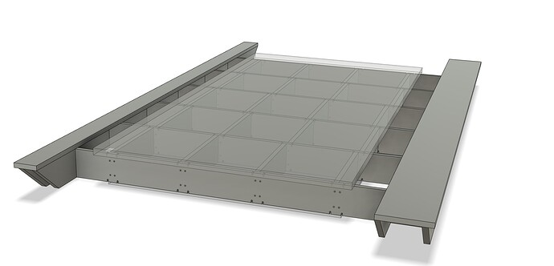
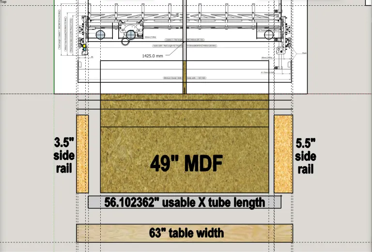
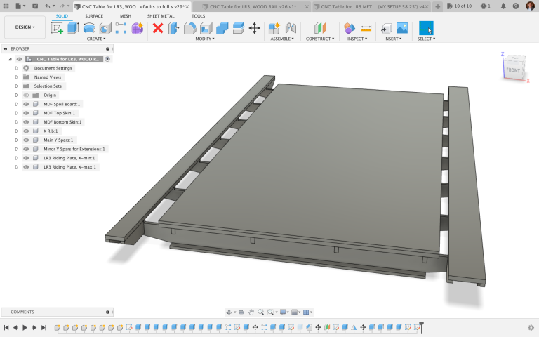
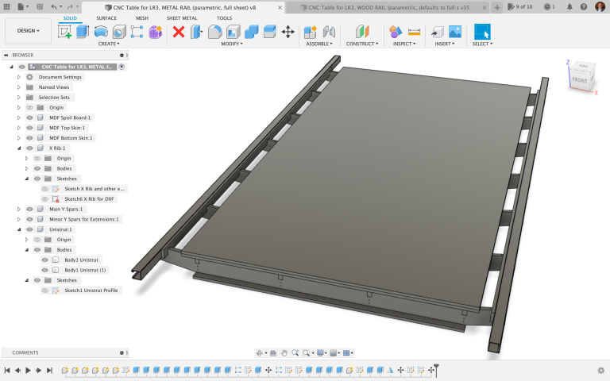

# Low Rider CNC Table Builds

{: loading=lazy width="600"}

The LowRider CNC is an incredible CNC router that can handle up to full sheet material! However, it is not a table. It is a CNC that can be mounted to a table. This page is dedicated to the table builds that have been done by the community, which can help you in designing and building your own. The tables listed on this page are the ones which are recommended to build, however, if you were interested in finding more complex or a larger variety of designs, there are many other designs which can be found on the [V1 Engineering Forum](https://forum.v1engineering.com/), or more specifically [with the tag parametric table](https://forum.v1e.com/tag/parametric-table).

## Table Design Considerations and Recommendations
There is a lot that goes into designing or building a table for a CNC, and below is a list of considerations and recommendations to keep in mind when designing your own table.

1. The size of the table should be large enough to fit the Low Rider v3 CNC kit and also accommodate any material that needs you are interested in cutting (additionally, you should consider whether or not there would be a necessity of passing it through doors or moving the table at all).
2. The surface of the table should be flat, level and free from obstructions to ensure accuracy when cutting materials.
3. Make sure the base of the table is sturdy enough to withstand vibration created by the CNC kit during operation (consider using locknuts as opposed to typical hex nuts if required).
4. Provide adequate space around the table for access to the Low Rider v3 CNC kit, as well as a method of dust collection (such as space for a vacuum) for any dust or debris created during cutting operations.
5. Ensure that the table includes an appropriate clamping system to secure materials in place while cutting them with the CNC kit without affecting its accuracy or precision (one method is just using wood screws to attach the material to the waste board). 

## V1 Engineering Fully Parametric Table
<iframe width="560" height="315" src="https://www.youtube.com/embed/cogLzPg2Arw"
  title="YouTube video player" frameborder="0" allow="accelerometer; autoplay;
  clipboard-write; encrypted-media; gyroscope; picture-in-picture" allowfullscreen></iframe>
* This video shows off a fully built lr3, on top of a parametric table design.

There is not a link to a 3d model, however, there is a link to the [Thingiverse](https://www.thingiverse.com/thing:2951713) page which hosts files for the brackets used in the video.

The Forum link: [V1 Engineering Fully Parametric Table](https://forum.v1e.com/t/parametric-table/37698)

## "Design8Studio Doug Joseph" Full Sheet Capable Table
<iframe width="560" height="315" src="https://www.youtube.com/embed/6x24C5ZwuCU"
  title="YouTube video player" frameborder="0" allow="accelerometer; autoplay;
  clipboard-write; encrypted-media; gyroscope; picture-in-picture" allowfullscreen></iframe>
* The Forum link: ["Design8Studio Doug Joseph" Full Sheet Capable Table](https://forum.v1e.com/t/cnc-cut-table-for-lowrider-v3-parameterized-for-cutting-full-sheets/37579/54)
* This video shows off the Low Rider v3 cutting out parts for a torsion box.

Additionally, there is a link to the plans by [Design8Studio](https://design8studio.com/for-lowrider-v3-cnc-cut-table-dxfs-for-cutting-f360-archives/). Where you can find detailed designs for the table as well, and the different variations of the table.

{: loading=lazy width="600"}

Including illustrations of the table dimensions and gantry placement.

{: loading=lazy width="600"}

The Fusion link: [Wooden Rails](https://a360.co/40E0n6C)

{: loading=lazy width="600"}

The Fusion link: [Metal Rails](https://a360.co/3MAcb5D)

## Go get it dirty, be safe, have fun!
