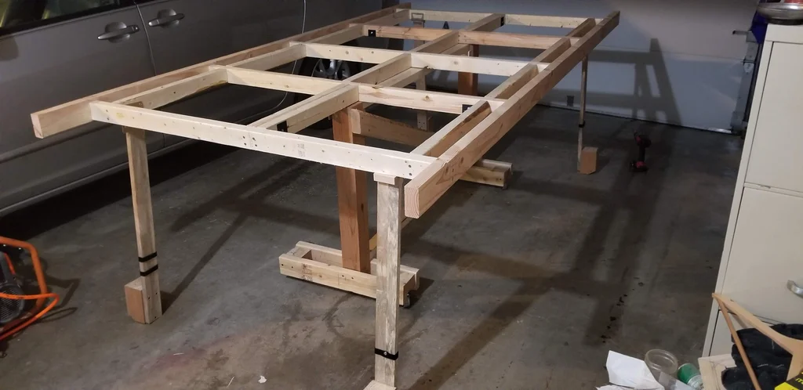
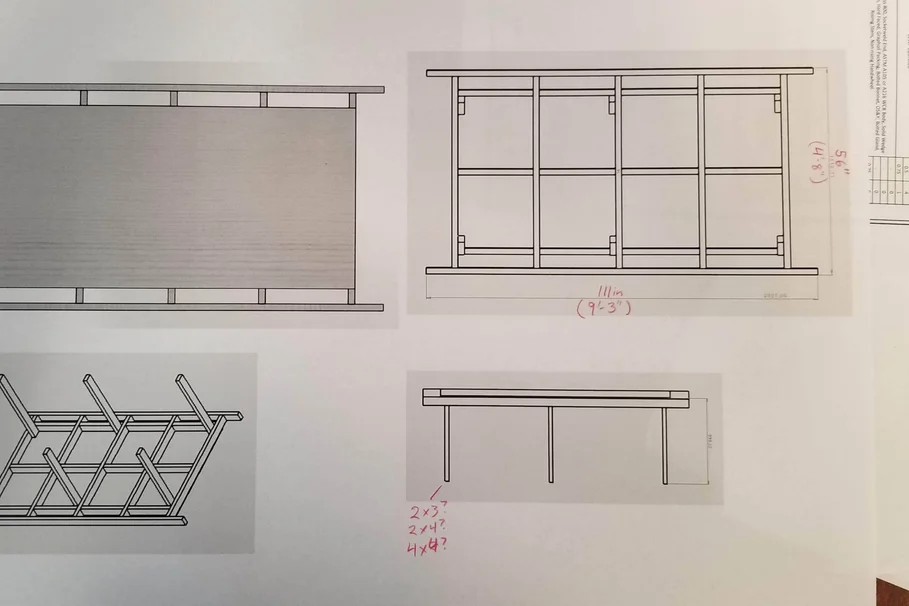
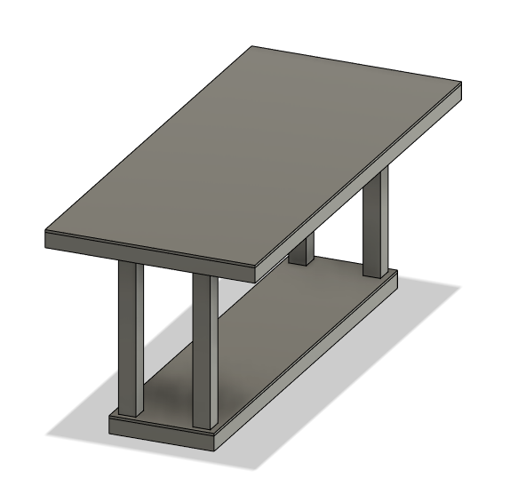
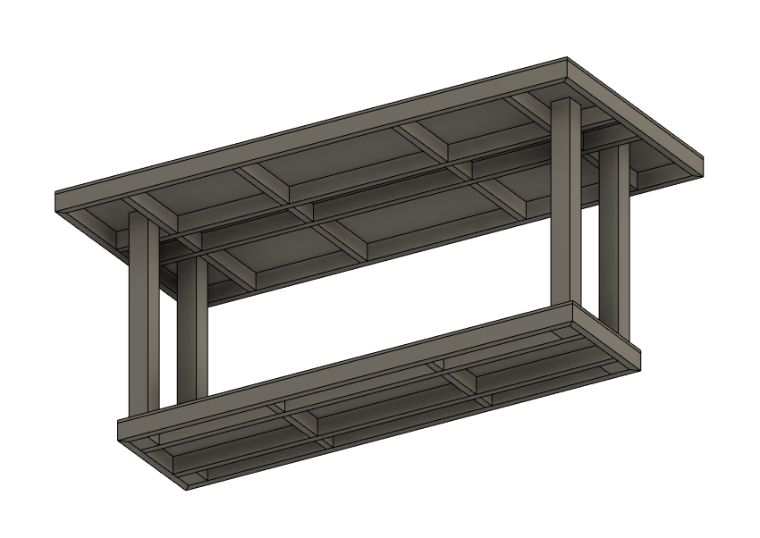
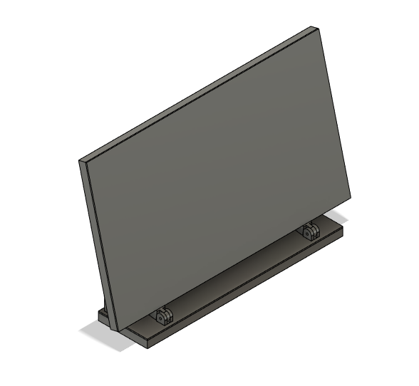
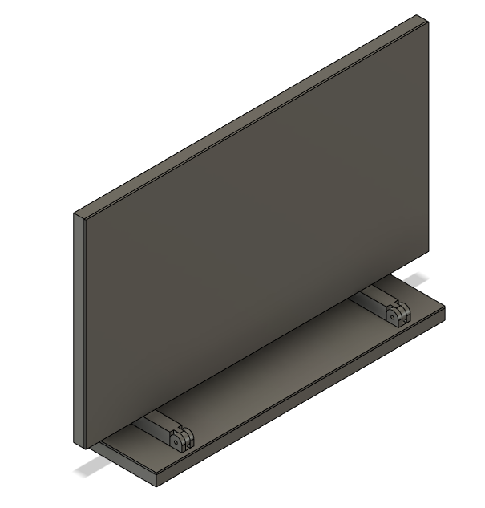
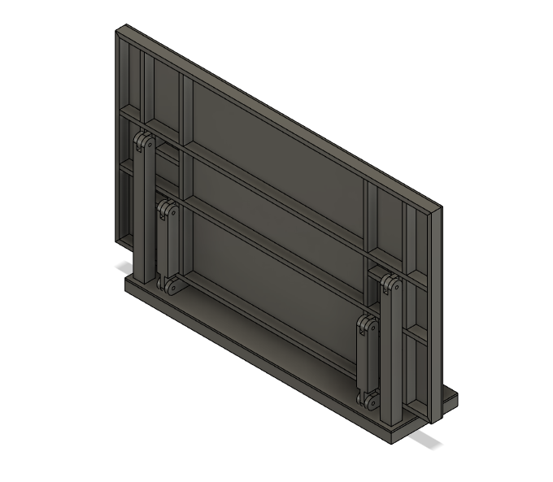
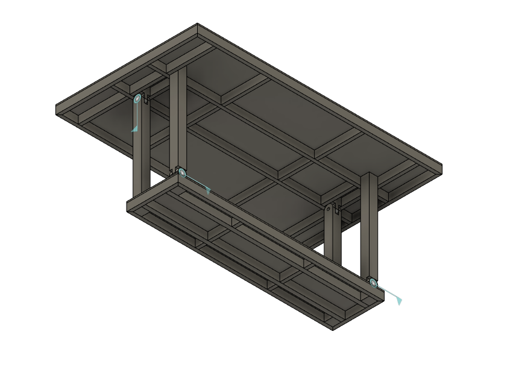
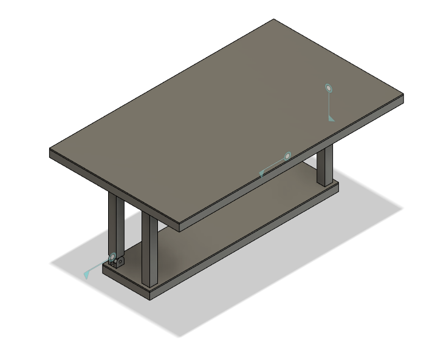
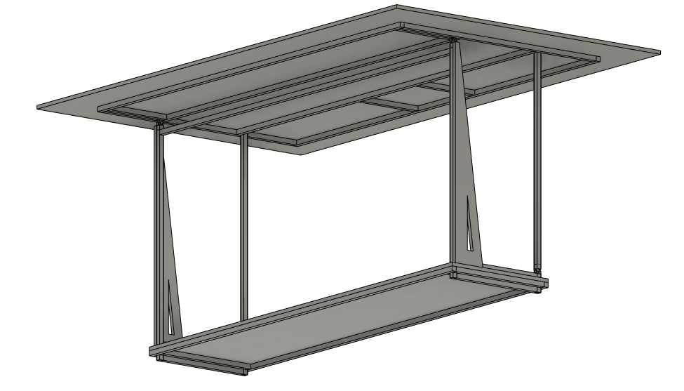

# Low Rider CNC Table Builds

{: loading=lazy width="600"}

The LowRider CNC is an incredible CNC router that can handle up to full sheet material! However, it is not a table. It is a CNC that can be mounted to a table. This page is dedicated to the table builds that have been done by the community, which can help you in designing and building your own.

## Folding Table Designs
Though it may not always be ideal, sometimes it is necessary to have a table that can fold up and out of the way. This section is dedicated to those designs.

### "Design & Build - TDE" General Wall Folding Table
<iframe width="560" height="315" src="https://www.youtube.com/embed/WaXTxx24Yco"
  title="YouTube video player" frameborder="0" allow="accelerometer; autoplay;
  clipboard-write; encrypted-media; gyroscope; picture-in-picture" allowfullscreen></iframe>
* "This video demonstrates how to build a wall-mounted fold-down CNC table or worktop using heavy-duty fixings and components, this table will hold over 200KG in weight, is rigid and folds away to save space."
* It is designed for use with the a 48" x 48" CNC router.

### "Larry Wimble"'s Vertically Flipping Table
<iframe width="560" height="315" src="https://www.youtube.com/embed/CszMnVafDXc"
  title="YouTube video player" frameborder="0" allow="accelerometer; autoplay;
  clipboard-write; encrypted-media; gyroscope; picture-in-picture" allowfullscreen></iframe>
* Here, "Larry Wimble" showcases his vertically flipping table design.

Though there was not a build video or build plans, there is a link to the [Thingiverse](https://www.thingiverse.com/thing:4612780) page. There, you can find the files for parts and brackets  of the table.

### "cameronleckliter"'s Fliptable LowRider CNC
{: loading=lazy width="600"}
{: loading=lazy width="600"}

There is no YouTube video for this design, however, still deserved some amount of recognition. This design is a folding table that is mounted to a rolling frame. It is a very simple design, and can be built with minimal tools and materials.

The designer did however make an [Instructables](https://www.instructables.com/Fliptable-LowRider-CNC/), which can be referenced when building this design.

### Reed Graff's Designs
There are currently no YouTube videos for any of the designs, but below you will see images and links to the Fusion 360 files for the designs along with links to purchasing parts.

All of the tables feature a 4'x8' working area, and an overall size of 9.5'x5.5' all built with various kinds of materials.

#### V1 Fixed Table Design
{: loading=lazy width="600"}
{: loading=lazy width="600"}

As you could imagine by the name, this features a fixed table design made of wood. However, is is possible to make it flip if the posts are not secured to the bottom of the table. 

The [Fusion360](https://a360.co/3HxIpLt) file can be seen here.

#### V2 Elbow Joint Design
{: loading=lazy width="600"}
{: loading=lazy width="600"}

This design features a wooden structure and a pivot located on the side of 2 of the supports in order to allow it to rotate horizontally. Additionally, the 2 other posts collapse in an elbow like manner.

The [Fusion360](https://a360.co/3VshJBv) file can be seen here.

#### V3 Elbow Joint Design
{: loading=lazy width="600"}
{: loading=lazy width="600"}

This design is very similar to the first version, however, it features the ability to rotate 90 degrees horizontally. This is done by changing the lengths of the joints and the position of the joints along the posts.

The [Fusion360](https://a360.co/44q8WnV) file can be seen here.

#### V4 Wooden Support Design
{: loading=lazy width="600"}
{: loading=lazy width="600"}

This design and the next is based off of a similar concept, where the table flips horizontally, however, the posts flip up in a different direction to support the table without worrying about extra movement.

#### V5 Metal Tubing Design
{: loading=lazy width="600"}
{: loading=lazy width="600"}

This is just the square metal tubing alternative to the previous design, which is a bit more sturdy and easier to build. 

| Group       | Name                                                                                                                                                                        | Sizes                                       | Other | # | Link                                                                                           | $ |   |
|-------------|-----------------------------------------------------------------------------------------------------------------------------------------------------------------------------|----------------------------------------------------|--------------------|----------|------------------------------------------------------------------------------------------------|---------------|---|
| New Table   | Lowes Cart: <a href="https://click.e.lowes.com/?qs=00f94046a755b4d661816020e110956d5340f755de2d109f2c0101ed9a6fb94b4b5ec94b61e8bbeb35e3c8516149af3c137af7d24c5c0ab7478f061c9333c174">Lowes<a>  |                                                    |                    |          |                                                                                                |               |   |
| Top         | MDF Board                                                                                                                                                                   | 2(4'x4'), 3(4'x1.5'), 1(1'5'x1.5')                 | 3/4in thick        |        2 | <a href="https://www.lowes.com/pd/MDF-Actual-0-745-in-x-48-92-in-x-8-07-ft/1000344499">Lowes</a>                   |            56 |   |
|             | Metal Piping                                                                                                                                                                | 2(8'), 2(94"), 4(14"), 1(1")                       | 1in                |        6 | <a href="https://www.lowes.com/pd/Steelworks-1-in-W-x-8-ft-L-Mill-Finished-Aluminum-Square-Tube/3053565">Lowes</a> |            29 |   |
| Front Posts | Metal Piping                                                                                                                                                                | 2(44.5")                                           | 1in                |        1 | <a href="https://www.lowes.com/pd/Steelworks-1-in-W-x-8-ft-L-Mill-Finished-Aluminum-Square-Tube/3053565">Lowes</a> |            29 |   |
| Bottom      | Metal Piping                                                                                                                                                                | 4(22"), 4(20"), 2(8'), 1(92"), 2(3.75"), 2(47.25") | 1in                |        8 | <a href="https://www.lowes.com/pd/Steelworks-1-in-W-x-8-ft-L-Mill-Finished-Aluminum-Square-Tube/3053565">Lowes</a> |            29 |   |
|             | Plywood Board                                                                                                                                                               | 4'x8'                                              | 3/4in thick        |        1 | _                                                                                          |             0 |   |
|             | Casters                                                                                                                                                                     | _                                                  | _                  |        1 | <a href="https://www.lowes.com/pd/Outwater-Outwater-Industries-Caster/5001673219">Lowes</a>                        |            30 |   |
| Printed     | Joints                                                                                                                                                                      | _                                                  | _                  |        8 | _                                                                                              |             0 |   |
|             | Gussets                                                                                                                                                                     | _                                                  | _                  | x        | _                                                                                              |             0 |   |
| Hardware    | Pipe for Joints                                                                                                                                                             | 3'                                                 | 1/2in OD           |        1 | <a href="https://www.lowes.com/pd/Hillman-1-2-in-dia-x-3-ft-L-Mill-Finished-Aluminum-Round-Tube/3053611">Lowes</a> |         12.98 |   |
|             | Hex Bolts                                                                                                                                                                   | 2"                                                 | 1/4"               |       20 | <a href="https://www.lowes.com/pd/Hillman/5002973941">Lowes</a>                                                    |          0.78 |   |
|             | Hex Bolts                                                                                                                                                                   | 3 1/2"                                             | 1/4"               |       10 | <a href="https://www.lowes.com/pd/Hillman-1-4-in-x-3-1-2-in-Stainless-Coarse-Thread-Hex-Bolt/3701974">Lowes</a>    |          1.34 |   |
|             | Hex Bolts                                                                                                                                                                   | 4"                                                 | 1/4"               |        8 | <a href="https://www.lowes.com/pd/Hillman-1-4-in-x-4-in-Zinc-Plated-Coarse-Thread-Hex-Bolt/3024614">Lowes</a>      |          1.48 |   |
|             | Lock Nuts                                                                                                                                                                   | _                                                  | 1/4"               |       40 | <a href="https://www.lowes.com/pd/Hillman-1-4-in-Zinc-Plated-Standard-SAE-Nylon-Insert-Lock-Nut/3058721">Lowes</a> |          0.15 |   |
| MDF Gussets | Leftover MDF                                                                                                                                                                | _                                                  | _                  |        2 | Given                                                                                          |             0 |   |
| **kwargs    | Legacy keyword arguments.                                                                                                                                                   |                                                    |                    |          |                                                                                                |               |   |

The [Fusion360](https://a360.co/44qyGk3) file can be seen here.

Additionally, if you were not especially good at welding, there are 3d models for joints to be used to connect the piping together. 
These can be found here: 
<ul>
    <li> Fusion link for the Flat Plate (https://a360.co/3p1GfgN).</li>
    <li> Fusion link for the L Connector (https://a360.co/3NsOqNj).</li>
    <li> Fusion link for the U Connector (https://a360.co/3LMz6dc).</li>
    <li> Fusion link for the Top Table Adapter (https://a360.co/3LOnFSh).</li>
    <li> Fusion link for the Joint Adapter to pipe (https://a360.co/3Ltajtb).</li>
</ul>

## Fixed Table Designs

### "Design8Studio Doug Joseph" Full Sheet Capable Table
<iframe width="560" height="315" src="https://www.youtube.com/embed/6x24C5ZwuCU"
  title="YouTube video player" frameborder="0" allow="accelerometer; autoplay;
  clipboard-write; encrypted-media; gyroscope; picture-in-picture" allowfullscreen></iframe>
* This video shows off the Low Rider v3 cutting out parts for a torsion box.

Additionally, there is a link to the plans by [Design8Studio](https://design8studio.com/for-lowrider-v3-cnc-cut-table-dxfs-for-cutting-f360-archives/). Where you can find detailed designs for the table as well, and the different variations of the table.

{: loading=lazy width="600"}

Including illustrations of the table dimensions and gantry placement.

{: loading=lazy width="600"}

The Fusion link: [Wooden Rails](https://a360.co/40E0n6C)

{: loading=lazy width="600"}

The Fusion link: [Metal Rails](https://a360.co/3MAcb5D)

### "Some Old Guy Coding" Small Table
<iframe width="560" height="315" src="https://www.youtube.com/embed/EUWJ9Cf5OV0"
  title="YouTube video player" frameborder="0" allow="accelerometer; autoplay;
  clipboard-write; encrypted-media; gyroscope; picture-in-picture" allowfullscreen></iframe>
* In this video, "Some Old Guy Coding" shows how to build a small table for the Low Rider 2 CNC.

There is not a link to a 3d model, however, there is a link to the [Thingiverse](https://www.thingiverse.com/thing:2951713) page which hosts files for the brackets used in the video.

## Go get it dirty, be safe, have fun!
