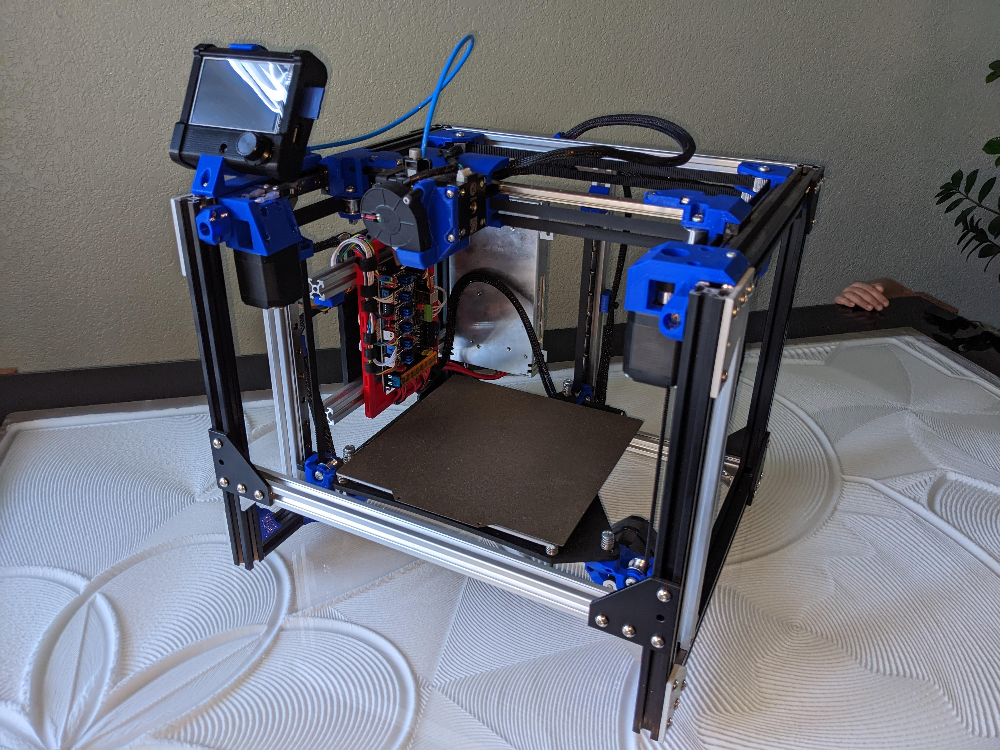
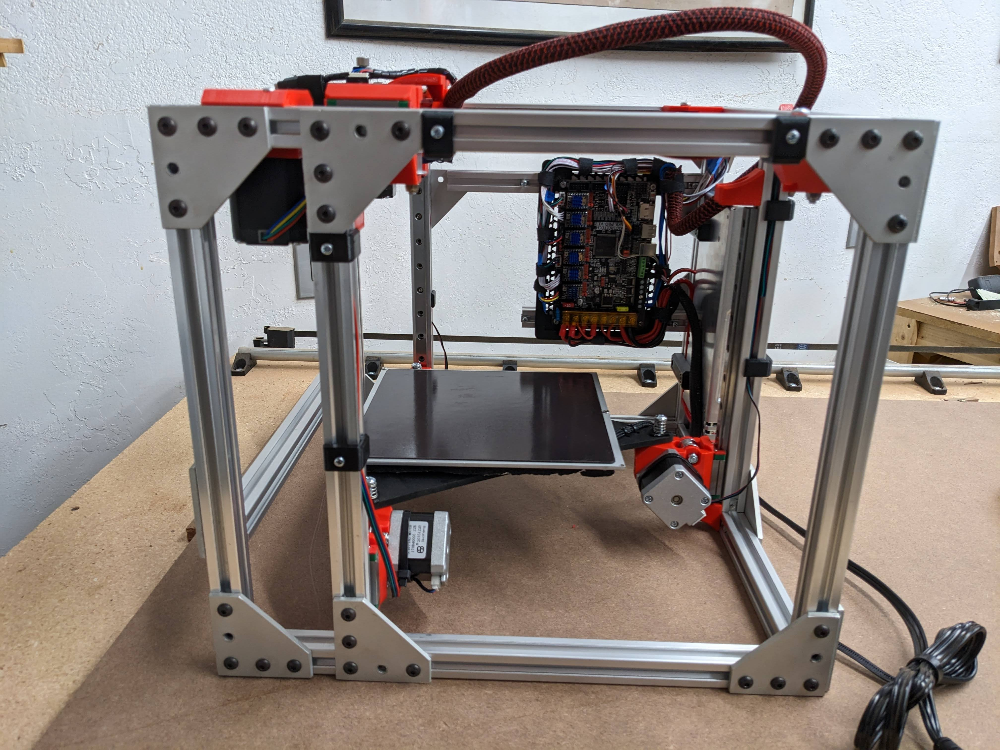
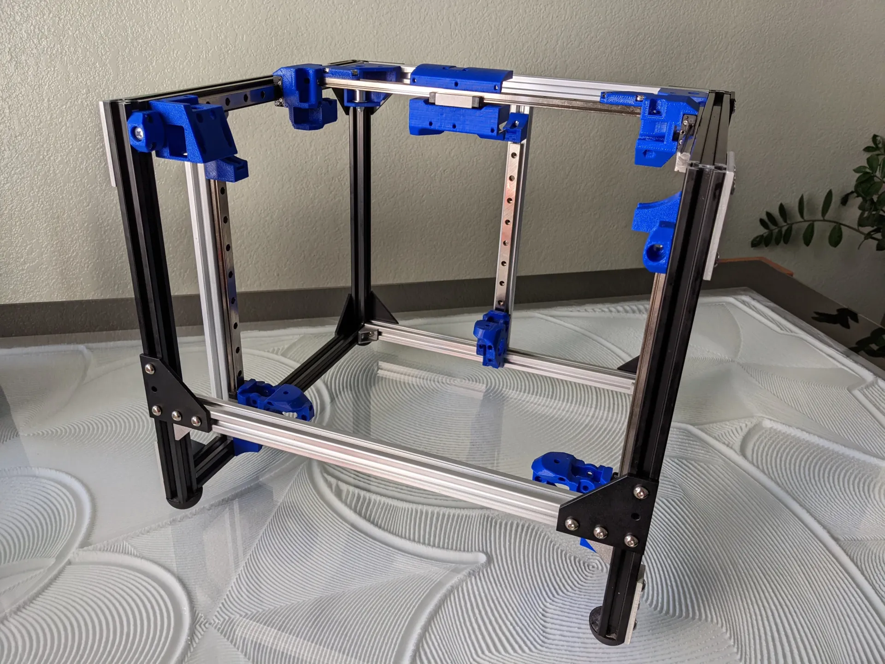
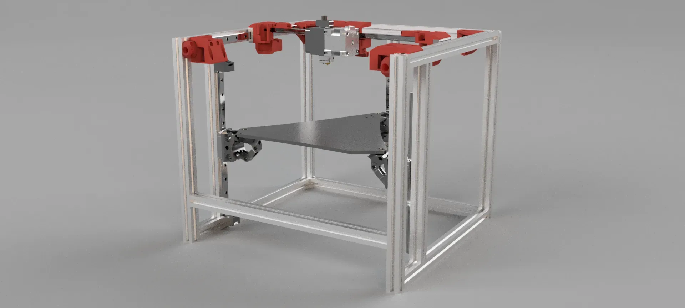
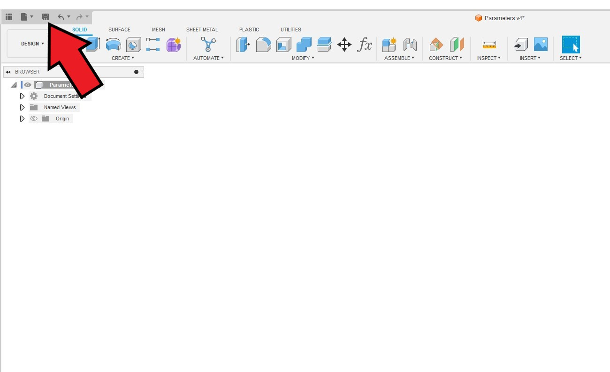
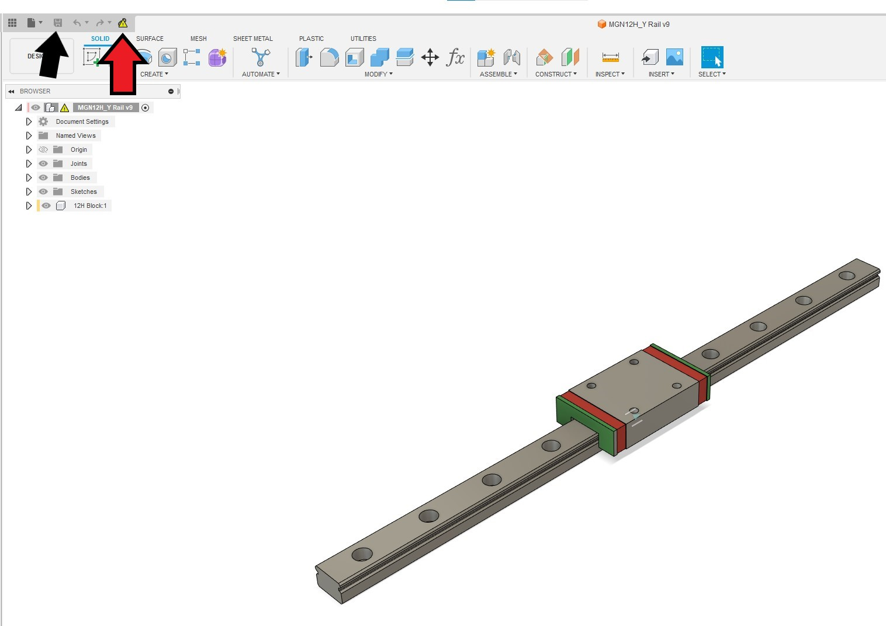

# MP3DP v4 CoreXY

Having fun, this is the second CoreXY version for me. Works fantastic, can be scaled on all axis. Physical and mesh bed leveling. You will need a 6 driver board for this one.

{: width="400"}

More details to come, **Updated version nearing completion, [forum thread](https://forum.v1engineering.com/t/repeat-v2/33330/55).**

[CAD link](https://forum.v1engineering.com/t/repeat-v2/33330/85?u=vicious1).

[Files link](https://www.printables.com/model/282346-mp3dp-v4).

{: loading=lazy width="400"}
{: loading=lazy width="400"}

{: loading=lazy width="400"}
{: loading=lazy width="400"}
{: loading=lazy width="400"}
{: loading=lazy width="400"}
{: loading=lazy width="400"}

{: loading=lazy width="400"}

{: loading=lazy width="400"}

{: loading=lazy width="400"}
{: loading=lazy width="400"}

## Resizing

{: loading=lazy width="400"}

 * Open the link wither on this page, or the Printables.com page.

---

{: loading=lazy width="400"}

 * Click the link to open in Fusion360

---

{: loading=lazy width="400"}

 * Open the Parameters file. It will appear blank.

---

{: loading=lazy width="400"}

 * Click "Modify"
 * Click "Change Parameters"

---

{: loading=lazy width="400"}

* These number represent the **Usable area** of your bed, and how tall you want the Z axis.
* Note it is best to work in multiples of 25mm. It is a must for the X axis, but you can do whatever you would like for the X and Y axes.

---

{: loading=lazy width="400"}

 * Save the file, and close it.

---

{: loading=lazy width="400"}

 * Open all three of the rail files. All at once or one at a time.

---

{: loading=lazy width="400"}

 * Click the update icon at the top (red arrow).
 * Save the file and close, for each file (black arrow).

---

{: loading=lazy width="400"}

 * Open the complete assembly.

---

{: loading=lazy width="400"}

 * Update and save this new assembly.

---

### Bed Resizing

{: loading=lazy width="400"}

 * Open the bed support component by clicking the small circular button next to it (red arrow).
 * The usable area should already be correct but you can adjust the rest to fit your specific bed.
 * Open the first sketch (black arrow). 
 * From here you can adjust the mounting hole locations (green arrows).
 * You can also move the center of the bed to account for the nozzle offset. The Hemera is offset by 12.5mm.
 * "Finish Sketch" to save any changes.

---

{: loading=lazy width="400"}

 * You can fine tune the mounting hole sizes here.
 * The strain relief can also be adjusted.

---

{: loading=lazy width="400"}

 * The step will let you adjust the plate to work for 3 or 4 mounting hole beds.
 * Any area in blue wil become part of the component.

---

{: loading=lazy width="400"}

 * This is the sketch to export for cutting, just right click "Export DXF".

---

{: loading=lazy width="400"}

 * Click the icon at the top to get the full assembly back.

---
