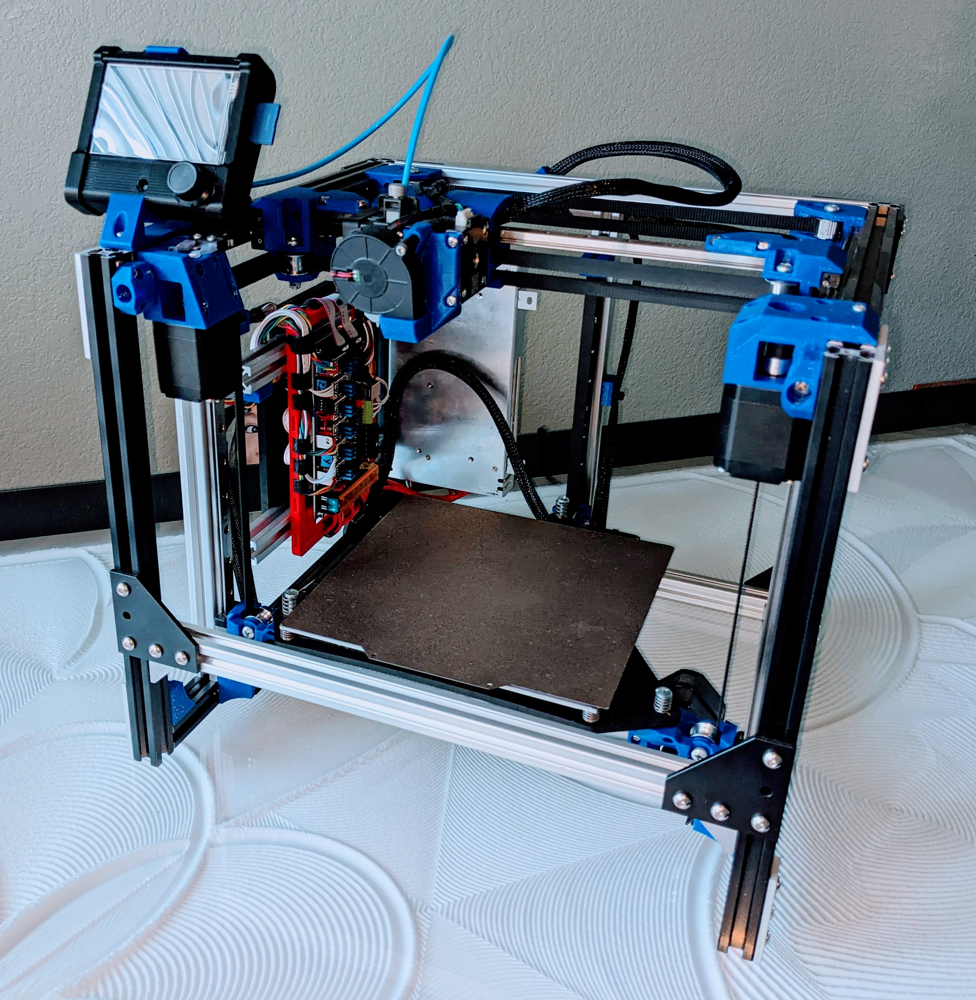

# MP3DP v4 CoreXY

Having fun, this is the second CoreXY version for me. Works fantastic, can be scaled on all axis. Physical and mesh bed leveling. You will need a 6 driver board for this one.

More details to come, **Updated version nearing completion, [forum thread](https://forum.v1engineering.com/t/repeat-v2/33330/55).**

[CAD link](https://forum.v1engineering.com/t/repeat-v2/33330/85?u=vicious1).

[Files link](https://www.printables.com/model/282346-mp3dp-v4).

