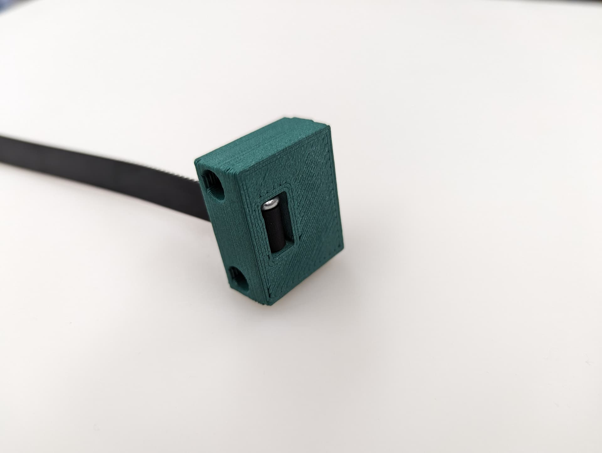
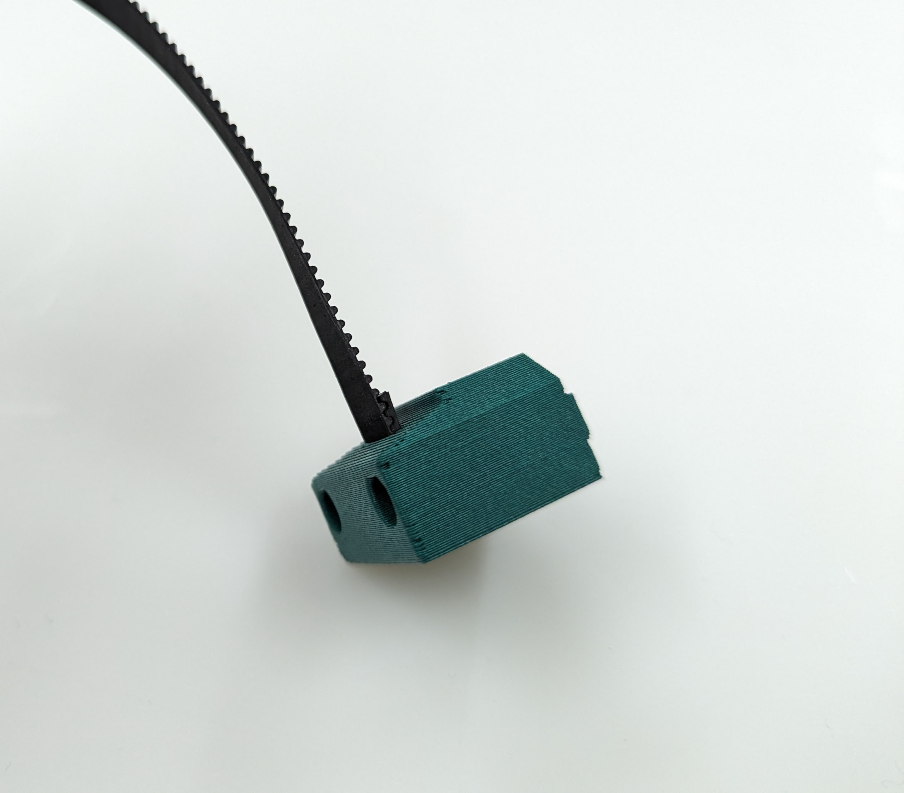
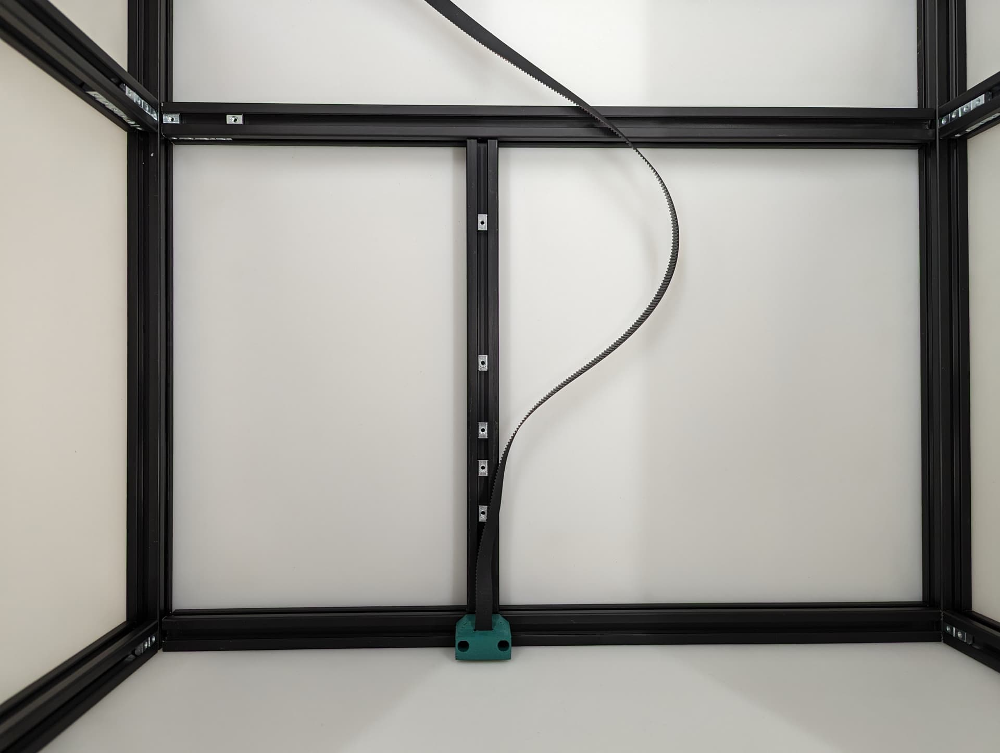
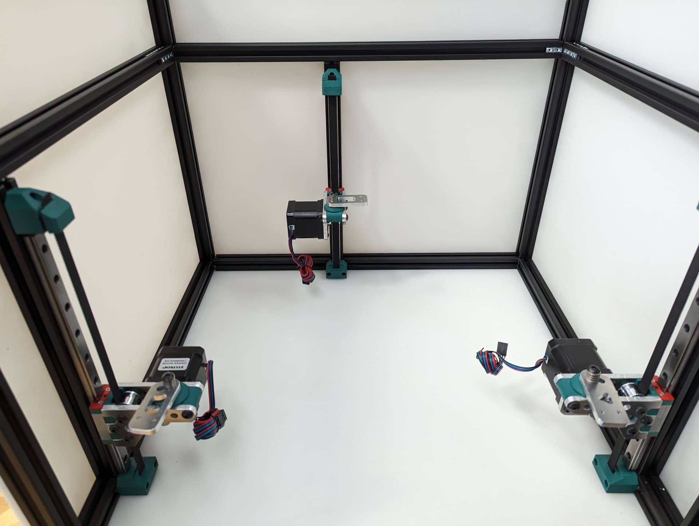
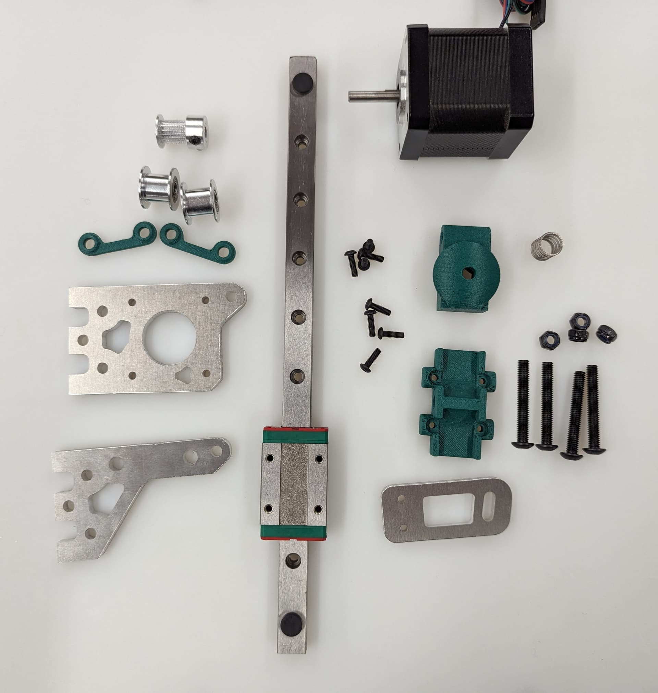
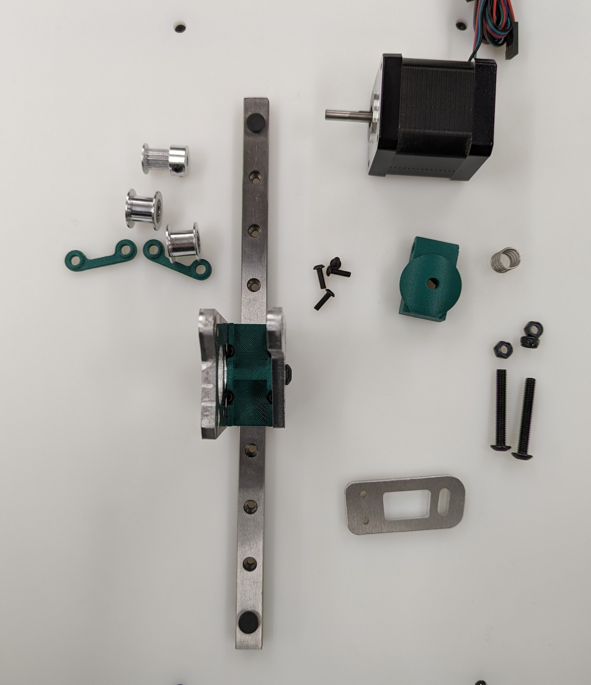
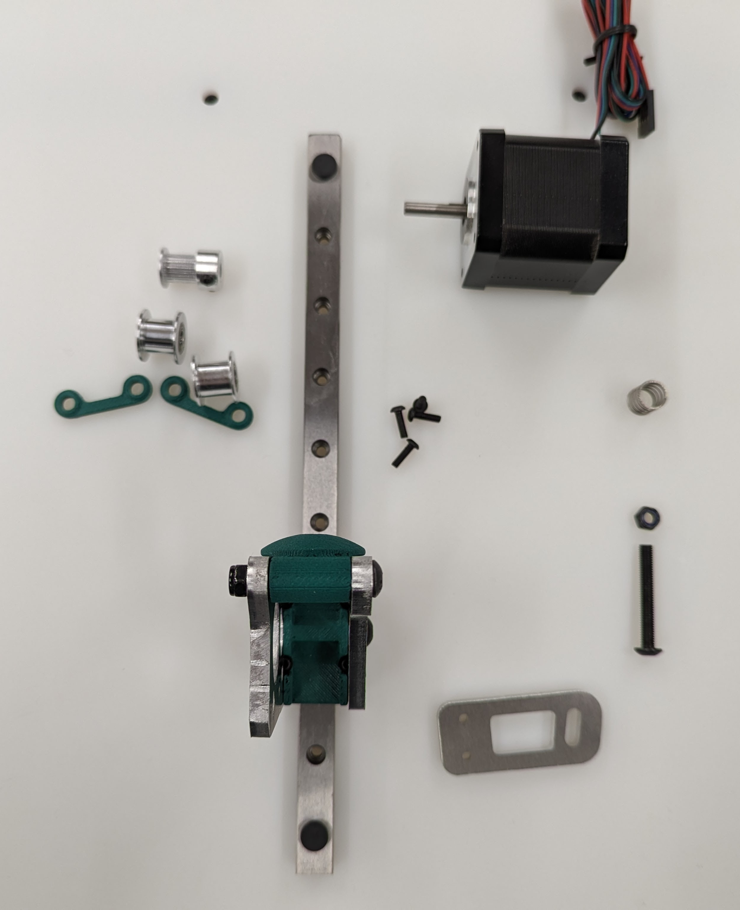
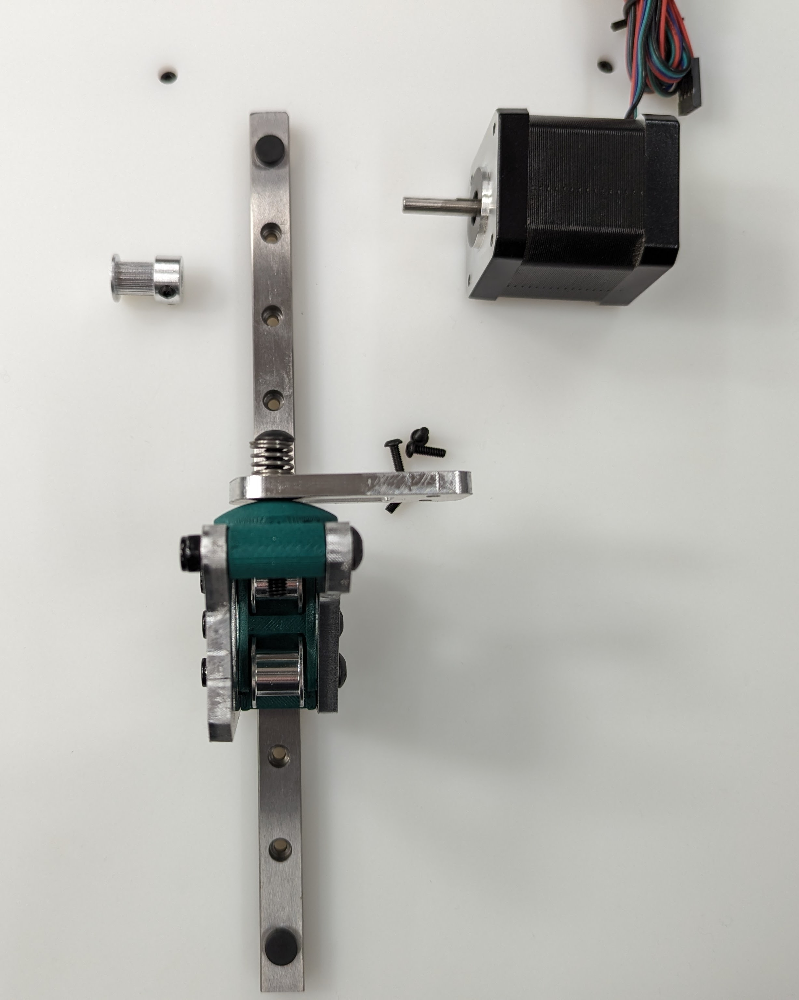
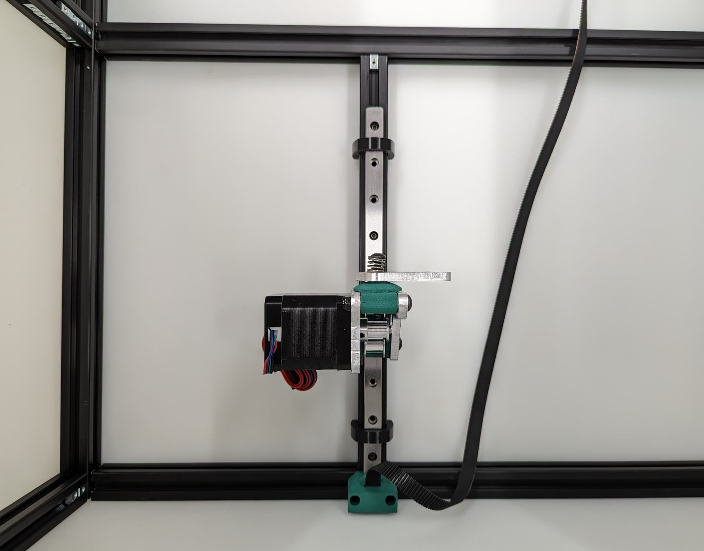

# MP3DP v5 CoreXY

This is the 3rd CoreXY version for me, 5th printer design overall. This printer was a group effort and a direct result of everyone’s input, [Forum Thread](https://forum.v1e.com/t/help-develop-the-next-mp3dp/41947)

This is a CoreXY with easily machinable plates for ultimate rigidity where it counts but 3D printed parts where it does not matter to save from complicated multi-sided milling.

Belted Z axis, with free floating bed to allow for physical tilt correction as well as mesh correction, and possible non-planer printer in the future. Electronic brakes provide easy drop protection for the bed.

{: width="600"}

This first build of mine has a 300x300x200 build area, running Klipper, **Costs about $800**. [Forum Thread](https://forum.v1e.com/t/v5-1-the-plated-printer/42809).**

!!! Warning
    ### **Note for potential builders**

    If you are thinking about building a printer… a V1 Engineering CNC is an easy to intermediate build, a 3D printer is an advanced to expert build. A lot of personal build decisions need to be made, wiring is on the advanced end, firmware edits are required, CAD reference and possible edits are required, and overall build precision is higher.

    Because the builds vary, so wildly, instructions might not exist for the exact combination of hardware and electronics you choose. As always you can come here for help but if you chose random parts we might not have enough experience with them to help. If you are on the fence and want to tackle this, it would be best to follow my build exactly.

## Parametric Options

If you want a printer that is different than the standard build size, or has a custom extruder/hot end, you'll need to edit some parameters in the CAD file to generate the correct part sizes for your build.

[CAD link - Fusion](https://myhub.autodesk360.com/ue29a24ab/g/shares/SH512d4QTec90decfa6e972762faaa11c772).

This is how you adjust the model. Open the modify menu, Change parameters Menu.
{: width="600"}

### Build Size

!!! Note
    The Three Bed cut parts (Bed A-C) are the only parts that are size dependent. Make sure to set the correct build size before cutting these parts. 300X x 300Y is the default included size.

These three settings are how you adjust the size of the build. Z is not exact as it depends on the hotend you chose but it should be close.

{: width="600"}

**Note: The CAD will fail if you go up and down in size. Make one edit and it should be fine. If you have an issue, start fresh.**

### Optional hole size

This lets you adjust the hole size for the Plates to frame.

 I was asked to allow for M5 hardware. This is where you do that. You will need to export new DXF files for the corners and tensioner parts.

{: width="600"}

### Belt Grip

If you want to make the Belt have a tighter or looser grip on the core bottom or Z top pieces, you can change it here.

{: width="600"}

## CAD Help

### Exporting DXFs

If you want to export your own DXF’s this is where you find them.

{: width="600"}

## BOM

### Flat Parts

The flat parts are designed for you to be able to mill them yourself with your MPCNC or LowRider out of 3/16" (4.7mm-5mm) aluminum. 

!!! Note
    The Three Bed cut parts (Bed A-C) are the only parts that are size dependent. Make sure to set the correct build size before cutting these parts. 300X x 300Y is the default included size.

|QTY |File Name                   |Comment                              |Link                                     | 
|----|----------------------------|-------------------------------------|-----------------------------------------|
|2   |Corner Top                  |                                     |                                         |
|2   |Corner Stepper              |                                     |                                         |
|2   |Truck Rail                  |                                     |                                         |
|2   |Truck Top                   |                                     |                                         |
|3   |Z Front                     |                                     |                                         |
|3   |Z Back                      |                                     |                                         |
|4   |Tensioner                   |                                     |                                         |
|1   |Bed A                       |                                     |                                         |
|1   |Bed B                       |                                     |                                         |
|1   |Bed C                       |                                     |                                         |

### Printed Parts

Printed Parts can be found here:
[Printables](https://www.printables.com/model/799513-mp3dp-v5)

No supports needed, keep the default orientation. 
PLA is recommended for ultimate rigidity, other filaments should be evaluated for rigidity.
2-3 walls
rectilinear infill.

|QTY |File Name                   |Infill |Comment                              |
|----|----------------------------|-------|-------------------------------------|
|1   |Core Top*                   |55%    |                                     |
|1   |Core Bottom*                |55%    |                                     |
|3   |Z Belt Lower                |40%    |                                     |
|3   |Z Belt Upper                |40%    |                                     |
|3   |Z Stepper - Z Bearing Mount |40%    |                                     |  
|6   |Z Stepper - Z spacer        |40%    |                                     |
|3   |Z Stepper - Bed Mount       |40%    |                                     |
|2   |Y Truck                     |40%    |                                     |
|4   |Y Truck - spacer            |40%    |                                     |
|2   |X Rail - Nut holder         |40%    |                                     |
|4   |Rear Spacer                 |40%    |                                     |
|1   |Smoother                    |40%    |                                     |
|2   |Front Spacer                |40%    |                                     |

### Frame

The frame is built with 2020 extrusion.

Cuts should be planned carefully to reduce waste. A site like [Opticutter](https://www.opticutter.com/linear-cut-list-calculator) can be used to verify the amount necessary for your printer size.

**It is highly recommended that you calculate this before ordering your extrusion to reduce potential extra cost**

#### Extrusion List

There are 20 total pieces of extrusion that need to be cut

|QTY |Name                        |
|----|----------------------------|
|6   |Y Rails                     |
|5   |X Rails                     |
|4   |Z Uprights                  |
|3   |Z Linear Rail Mount         |
|1   |Bed Support 1               |
|1   |Bed Support 2               |

*Cut all extrusions 2-3mm short. This lets you have not perfect cuts and still build an extremely accurate frame.

### Bed Parts

### Extruder

### Frame

2020 Extrusion - [Amazon](https://amzn.to/3P7TBCl)

### Electronics

### Hardware

## Assembly

### Frame

The process is very similar for a corner bracket frame. Panels are easier to build but harder to make.

Building on a very flat and solid surface will make this part easier.

Frame parts and tools. We will start with the back panel.

{: width="600"}

Load up the t-nuts. It's important at this stage to insert all t-nuts that will be necessary if you are using the trapped t-nuts instead of twist-ins. I only use twist in’s when I forget to load one in.

{: width="600"}

Slide the extrusion on. Going to use this same process a lot.

{: width="600"}

Top and bottom

{: width="600"}

Load in the trapped Tnuts (if you are not using twist in’s).

{: width="600"}

Add the other rails, load in more trapped T nuts. Remember top and bottoms as well.

{: width="600"}

Add last rear rail. Verify all dimensions, Diagonals are very important as well (cut ends are not accurate to measure from so inside corner to inside corner works best).

{: width="600"}

Verify Z rail location to the CAD dimensions. Do yourself a favor and get them all very accurate.

{: width="600"}

{: width="600"}

Build out the side panels, stop at this point to load in trapped T Nuts.

{: width="600"}

{: width="600"}

Verify verify dims

{: width="600"}

Load in the Nuts for attaching the sides

{: width="600"}

{: width="600"}

You can slide the sides in to get ready for the bottom.

{: width="600"}

Add the front bottom rail to the bottom panel.

{: width="600"}

Attach the bottom and check all the dimensions again, snug up the screws. Check every diagonal you can.
I stop here to add the hardware in while it is easy to reach in. If you are building a corner bracket frame feel free to build the whole cube.

{: width="600"}

### Z Belt

#### Parts required for this step

=== "Printed Parts"

    |QTY |Name                        |
    |----|----------------------------|
    |3   |Z Belt Lower                |

=== "Hardware"

    |QTY |Name                        |
    |----|----------------------------|
    |9   |M3x10mm screws              |
    |6   |M3 t-nuts             |

#### Assembly

This is a new style of fastening. Using a M3x8mm screw, you can easily and securely anchor the belts

{: width="600"}

Get the belt started, you don’t need to it be as big of a loop as this picture, but do what is easy for you. This will be trimmed later.

{: width="600"}

You will see there is a slightly larger opening on one side for the head of the fastener.

{: width="600"}

Pull it all the way in nice and tight.

{: width="600"}

Trim the belt off, make sure it is not too far over the top of the block.

{: width="600"}

Get the belt ready for the rest of the Z axis.

{: width="600"}

### Z Axis

The next step will be to assemble and install the motion system for the Z axis.

!!! Note 

    Pay close attention while installing to the orientation of stepper motors. The 3 axes are NOT all assembled exactly the same.

    The 3 bed mount plates are also not the same, and orientation matters. Make sure your placement matches the picture below. Pay attention to the shape of the holes in each plate

The final result will look something like this.

{: width="600"}

#### Parts required for this step

=== "Milled Parts"

    |QTY |Name                        |
    |----|----------------------------|
    |4   |Z Front                     |
    |3   |Z Back                      |
    |1   |Bed A                       |
    |1   |Bed B                       |
    |1   |Bed C                       |

=== "Printed Parts"

    |QTY |Name                        |
    |----|----------------------------|
    |3   |Z Stepper - Bed Mount       |
    |6   |Z Stepper - Z spacer        |
    |3   |Z Belt Upper                |
    |3   |Z Stepper - Z Bearing Mount |

=== "Hardware"

    |QTY |Name                        |
    |----|----------------------------|
    |8-12|M3x8mm screws               |
    |4-8 |M3 t-nuts                   |
    |4   |M5x35mm screws              |
    |4   |M5 locknuts                 |
    |4   |M3x10 screws                |
    |3   |Bed Spring                  |
    |3   |Stepper Motor               |
    |3   |Z Linear Rail               |
    |6   |Smooth Idler                |
    |3   |Pulley                      |

{: width="600"}
#### Assembly

Start by installing the Z Truck to the Rail block with 4 M3x10 screws

{: width="600"}

Add the 2 side plates to the Z truck. Make sure the plates are oriented correctly for the corresponding axis you are working on according to the picture above. This step is what sets the direction.

{: width="600"}

Add the bed mount between the plates and secure with a M5x35 Screw and locknut.

{: width="600"}

Add your idlers and spacers to the assembly M5x35 screws and locknuts. Make sure the idlers are not squished. You need some play here.

!!! tip inline end

    Feel free to lightly sand the spacers to give more room if needed.

    If the M5 screw does not easily slide into the spacer, use a drill bit to open the hole up a little. The spacer needs to be able to slide without grabbing on to the screw.

{: width="600"}

Add the bed mount plate and "spring" to the assembly using a M5x35 screw and locknut.

The locknut here is a captured nut. Insert the nut into the hole as far possible to ensure it will grab. Careful not to over-tighten.

!!! warning inline end

    Be sure you have the correct bed mount plate for the axis you are working on. Orientation Matters!!

    See final assembly picture above to verify.

{: width="600"}

Add the pulley to the stepper motor shaft. A sheet of paper is an ideal spacer for pulley placement.

!!! tip inline end

    Use of thread locker on the set screws is highly recommended here

{: width="600"}

Add the stepper motor to the mount plate with 4 M3x8 screws. Pay attention to wire orientation. Wires facing to the middle allow for easiest wire routing later.

{: width="600"}

Now is a good time to check that the pulley and idlers are in line with each other

{: width="600"}

Center your rail on the extrusion, and line up your t-nuts. The Z Rail should be touching the lower belt mount.

Snug the rail on with M3x8mm screws.

!!! tip inline end

    Use of rail aligners are highly recommended here. You can print a few yourself from [Printables - Rail Aligner.3mf](https://www.printables.com/model/282346-mp3dp-v41/files)

{: width="600"}

Add the Z Belt upper to the extrusion above the rail using a M3x10mm screw and t-nut

Thread in the belt and add some tension, you should be 2-10mm gap from the top of the rail. The test here is to make sure your Y trucks don’t hit in a later step.

!!! tip inline end

    To tension the belt, loosen the screw on the upper Z mount a little. Push up on the bottom of the mount until the Z belt has tension on it. Tighten the screw back down while holding the tension on the belts.

    The Z belts do not need an excessive amount of tension on them.

{: width="600"}

All three Z axes mounted and ready to rock. Notice the bed mounts are different and the way the steppers are facing.

{: width="600"}

### XY Gantry
