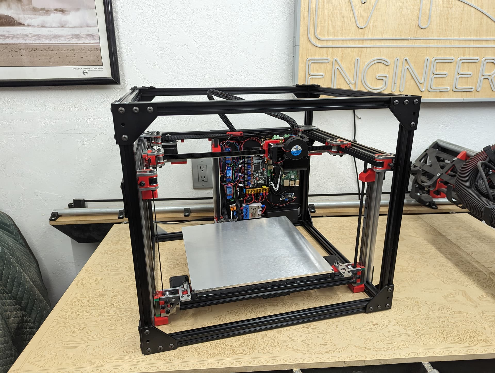

# MP3DP v5 CoreXY

This is a CoreXY with easily machinable plates for ultimate rigidity where it counts but 3D printed parts where it does not matter to save from complicated multi-sided milling.

Belted Z axis, with free floating bed to allow for physical tilt correction as well as mesh correction, and possible non-planer printer in the future. Electronic brakes provide easy drop protection for the bed.

{: width="600"}

More details to come, [forum thread](https://forum.v1e.com/t/v5-1-the-plated-printer/42809).**

[CAD link](https://myhub.autodesk360.com/ue29a24ab/g/shares/SH512d4QTec90decfa6e972762faaa11c772).

## BOM

### Bed Parts

### Extruder

### Frame

### Electronics

### Hardware

