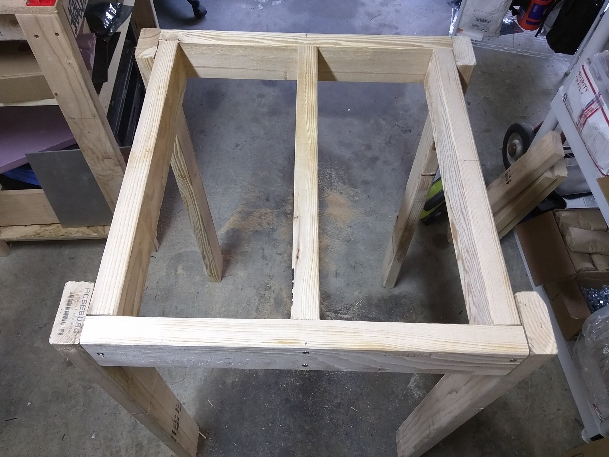
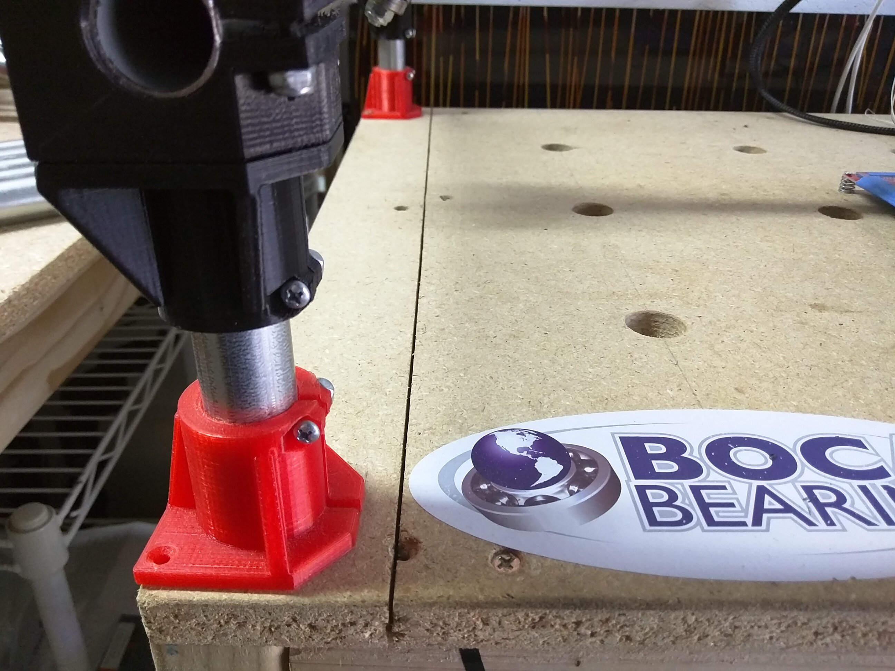

# Table

## How Fancy does it need to be?

Your table needs only be as fancy as a sheet of wood on a relatively flat, smooth surface. A CNC can self correct many of its own imperfections if needed. Typically, our tables only support the CNC and some material, so nothing heavy duty is typically required.

Any existing table that is large enough is fine, you can use it’s surface directly or a more popular option is to add a waste board of some sort that is replaceable as it gets used.

Next, as shown below, would be to build a basic table with any material that is easy to source for you. Accuracy is not super important, but the more square and flat you make it the better.

If you have a table saw, a Torsion Box table is pretty easy to make and can lead to a very stable surface that will last a long time.

Of course, once you have a CNC you can use it to cut out its own torsion box with fit together joints and all the fancy features you might want. This is a good feature that lets you build and use your CNC and then make any changes and do a minor rebuild.

## A Quick and Dirty Table

You can really use any table you have, the sturdier the better of course. If you don’t have a spare
table that you're willing to get really dirty, here is one I put together for a few dollars' worth of 2×4's.

{: loading=lazy width="400"}

Basic 2×4 table, screwed together.
___

{: loading=lazy width="400"}

I'd screw the table top on to keep it square, then cut the center out as a spoil board. That way it is
easy to replace without the need to disassemble the machine.
___
 
## GeoDave at it again! – parametric table

[GeoDave's table on Thingiverse](http://www.thingiverse.com/thing:1468511)

## MPTable??

Or try out my “Mostly Printed” Table, [MPTable](http://www.thingiverse.com/thing:1665991)

## Wanna share your table?

If you have a cool table and a few pictures, please click the pencil at the top of the page and add
your version. If you need some help, start a page in the forums and we can help add it for you!
