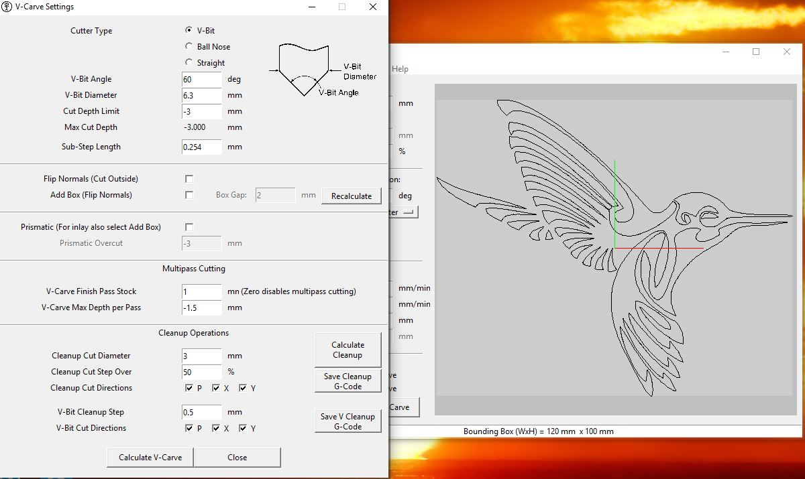
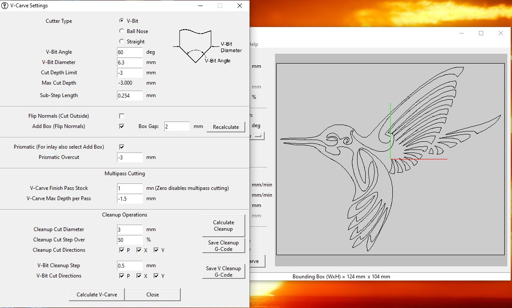
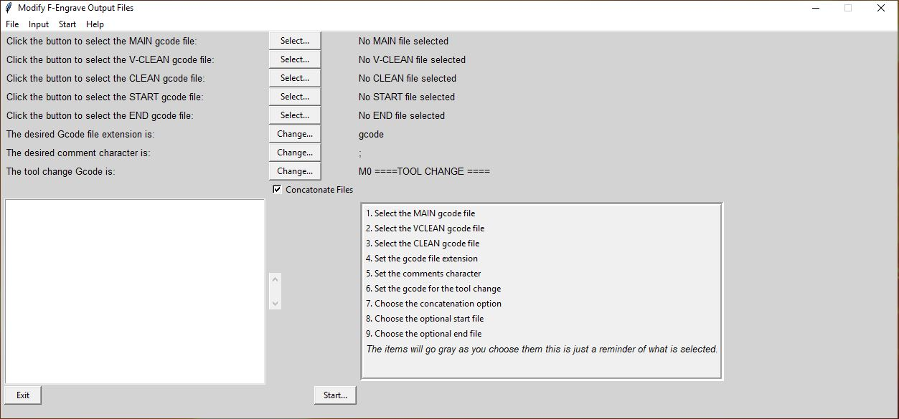

# V Carve Inlay Process Using F-engrave

These are instructions for combining the F-Engrave software with the MODfef script to create
a V-Carve Inlay with an MPCNC.

<iframe width="560" height="315" src="https://www.youtube.com/embed/SuHgjZDXi8k"
  title="YouTube video player" frameborder="0" allow="accelerometer; autoplay;
  clipboard-write; encrypted-media; gyroscope; picture-in-picture" allowfullscreen></iframe>

This video shows the process. Press (f) to show the video full screen.

## F-Engrave Preprocessing

1. Select the picture you want to use for your inlay
      - It is best to use a dxf or bmp file
    - It is better to use a black and white picture
    - The detail in the picture will determine its suitability for inlay work
1. Prepare the picture for use with F-engrave
    - I use Inkscape or Gimp or plain old Windows Paint
    - You may have to do some work on simplifying the picture or enhancing the details

## Starting F-Engrave

1. Start F-engrave and import your picture

    + The picture will display, some of the imperfections may be purely the representation but others may cause your inlay part to have defects
    + Make the necessary selections with F-engrave – see [Scorchworks instructions](http://www.scorchworks.com/Fengrave/fengrave.html#documentation "Scorchworks F-Engrave instructions")
    + Use the save Gcode option (this will be the “MAIN” file)
    + Save the Clean Gcode and the Vclean Gcode
       - If there is nothing to Clean or Vclean F-engrave will complain that the clean-up hasn’t been run.

{: loading=lazy width="650"}

### F-Engrave Settings

**Here are some working F-Engrave settings:**

{: loading=lazy width="750"}

* The first part that you are creating is the "female" part, this is pocket that will accept the inlay or "male" part.
* To create the "male" part you will need to mirror the image in F-Engrave, select Prismatic and Add Box on the V-carve settings.
* Then you will repeat the process of creating the gcode files for the "male" part. This may look odd, but it will fit snugly into the "female" part.

{: loading=lazy width="750"}

{: loading=lazy width="750"}

----

## Post Processing with MODfef

### Start MODfef and process the output files from F-engrave

1. Select the MAIN file, the “VCLEAN” file and the “CLEAN” file
1. You can also select a custom start file and end file (these are not produced by F-engrave)
1. You can select the file extension for your gcode file
1. You can enter a tool change line. The program will insert a pause here so you can change your cutter on the machine.
1. You can enter the character that should be used for comments. F-engrave will enclose comments in parentheses () by default.
1. You can choose if you want the files to be concatenated. If you select this it will make one file with a tool change.
1. The output file will have the same name as the “MAIN” file but with your new extension.
1. The concatenated file will contain the “START” file (if one is selected), then the “MAIN” file, then the “VCLEAN” file (if one is selected), then the tool change, then the “CLEAN” file (if one is selected), then the “END” file (if one is selected).

{: loading=lazy width="750"}

----

## Carving

1. Load the MODfef processed gcode file into Octoprint (or your gcode streamer)
{: loading=lazy width="750"}

1. Select appropriate wood for the inlay
    - Choose contrasting wood for the male and female parts
        - The male part is wood that will be inlayed.
        - The female part is the wood that will have the inlay glued into it.
1. Set up the work piece for the female part, remember that your origin is set to the middle of the inlay.
1. Set up the V cutter first.
1. Cut the female part.
1. If you have clean up files you will need to do a tool change, the system should just pause and allow you to complete that.
1. Set up the flat end mill that you specified in F-Engrave and complete the "female" part.
1. Once its complete, remove the "female" part and replace it with the "male" (inlay) wood.
1. Set up the V cutter again and set your origin over the center of the wood.
1. Cut the male part.
1. Once more if you have clean files you may have a tool change. It’s the same process that you completed with the "female" part.

## Clean up and Assembly

1. Once its complete clean up both parts.
    - I use a scalpel to clean any edges or corners that need it.
    - I also remove any burs that may be present.
    - I dry fit them to see that the gap between the male and female parts are consistent.
    - If it doesn’t look right using some color on the inlay protrusions during a dry fit can help to show where the parts are interfering.
1. Glue the parts together
    - I use regular wood glue and leave it to dry overnight
    - It is important to clamp the parts evenly as you can influence the fit which will spoil the inlay effect.
1. Trim the excess from the inlay (male part)
    - I usually do this on the band saw but you can do it with any tool that will remove the excess wood without dislodging the inlay.
1. Sand the part down until the inlay is flush
    - There is normally quite a bit of inlay wood to be removed, some form of belt sander works very well here.
1. Finish the part with the appropriate finish
    - It depends on the type of wood you have chosen. Select a finish that will work with both the female wood and the male wood.

----

## Additional Information and References:

F-Engrave - [Website](https://www.scorchworks.com/Fengrave/fengrave.html "Scorchworks F-Engrave site")

MODfef - [Download](https://www.jobbos.com/MODfef/MODfef2.zip "Download the zip file with for MODfef")

Inkscape - [Website](https://www.inkscape.org/ "Inkscape site")

Gimp - [Website](https://www.gimp.org/ "Gimp site")

Octoprint - [Website](https://www.octoprint.org/ "Octoprint site")

MPCNC - [Website](https://www.v1engineering.com/ "V1 Engineering site")

