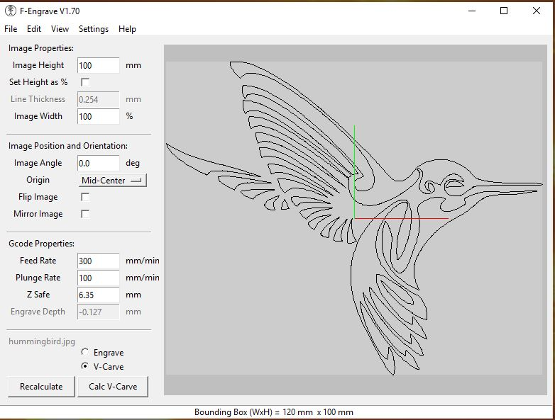

## Vcarve inlay process using F-engrave ##

- Select the picture you want to use for your inlay
    - It is best to use a dxf or bmp file
    - It is better to use a black and white picture
    - The detail in the picture will determine its suitability for inlay work
    
     
- Prepare the picture for use with F-engrave
    - I use Inkscape or Gimp or plain old Windows Paint
    - You may have to do some work on simplifying the picture or enhancing the details

* Start F-engrave and import your picture

    + The picture will display, some of the imperfections may be purely the representation but others may cause your inlay part to have defects
    + Make the necessary selections with F-engrave – see Scorchworks instructions
    + Use the save Gcode option (this will be the “MAIN” file)
    + Save the Clean Gcode and the Vclean Gcode
       - If there is nothing to Clean or Vclean F-engrave will complain that the clean up hasn’t been run.

    
