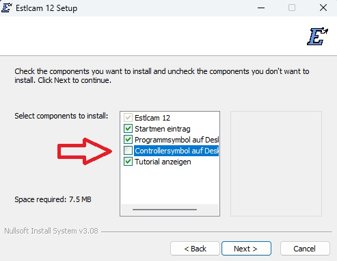
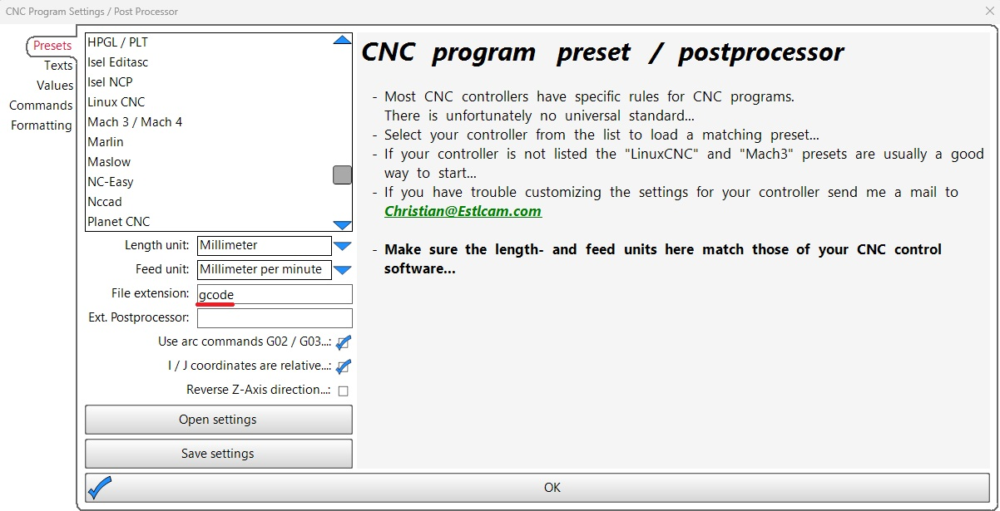
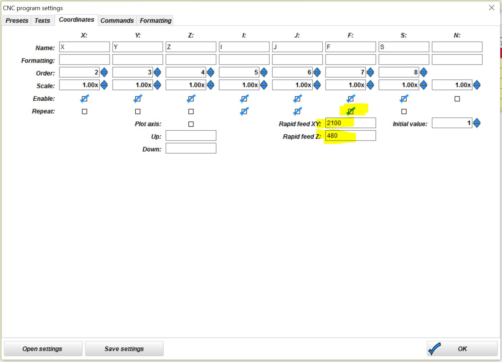
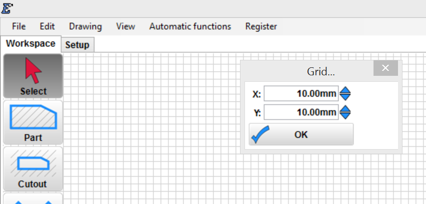
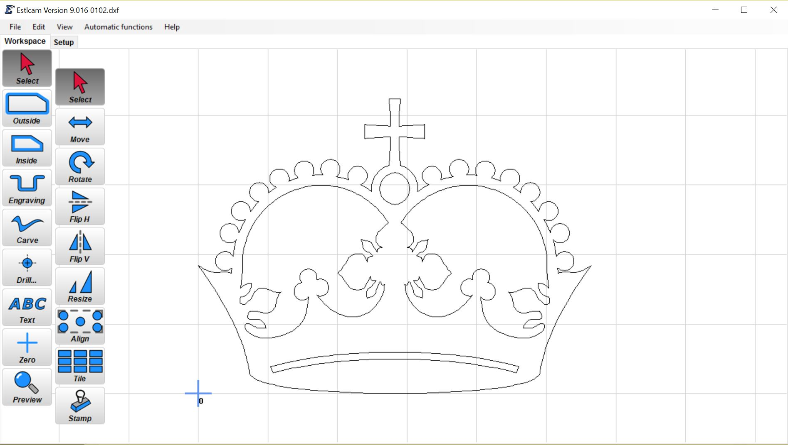
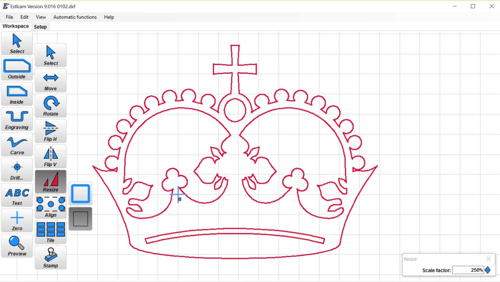
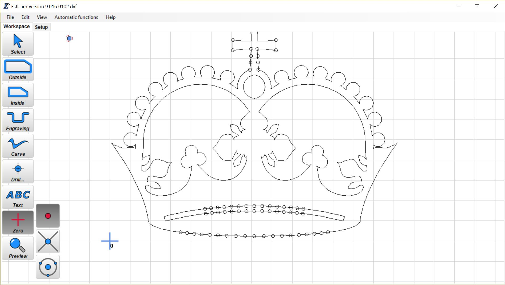
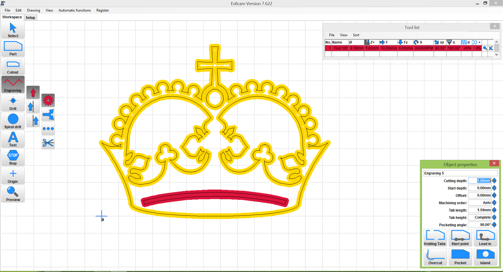
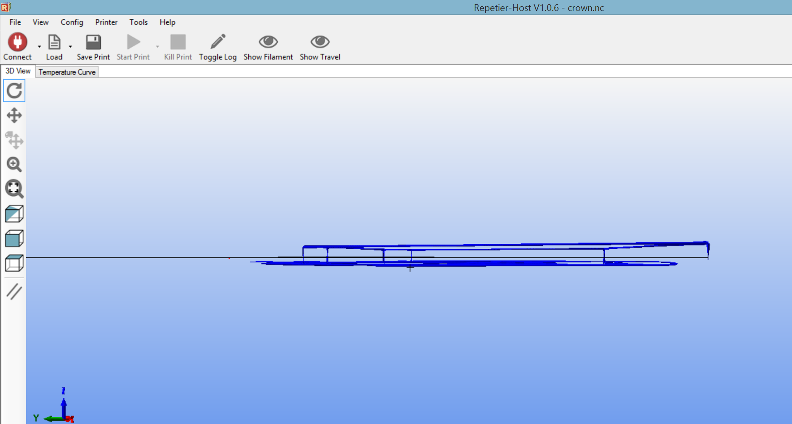

# Estlcam Basics

{: loading=lazy width="400"}

**EstlCAM is for making tool paths.**

Estlcam seem to be the easiest way to generate CNC tool paths that we can find. Generally this is used for everything except work with lasers, for that [lightburn](../tools/lasers.md/#lightburn) is the better program. This is a low cost program with a mostly unlimited free trial. anything you learn from estlcam will transfer over to other cam software so no time is "wasted" by starting with this program even if you are confident you will use another software package later.

Estlcam is also very easy for everyone here to troubleshoot. If you have CAM issues with other software you are pretty much on your own. Most of us know estlcam very well and can help you get going very easily.

If you are unsure what a tool path or CAM is I suggest taking a look at this page, [CNC Software Basics](../learn/software_overview.md/#tool-path-generationcam)

## Step one – Install Estlcam

[Estlcam is found here.](http://estlcam.com) Currently we recommend Estlcam V12.

{: loading=lazy width="400"}
The installer starts in German, you will be able to change this later.

---

{: loading=lazy width="400"}
Install Estlcam. Using the default options in the installer, remove the one controller option shown here.

---

{: loading=lazy width="400"}

 You will now need to launch Estlcam and continue the setup. In the top menu select Setup/basic setting. MAtch all the setting shown here, paying close attention to the seconds and minutes selection shown, it is common for people to get this wrong.

 If you are using the Jackpot CNC controller select **"GRBL"** here.

 If you are using the SKR pro or tother older V1 boards select **"Marlin"** here.

 For now other than language it is best just to match all of the settings shown. Only change these later if you understand them completely and have completed a job on your own. If you as for help chances are we are going to ask to see this screen.

After you click okay close Estlcam and restart it to update the settings.

## Step 2 – First Use Estlcam Setup

{: loading=lazy width="400"}

Next menu is "Setup/CNC Programs" Then "Presets" tab. Change the file extension “gcode” so all the programs recognize it.

---

{: loading=lazy width="400"}

The next tab to set is the "texts" tab. This is where you enter the starting, ending, and tool change setting from the [Milling Basics](../tools/milling-basics.md/#gcode---start-tool-change-and-ending) Gcode section. 

These will vary depending on your control board, but you can simply cut and paste the sections if you are using GRBL or Marlin.

---

{: loading=lazy width="400"}

In the "Values" tab, It is best to repeat the "F" values on each line, and this is where you set your "rapids" values. The values shown should work for everyone but can be modified later after evaluating your build to save a little time and move faster between cuts.

CLick "OK" to save, That is all it takes to get estlcam speaking the language the control board needs. You should not have to change any of those setting often if ever again.

---

{: loading=lazy width="400"}

Next up is the travel feed rates. 2100/60=35mm/s, 900=15mm/s (keep the Z low)

{: loading=lazy width="400"}

I delete all the default tools and use this as a conservative test speed setting for an 1/8″ flat
endmill in wood. Do not exceed 8mm/s in the z plunge field unless you know what you are doing and
know what firmware limits you have.

You are ready to generate some GCode.

## Step 3 – 2D gcode, Good for pen plotting or 2D milling (cutting things out)

Grid Size. DXF files are crazy sizes sometimes so to make sure your DXF is the right size change the
grid. Found in **View>Grid** I set mine to 10mm or 25.4mm=1in.

{: loading=lazy width="400"}

For this 2D or 2.5D work .DXF files are used. You can use any vector program to make them,
illustrator, SolidWorks, etc. Get some files from here, (Need a new source, sorry).

I used this one in the [video](https://youtu.be/s8YwkcK3P9U), [Crown Vector](../img/old/2018/08/0102.zip).

Open DXF. **File>Open** – If your DXF is completely the wrong size try again with different initial
units.

{: loading=lazy width="400"}

This is what the crown looks like imported in inches as the initial units. This is whatever units
you save your DXF as.

{: loading=lazy width="400"}

## Step 4 – Scale / Re-Zero

The crown imported at about 55mm wide I want about 150mm wide.

**Select>Resize>Drawing Layers**, then click on the DXF to select it. I scaled the crown 250x to get it
to 150mm (5 3/4″).  Zoom out to see your DXF.

{: loading=lazy width="400"}

**Zero>Create arbitrary point**, then select outside of the DXF paths. This is how to set your origin
(or Home). The little blue plus symbol is what your machine sees as 0,0 (x=0, y=0, generally the
lower left corner of your work). When you start your program the machine will work to the right and
above where you start it from (represented by the blue plus). Some people like to work from the
center for round or oval objects.

{: loading=lazy width="400"}

## Step 5 – Select the tool paths

To use the pen you want to draw on the line so use engrave (tool centered on line), if you were
cutting a part you can choose part (tool edge on the outside of line), or cutout (tool edge in
inside of line). Click **Engrave** then just click on each line segment.

{: loading=lazy width="400"}

## Step 6 – Save

Export. **File>Save CNC Program**. Give it a name. You will get a depth popup, for the pen I use 1mm or
less, anything else, set it to the thickness of your material plus a bit to cut all the way through.
You can then preview the path.

## Step 7 – Control Software

Open [repetier-host](http://www.repetier.com) or log into your Jackpot (ssid-fluidnc). load the  file you just saved. If you have the bed size
adjusted you can get a sense of scale. 
If you can’t see the lines in repetier-host check the box "Print Preview>Show Travel moves".

{: loading=lazy width="400"}

View it from the edge and you can see that the path is below your z-home, and the movements are
above z-home.

{: loading=lazy width="400"}

Don’t pay any attention as to where it is shown on the bed. It will start where ever your head
currently is.

## Step 8

Start. Put the tip of the pen (or tool) a hair above where you want it to start and hit run. It
should pick up, move, drop down and go. If it goes down first and doesn’t pick up between moves
your z axis is backwards. [Flip the plug](../software/reverse-motor.md).

## Test File

[Test Crown 12mm/s GCODE](../img/old/2015/09/Test-Crown-12mms.gcode)– [Test Crown 12mm/s Zipped file](../img/Test-Crown-12mms.zip).

This all it takes to plot with a pen or do basic 2D (2.5D) milling, some of the most common
things this type of mill is used for. Make sure to adjust your tool and its settings depending on
the material in use. Always do a test cut!

Here is an old video, the new [Primo pen / knife holder](https://github.com/V1EngineeringInc/MPCNC_Primo_Tool_Mounts/tree/master/Knife_Pen_Mount) has built in spring so you will get even more consistent results.

<iframe width="560" height="315" src="https://www.youtube.com/embed/s8YwkcK3P9U"
  title="YouTube video player" frameborder="0" allow="accelerometer; autoplay;
  clipboard-write; encrypted-media; gyroscope; picture-in-picture" allowfullscreen></iframe>

This video is of the very first MPCNC, drawing the very first test crown (that I still have framed in my room). This video still makes me smile ear to ear, I am very proud of it even though we can do so much more and so much faster these days. At the time this was amazing and I hope your first crown feels the same way.

P.S. the crown's "jewel" is not perfectly round. 

## Milling Basics

Once you can do some drawings and you are ready to try and cut something, here are some [Milling Basics](../tools/milling-basics.md).
