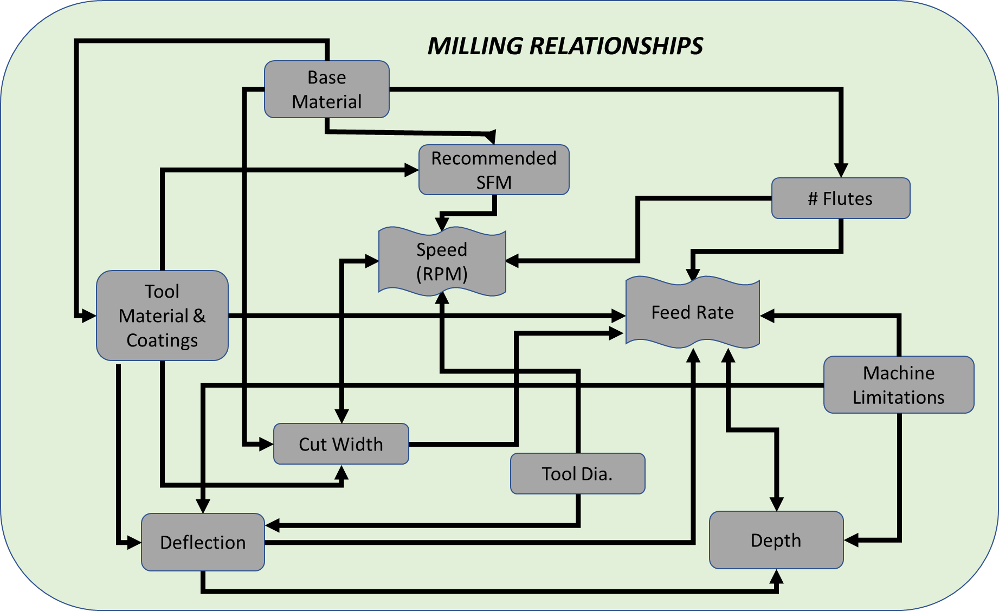

# Milling Metal

#### By Clark (@clarkspeed in the forums) [Forum discussion](https://forum.v1engineering.com/t/milling-metals-documentation/29881)

## Summary

If you keep the machine small, and follow the practices outlined below, the MPCNC is capable out of
the box for light duty cutting of metals. The stiffness of the design is adequate
and low horsepower routers and spindles work fine. 

Nothing extra is really required for cutting metals but the 
best upgrade would really be a variable speed router to provide a larger window to dial in feeds and
speeds and perhaps an air blast system for cooling and clearing chips. 

Don’t be afraid to experiment! This article is only intended to get others started and understand
how to troubleshoot problems. Think about the chips and look at them when making changes. If you
want to go deeper in the subject use a good feeds and speeds calculator and read on-line articles 
specific to each number or setting in calculator.

## Chips are the goal

Milling is dependent on the ability of the tool to make a chip as it rotates.

Say you are cutting a relatively hard material like steel with a ½” endmill and the cut you need
to make is a slot. The mill is going to be surrounded 180 degrees by material as it moves forward.
It has a generous 1/2 turn to make the chip and you would probably not feed the tool into the
material very quickly.

For this scenario, you would not need very many RPM’s on you spindle (speed), the feed rate would be
rather slow and the MRR (Material Removal Rate) could be quite high depending on depth. It would
require a decent amount of HP and torque along with cooling fluid. You would need a very stiff and
heavy machine to do this.

So how do we adopt this process to a lightweight, high RPM, low HP, home built
machine? Each cutting parameter must be tuned for the machine. 

## Speeds (RPM)

The first adjustment in moving from a conventional heavy mill to a router-based gantry mill is
RPM.

Let’s assume the worst case in using a DeWalt DW660 or similar with no speed control. In essence,
the speed portion of the MPCNC speeds and feeds is already set. When a router is spinning at 30,000
RPM there is an extremely small amount of time to make a chip as the cutter blade enters and exits
the material.

To adjust for this, simply enough, a router-based mill is set up to make smaller chips.

### Make Smaller Chips

There are essentially 3 ways to reduce the chip size to the point of being in the speed zone of a
router.

#### Reduce the tool diameter

??? SFM (surface feet per minute)

     (surface feet per minute) is the speed of the cutter in relation to the part. SFM is directly
     related to the spindle RPM by the equation SFM=RPM X Circumference of the cutter. Tool
     manufacturers provide a recommended SFM based tooling geometry and type of material being cut.

The harder the material being cut, the slower the SFM required. Mild steel requires roughly half
the SFM as aluminum. This is an important point because moving from wood, to aluminum, to mild steel
requires either slower and slower spindle speeds or smaller and smaller cutters. Luckily 1/8”
diameter endmills can get close to the correct SFM for many metals.

#### Decrease the number of flutes

When cutting a slot an endmill is going to be surrounded 180 degrees by material as it moves
forward.

With 2 flutes you only need ½ the time as a single flute to generate the same chip and so on.
Therefore, the more flutes you have, the faster your RPM and feeds must be to make the same sized full chip.
More flutes = require higher RPM’s, more machine rigidity, and faster cutting speeds.

That sounds like a really cool way to jack up your productivity until you understand the practical
limitations, machine ridity, chip clearing, and feedrate.

For each flute on the cutter the machine will be engaged in the material. Two flutes equal nearly two times the 
load on the machine of a single flute cutter.

For each flute on an equal sized cutter there is a smaller path for the chip to get ejected.

The practical limit of travel speed for a standard MPCNC build is around 1800 mm/min. If we can’t
feed faster than that, clear the flutes, or resist the cutting load, than more flutes will not help us. 

#### Limit the cut width

Chip load relates the thickness of a chip removed by each cutting edge. This
is parameter is specific to the tool and the material being used. You can have to small and too large of a chip.

For each revolution a single flute end mill needs to cut and discharge a single chip. I referenced
the worst case in cutting a full slot with 100% cut width, but if we avoid making a slot and only
use 15% of the tool diameter for cutting, then we have even less time to generate that full chip and
more RPM is needed.

Therefor by using a small diameter cutting tool with a small number of flutes
and limiting the cut width, we can cut metal at an RPM attainable by a fixed RPM router and within
the working parameters of the MPCNC. **That is the “sweet spot”.**

Limiting the amount of material that the cutter engages with does a couple of things. You are not
only able to match the router RPM to get that full chip, but it also reduces the load on the tool
and machine. Another benefit is relatively fast feed rates, deeper cuts, and better cooling.

Even for large industrial machines there is an optimum RPM, cut width, and feed rate that allows the largest
MRR, which is what really matters. 

Climb milling is preferred over conventional when using this strategy.

## Feed Rates

Once a proper end mill is selected in terms of number of flutes and cut width is determined, the next big challenge is feed
rates.

High RPM usually means high feed. By limiting the cut width on a 1/8” endmill you can achieve
incredibly fast feed rates of 3000mm/min or more! This is the basis for high-speed machining (HSM).

However, the MPCNC is limited on feed rates to about 1800 mm/min and has a certain amount of
deflection in the rails. So, the challenge is to cut materials at a feed rate that is appropriate for the
machine and above the point of chip thinning.

??? Chip thinning

     Chip thinning as it sounds is a condition where you are not making a full chip anymore. As the chip
     gets thinner, less heat is removed from the cut and overheating occurs because the tool is rubbing
     the material instead of cutting it. This will limit tool life.

Bottom line, we want feed rates to be as fast as we can go without overloading the tool, the machine, while 
still getting a proper sized chip. Going very slow to ease your way through will not work.

To summarize thus far, end mills can be programmed to run with a limited cut width in
a high RPM router to make proper size chips and cut metals adequately. There are other factors
we still must deal with. The next issue is deflection, and it not only limits the feed rate we can
move but also the cut depth. I will separate this into 2 separate topics, tool deflection and
machine deflection.

### Tool Deflection

Tool deflection is the tool sticking out of the spindle flexing and bending as
it comes into contact with the wall. This can and will break tools. Normally the simplest way to
compensate is use a bigger diameter cutter. If you have a variable speed router you have some
options here but if you only have 25-30,000 RPMs to work with you are probably stuck with a 1/8”
diameter cutter. If you think you are breaking tools due to tool deflection, there are a few things
you can change to solve this issue and they are not too difficult.

**Tool made of carbide** – much stiffer material, this is the least you will need to do to cut
metal.

**Smaller cut length** – purchase tools with shorter flutes, not longer.

**Reduce stick out** – push the tool as deep into the collet as you can to run at the depth you
need. Mount the tool with only the flutes exposed and a very small amount of the stem sticking out
of the collet. Avoid long reach end mills.

**Tool coatings** – Tool coatings have multiple benefits including increasing stiffness and
extending life.

 - **AlTin** – Highest temp resistance, good for dry machining of tough alloys such as titanium, Inconel, and stainless steel.
 - **TiCN** – Better than TiN and often used for stainless steel, cast iron, and harder steels
 - **TiN** – General purpose for mild steel, stainless steel, and Inconel
 - **ZrN** – Resists gumming of sticky materials. Best choice for nonferrous materials such as aluminum and plastics.

### Machine Deflection

Next up is machine deflection. This the most difficult variable to quantify. **Smaller machines will
be more rigid than larger machines.** If you intend on cutting metal you should limit the bed size as small as possible 
and only increase it as you gain experince.

First of all, before you run any program in metal, make sure your CNC mill is tight. For the MPCNC,
check all of the bearings to make sure that they are touching a metal tube. No free spinning
bearings that do not touch the rails. No exceptions. Then lock the motors in, grab the core, and try
to move it around. Look for any movement and try to determine where it is coming from. If your
machine is not tight, cutting metal will be a very frustrating experience. Watch it closely as it
runs. If you see a cut start to deteriorate, it is most likely the machine loosening up or a tool
that is dull. Sadly enough, the machine loosening up will cause the tool to dull.

If things do start to loosen up over time, best practice is to reinstall the fastener with
Loctite but do not over tighten.

Follow the original assembly instructions. Cranking up the torque on the
screws creates more stress in the PLA which in turn causes more creep or relaxation in the material, and this is accelerated 
by the surrounding temperature in the environment. Proper torque on the bolts and screws is better than tighter.

## Depth of Cut

If you have the right tool, proper cut width, and reasonable feed rates that all match
the router RPM, then the only limitation to go deeper and deeper is machine rigidity.
Deeper cuts are actually better for the process. The more material in
contact with the flutes spreads the force of cutting into more of the tool. This increases tool
life.

If you only cut at 1/2mm depth, the very tip of the tool must do all of the work and will dull in a
much shorter time while the rest of the tool is still sharp.

But on the contrary, the deeper the cut the more force is imparted on the tool and into the machine
causing deflection.

**This can only be dialed in with trials and experiments.** If you go conservative with 1 or 2 mm
cuts, you will go through tools faster, and if you cut at 6, 7, or even 8mm depth, you may exceed
the deflection of the machine and possibly the tool.

Once your CNC is pushing the maximum feedrate, increasing depth becomes the best opportunity for 
increasing your MRR while maiintaning a proper chip size.

## Example Tool Manufacturer Recommendations for 1/8" diameter, 2 flute end mill

### Wrought Aluminum Most Grades SFM=1000

|                     | Slotting            | Roughing            | Finishing            |
| ---                 | ---                 | ---                 | ---                  |
| Chip Load           | 0.00151 in          | 0.00198 in          | 0.00217 in           |
| Radial Depth of Cut | 1 x Dia. = 3.18mm   | 0.6 x Dia. = 0.19mm | 0.25 x Dia. = 0.79mm |
| Axial Depth of Cut  | 0.5 x Dia. = 1.59mm | 1.0 x Dia. = 3.18mm | 1.0 x Dia. = 3.18mm  |

### Carbon Steel Low Carbon SFM=600

|                     | Slotting            | Roughing            | Finishing            |
| ---                 | ---                 | ---                 | ---                  |
| Chip Load           | 0.00052 in          | 0.00061 in          | 0.00068 in           |
| Radial Depth of Cut | 1 x Dia. = 3.18mm   | 0.6 x Dia. = 0.19mm | 0.25 x Dia. = 0.79mm |
| Axial Depth of Cut  | 0.5 x Dia. = 1.59mm | 1.0 x Dia. = 3.18mm | 1.0 x Dia. = 3.18mm  |

## Putting it all together

If you have followed this so far, you may have realized that all of these things interact.

You may be able to cut a little deeper if you slow down the feed rate. Sure, as long as you don’t go
too slow.

You may be able to speed up the feed rate by selecting a tool with more flutes. Sure, if you don’t
exceed the feed rate or rigidity of the machine.

And on and on. Speed and Feed calculators are a great way to play around with different settings to
see what changes.

Here is a diagram that shows some of the intermingled relationships.

Of course, there is more to think about. These were some of the basic settings that effect your MRR.

## Advanced Topics

### Runout

Runout is how far off center your cutting edge is on your tool. Nothing is perfect so any and typically all
of the spinning componets add to the total runout, motor bearings, shaft, collet, and tool.

Low runout is critical for high-speed milling with small cutters. The tool will get loaded
heavier in the area of runout which will affect the chip load. Imagine a 2 flute endmill with a
small chip made on 1 flute and a large chip made on the other while you are trying to set your
machine to a nominal value.

For a router there can be runout in the spindle and in the collet. Check both. Use a dial
indicator with a base. A loose tool can deform the collet so check it maybe every 10 run hours or
anytime a tool falls out. If the collet has excess runout replace it. Check for any debris that may
be causing a problem.

Poor or worn bearings can cause runout in the spindle. You may need to replace the bearings or
choose another router.

You should try to limit the total combined runout to below 0.001”. That is really small and
difficult to measure without a quality gauge. Once you cannot reduce the runout anymore be aware
you may need to reduce the cut width more to compensate for the maximum runout value.

### Tool Quality

Buy the best tools you can afford. Each step up gives increased advantage. At the
lowest level are high speed steel endmills. For a quick one-off job in aluminum, you might get away
with it, but you will need to go really easy. As a minimum you should step up to a carbide tool.
It will last longer and resist deflection much better. Carbide tools are a must for mild carbon
steel.

The next step up is a coating. Use TiN or better for steel and aluminum. It increases
hardness and tool life. Even better for aluminum is ZrN. This coating not only has increased
hardness but resists gumming up. It will allow you to use a 2 or 3-flute endmill and run faster
feed rates.

### Chip clearing

This is very important especially in aluminum. You must keep the chips clear of the cutting tool.
This is easy enough when pocketing or face milling but gets much more difficult when doing a
trochoidal slot.

The deeper you cut, the more difficult it is to clear them. There are various ways to deal with
this. The most common is a compressed air jet either manual or continuous flow. Other techniques
include vacuum attachments, or if slotting all the way through the part, leaving a gap on the back
side for the chips to fall.

If nothing else, you can just limit the cutting depth, but that reduces MRR and adds time to the
process.

### Cooling

A full flush cooling system is a little impractical for the MPCNC but could be done. If you really
run a lot of metal in your machine it might something to consider.

You can lubricate aluminum with a mist. It will reduce the tendency of aluminum to gum
up. A misting system can be built easily for less than $50 plus the cost of small air compressor. A
spray bottle also works if you monitor the cutting.

You can use various fluids including water-based machining lubricants or light oils. A lubricant
mist helps but is not required for steel and it cuts rather well dry.

Here is a simple diagram of a misting system. It floods the area with tiny droplets but does not
atomize the fluid into a fog you can breathe. You can find more details and specific instructions
with a Google search.

### Surface finish

If you need a better surface finish, that usually means taking a final thin pass of
0.2-0.3mm and slowing the feed rate down, a "Finishing pass" or "Spring pass". You may also reduce 
the cut width. If your surface finish
is deteriorating while you cut, you will need to troubleshoot the cause.

## Programming (CAM) for Metals

The final piece of the puzzle is programming your machine’s g-code in a way
that minimizes tool loads and power. This is where all of the many factors previously described
need to be addressed. Some CAM software packages do this much better than others. You may not need
to incorporate all of these strategies depending on the robustness of your machine but by using them
you guarantee low consistent tool loads and no surprises. These become much more important when
cutting ferrous metals like steel.

 - **Avoid plunging** a MPCNC into metal. Always use a helical spiral when entering the metal from the
   top. Endmills do not drill very well to start with, but if you do need to drill metal with an
   endmill, you must go slowly. Another idea for smaller diameter holes is just center mark the
   location of the hole with your CAM program and complete the drilling on a drill press. For starts
   and stops you may need to drill access holes with a drill press. If you must plunge, limit the z
   speed and depth of plunge as much as possible. You can deflect the rails enough to lift a router
   by plunging too fast.
 - Only use milling strategies that avoid loading the tool beyond the cut width you desire. A
   **Trochoidal (or adaptive)** tool path is great for this. It avoids excess tool loads by limiting cut
   width and by moving away from the cut on each tiny circle it cools the tool even more. It is the
   best programming strategy for making slots, but it can be slow due to a large percentage of the
   machine movement is not productive. A 1/8” diameter endmill with 50% Trochoidal width and 8%
   stepover will only advance at 5% of the feed rate. For this reason, you should be able to run
   most Trochoidal cuts at the maximum feed rate of the MPCNC.
 - **Peeling** is another good strategy you can use to minimize tool engagement. Just be careful where
   you enter and exit the material and the corners.
 - When changing directions in a corner some programs will push the tool into a 180-degree cut
   width. You may need to cut a clearance area or “oversize” the tool path to avoid the wall turn.

 - **Experiment** with different strategies. A trochoidal outline for clearance, peeling a pocket, and
   trochoidal pockets can all be combined.
 - **Test** your strategies with wood or other soft material. This is very important if you are unsure
   of how the tool will move.

## Baseline Settings

Now for the good stuff. Even if you do not fully understand this article you can use the following
chart as a starting point. It is based on using coated solid carbide 1/8” diameter endmills 1-1/4”
long, 1/4” length of cut, running at 30,000 RPM. For mild steel, toolpaths must limit the tool
engagement no more that the cut width recommended. Always experiment with wood if unsure of
toolpaths.

When running trials, start with the lower side of the cut width range and dial up the feed rates as
you go. Then experiment with cut width and depth to find your own sweet spot.

| Material         | Tool Diameter\n(in) | Flutes | RPM   | Feedrate Range\n(mm/min) | Cut Width Range % of diameter | Starting Depth | Note         |
| ---              | ---                 | ---    | ---   | ---                      | ---                           | ---            | ---          |
| Aluminum         | 0.125               | 1      | 30000 | 300-800                  | 8.9-14%                       | 3              | Mist Cooling |
| Aluminum         | 0.125               | 2      | 30000 | 850-Max                  | 8.9-14%                       | 3              | Mist Cooling |
|                  |                     |        |       |                          |                               |                |              |
| Low Carbon Steel | 0.125               | 2      | 30000 | 900-Max                  | 4.7-5.7%                      | 1.5            |              |
| Low Carbon Steel | 0.125               | 3      | 30000 | 1300-Max                 | 4.7-5.7%                      | 1.5            |              |

Speed and Feed calculators are available to dial in other options such as variable speed routers,
larger diameter tools, different materials, etc. I highly suggest using one so you can see how each
parameter can interact with others. I don’t know how far you can push the envelope with your MPCNC,
but other router-based mills have run stainless steels, Inconel, and titanium with proper set up and
high-quality tooling.

