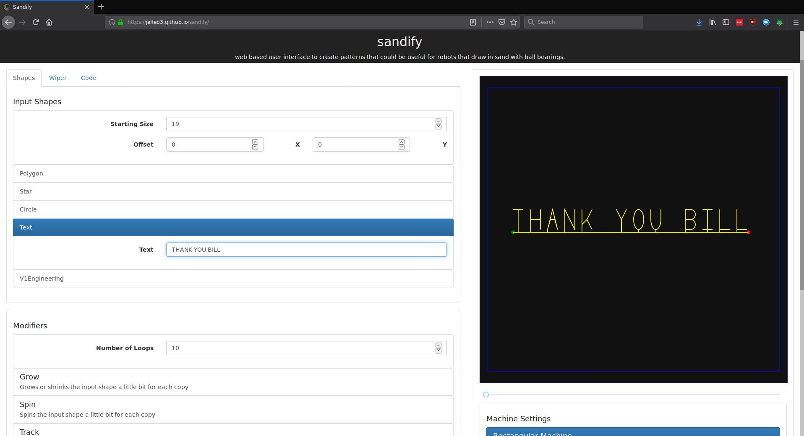

# ZenXY v3

COMING SOON

## Pattern Software

**Sandify**

{: loading=lazy width="450"}

Amazing patterns are easily possible by using [Sandify.org](https://sandify.org/), the back end is here [Sandify on GitHub](https://github.com/jeffeb3/sandify),
This table would be nothing without this tool! ([feel free to show some appreciation for this amazing free piece of
software](https://liberapay.com/jeffeb3/)).


## Bill of Materials

1- You will need to buy or build a table, usually suited to fit two pieces of tempered glass.

2- A full set of printed parts, buy from the [V1 Shop](https://www.v1e.com/products/zenxy-v3-printed-parts-set), or 3D Print your own [Printables](link).

3- You can buy most of the other specialty parts and hardware here, [V1 Shop](https://www.v1e.com/collections/zenxy){:target="_blank"}

|QTY  |Description             |Comment                                        |Link                        | 
|-----|------------------------|-----------------------------------------------|----------------------------|
|1    |Control Board           | 5 driver minimum, More info below             |[Shop][sh1] – [Elecrow][am1]|
|1    |Extrusions              | More info below                               |[Shop][sh2] – [Elecrow][am2]|
|2    |Steppers                | Nema 17, most any torque will work            |[Shop][sh3] – [Elecrow][am3]|
|1    |Power Supply            | 12-24v (board dependant) ~0.5A+               |[Shop][sh4] – [Elecrow][am4]|
|3    |V-Wheel Blocks          | 50mm                                          |[Shop][sh5] – [Elecrow][am5]|
|x    |Pulleys                 | 6mm                                           |[Shop][sh6] – [Elecrow][am6]|
|x    |Smooth Idlers           | 6mm                                           |[Shop][sh7] – [Elecrow][am7]|
|x    |Toothed Idlers          | You can actually substitute smooth idlers     |[Shop][sh8] – [Elecrow][am8]|
|1    |Belt                    | More info below                               |[Shop][sh9] – [Elecrow][am9]|
|1    |Magnet                  |                                               |[Shop][sh10] – [Elecrow][am10]|
|1    |Steel Ball              |                                               |[Shop][sh11] – [Elecrow][am11]|
|x    |Cable Ties              |                                               |[Shop][sh12] – [Elecrow][am12]|
|x    |Extrusion Screws        |                                               |[Shop][sh13] – [Elecrow][am13]|
|x    |Extrusion T-Nuts        |                                               |[Shop][sh14] – [Elecrow][am14]|
|x    |M3                      |                                               |[Shop][sh15] – [Elecrow][am15]|
|x    |M5                      |                                               |[Shop][sh16] – [Elecrow][am16]|
|x    |Attachment screws       |                                               |[Shop][sh17] – [Elecrow][am17]|
|2    |Optical Endstops        |                                               |[Shop][sh18] – [Elecrow][am18]|
|1    |                        |                                               |[Shop][sh19] – [Elecrow][am19]|

[sh1]: https://www.v1e.com/products/jackpot3-cnc-controller
[sh2]: 
[sh3]: https://www.v1e.com/products/nema-17-76oz-in-steppers
[sh4]: https://www.v1e.com/products/24v-power-supply
[sh5]: 
[sh6]: 
[sh7]: 
[sh8]: 
[sh9]: 
[sh10]: https://www.v1e.com/products/1-2-x-1-2-magnet
[sh11]: https://www.v1e.com/products/1-2d-steel-ball
[sh12]: 
[sh13]: 
[sh14]: 
[sh15]: 
[sh16]: 
[sh17]: 
[sh18]: https://www.v1e.com/products/optical-endstop
[sh19]: 

[am1]: https://m.elecrow.com/pages/shop/product/details?id=207484&
[am1]:
[am1]:
[am1]:
[am1]:
[am1]:
[am1]:
[am1]:
[am1]:
[am1]:
[am1]:
[am1]:
[am1]:
[am1]:
[am1]:
[am1]:
[am1]:
[am1]:
[am1]:

___

## Control Board

There are a lot of options.

Any board with two drivers or more with firmware capable of running CoreXY, and TMC silent stepper drivers are highly recommended.

**[TMC2209 Pen/Laser Controller](https://m.elecrow.com/pages/shop/product/details?id=207484&)** -  by Bart Dring, seems 
to be a perfect match for the Zen. This board has the silent 2209 drivers, and the esp32 has a built-in web interface for wireless
control and file transfer.

## Calculator for Extrusions, Belt, Glass


## Example table

## Assembly

## Wiring

 :smile:.


## Firmware

This is running CoreXY kinematics and requires homing Y before X, as set in the firmware. All firmware will also need the exact size of your 
build's work area using soft limits to stop from crashing with bad gcode. The only other thing to set is homing and max speeds depending on what you prefer.

Here is an example FluidNC TMC2209 Pen/Laser Controller Firmware config file [Semi Pre-Configured GitHub Repo](https://github.com/V1EngineeringInc/FluidNC_Configs).


## Example Starting Gcode

When using Sandify, or any other software you usually need to set the starting or homing Gcode. You can cut and paste what is below and adjust for your specific build if needed. 

For FluidNC/GRBL you can use
```
$HY
$HX
G1 F2000
```

For Marlin it would be
```
G28 Y
G28 X
G1 X1 F2000
```
Here is a Human readable version of that
```
Move the Y axis all the way to the trigger.
Move the X axis until it triggers.
Set the move speed to 2000mm/min (33mm/s). 
```

## ZenXY v2 to ZenXY v3

If you want to use your previous table and retrofit a new machine it is possible. The ZenXY v3 has a slightly smaller footprint so you can use the offset templates when installing the new corner parts to make it easy.

You can use your same control board, steppers, end stops, magnet and ball, the rest of the printed parts and hardware are different.

Parts link - 

Picture - 

## Adding WLED


## License

If you like our work or want to sell sand tables your support is appreciated. Donation links, [Github Sponsor](https://github.com/sponsors/V1EngineeringInc), PayPal(https://www.paypal.com/donate/?hosted_button_id=LAXN6LWJMB3QS) 

[![CC BY-SA 4.0][cc-by-sa-shield]][cc-by-sa] 

This work is licensed under a
[Creative Commons Attribution-ShareAlike 4.0 International License][cc-by-sa].

[cc-by-sa]: http://creativecommons.org/licenses/by-sa/4.0/
[cc-by-sa-image]: https://licensebuttons.net/l/by-sa/4.0/88x31.png
[cc-by-sa-shield]: https://img.shields.io/badge/License-CC%20BY--SA%204.0-lightgrey.svg
