# ZenXY v3

Picture or gif needed
---

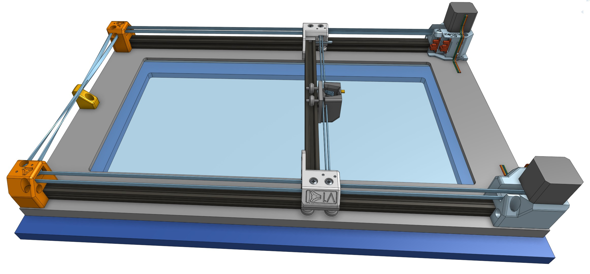{: loading=lazy width="800"}


## Pattern Software

**Sandify**

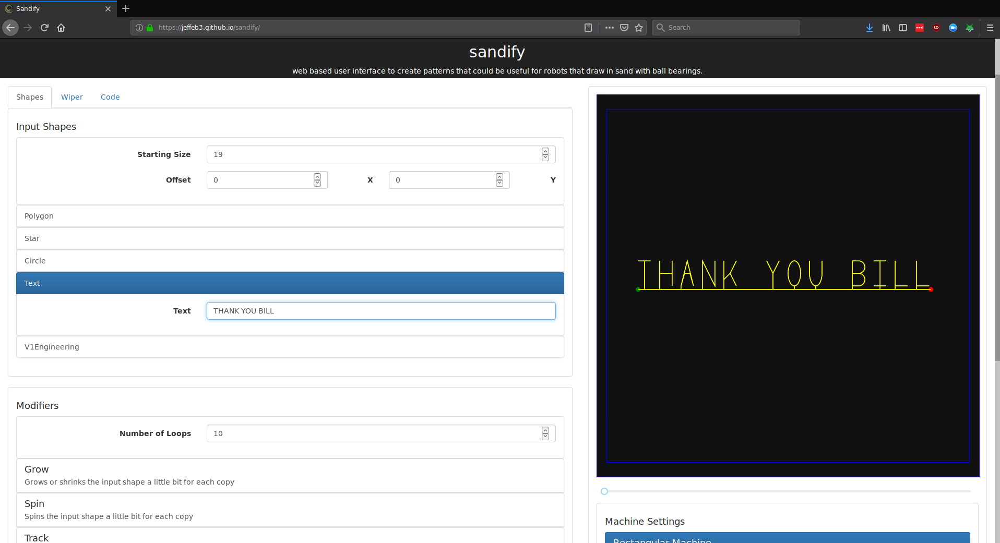{: loading=lazy width="450"}

Amazing patterns are easily possible by using [Sandify.org](https://sandify.org/), the back end is here [Sandify on GitHub](https://github.com/jeffeb3/sandify),
This table would be nothing without this tool! ([feel free to show some appreciation for this amazing free piece of
software](https://liberapay.com/jeffeb3/)).


## Bill of Materials

1- You will need to buy or build a table, usually suited to fit two pieces of tempered glass.

2- A full set of printed parts, buy from the [V1 Shop](https://www.v1e.com/products/zenxy-v3-printed-parts-set), or 3D Print your own [Printables](link).

3- You can buy most of the other specialty parts and hardware here, [V1 Shop](https://www.v1e.com/collections/zenxy){:target="_blank"}

|QTY  |Description             |Comment                                        |Link                        | 
|-----|------------------------|-----------------------------------------------|----------------------------|
|1    |Control Board           | 5 driver minimum, More info below             |[Shop][sh1] – [Elecrow][am1]|
|2    |Extrusions              | Length info below - V-Slot 20/20              | Shop       – [Amazon][am2]|
|2    |Steppers                | Nema 17, most any torque will work            |[Shop][sh3] – [Amazon][am3]|
|1    |Power Supply            | 12-24v (board dependant) ~0.5A+               |[Shop][sh4] – [Amazon][am4]|
|3    |V-Wheel Blocks          | 50mm                                          |[Shop][sh5] – [Amazon][am5]|
|2    |Pulleys GT2             | 6mm width, 5mm bore, 16T+                     |[Shop][sh6] – [Amazon][am6]|
|6    |Smooth Idlers GT2       | 6mm width, 3mm bore, 20t                      |[Shop][sh7] – [Amazon][am7]|
|2    |Toothed Idlers GT2      | same as above, or use smooth idlers           |[Shop][sh8] – [Amazon][am8]|
|1    |Belt                    | GT2 6mm, More info below                      |[Shop][sh9] – [Amazon][am9]|
|1    |Magnet                  | 1/2" x 1/2" Neo                               |[Shop][sh10] – [Amazon][am10]|
|1    |Steel Ball              | 1/2"                                          |[Shop][sh11] – [Amazon][am11]|
|8+   |Cable Ties              | 18lb, 2.4mm                                   | Shop        – [Amazon][am12]|
|4    |Extrusion Screws        | M5x10                                         |[Shop][sh13] – [Amazon][am13]|
|4    |Extrusion T-Nuts        | Fit 20 Series                                 |[Shop][sh14] – [Amazon][am14]|
|20   |M3x20                   | Phillips Pan Head                             |[Shop][sh15] – [Amazon][am15]|
|7    |M5x25                   | Phillips Pan Head                             |[Shop][sh16] – [Amazon][am16]|
|13   |Attachment screws       | Truss Head, Suited to your build and material | Shop        – [Amazon][am17]|
|2    |Optical Endstops        |                                               |[Shop][sh18] – [Amazon][am18]|
|1    |                        |                                               |[Shop][sh19] – [Amazon][am19]|

[sh1]: https://www.v1e.com/products/jackpot3-cnc-controller
[sh2]: 
[sh3]: https://www.v1e.com/products/nema-17-76oz-in-steppers
[sh4]: https://www.v1e.com/products/24v-power-supply
[sh5]: https://www.v1e.com/products/50mm-v-wheel-plate-set
[sh6]: https://www.v1e.com/products/16t-6mm-gt2-pulley
[sh7]: 
[sh8]: https://www.v1e.com/products/16t-toothed-idler-6mm-gt2
[sh9]: https://www.v1e.com/products/6mm-gt2-belt
[sh10]: https://www.v1e.com/products/1-2-x-1-2-magnet
[sh11]: https://www.v1e.com/products/1-2d-steel-ball
[sh12]: 
[sh13]: https://www.v1e.com/products/m5x10mm-w-tnut-zenxy-v3-set
[sh14]: https://www.v1e.com/products/m5x10mm-w-tnut-zenxy-v3-set
[sh15]: 
[sh16]: 
[sh17]: 
[sh18]: https://www.v1e.com/products/optical-endstop
[sh19]: 

[am1]: https://m.elecrow.com/pages/shop/product/details?id=207484&
[am2]: https://amzn.to/4hgWH5l
[am3]: https://amzn.to/3UHJRnX
[am4]: https://amzn.to/4heYojI
[am5]: https://amzn.to/3ULxNC8
[am6]: https://amzn.to/4d2j2RG
[am7]: https://amzn.to/4r1Ycru
[am8]: https://amzn.to/3VjA1J3
[am9]: https://amzn.to/3TkLmIn
[am10]: https://amzn.to/4r9L9Ew
[am11]: https://amzn.to/4hi3iMQ
[am12]: https://amzn.to/4rgZTkQ
[am13]: https://amzn.to/4xpGNuw
[am14]: https://amzn.to/4xpGNuw
[am15]: https://amzn.to/3VjCkMd
[am16]: https://amzn.to/4qXF51z
[am17]: https://amzn.to/4yp4sMa
[am18]: https://amzn.to/4gRmZJZ
[am19]:

___

## Control Board

There are a lot of options.

Any board with two drivers or more with firmware capable of running CoreXY, and TMC silent stepper drivers are highly recommended.

**[TMC2209 Pen/Laser Controller](https://m.elecrow.com/pages/shop/product/details?id=207484&)** -  by Bart Dring, seems 
to be a great match for the Zen. This board is very small, has the silent 2209 drivers, and the esp32 has a built-in web interface for wireless
control and file transfer.

**Jackpot CNC Controller** - Any version of the Jackpot series boards will work great, they are just a bit larger than the Pen/Laser boards.

### Firmware

This is running CoreXY kinematics and requires homing Y before X, as set in the firmware. All firmware will also need the exact size of your 
build's work area so you can use soft limits to stop from crashing with bad Gcode. The only other thing to set is homing and max working speeds.

Here is an example FluidNC TMC2209 Pen/Laser Controller Firmware config file [Semi Pre-Configured GitHub Repo](https://github.com/V1EngineeringInc/FluidNC_Configs).


## Calculator for Glass, Belt, Extrusions

Glass - The size of your Glass typically sets all the other dimensions. So make sure you use your actual glass size and go from there.

Belt - A over estimate for the total belt length is (X_glass+100)x4 + (Y_glass+100)x4. After the machine is built you can cut the belt to length.

Extrusions - Over estimate X=glass width +15mm  Y=glass length +43mm. After you mount your corners you can measure your actual value or check the CAD. The Y extrusions have a lot of extra room, the X extrusions has about 8mm extra room, so the cuts do not need to be perfect but 2-5mm short makes for easy adjustments.

---

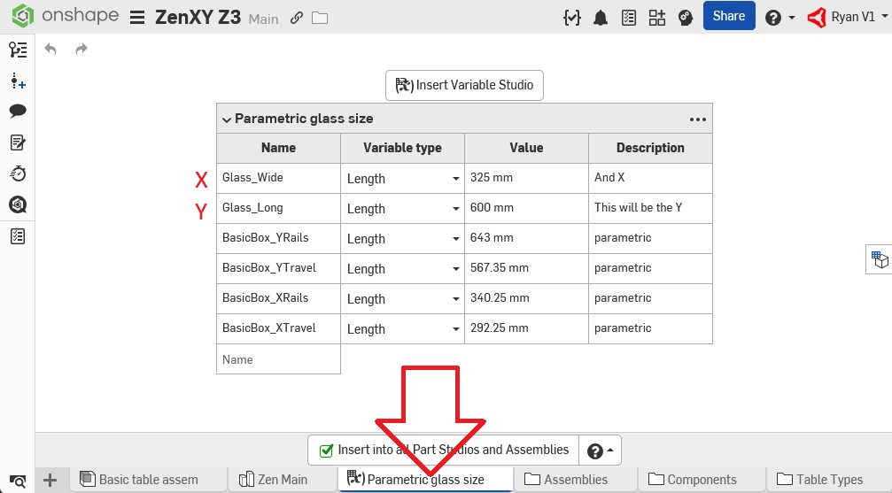{: loading=lazy width="600"}

* Open the Parametric glass size tab.
* Set your glass size here to adjust all the examples and files to fit your glass.
* Each table has other adjustable parameters to fit your material.

---

In the CAD file the "Table Types" tab has 3 basic examples to build from. Find the table closest to your build style and you will see the Y Extrusions, X extrusion cut length, and approximate Belt Length shown on the upper left.

---

I use the printed parts to mark the mounting screw locations to pre-drill, but you can use the CAD to do it as well. There are two surface mounting screw options as well as a side wall screw option. Two screws are needed, more is optional

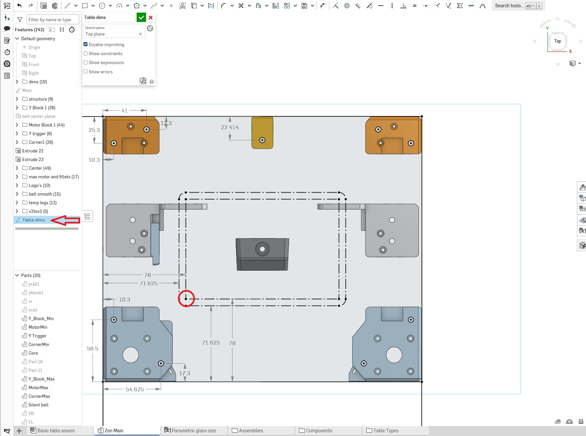{: loading=lazy width="600"}

* How to find exactly where the mounting screws are from the table edge.
* In the Zen Main tab, open the Table dims sketch.


## Example table

The table is usually based on the size tempered glass you can get. From there a pocket to support the edges or a slat build takes care of the rest. The CAD has a few simple adjustable examples of basic tables in the "Table Types" folder.

So far the cheapest small glass would be from Ikea, the BESTÅ. We were also told that for larger glass pinball suppliers carry new and used sheets for a great price if you have a shop near you. I personally got large tempered glass fence panels ordered in from my local big box store for a great price, some replacement shower doors with no holes would also work for larger tables.

Two pieces of glass work best, but if you are in a pinch in a small table a thin 1/4" MDF sheet holds up for a while if your humidity is low.

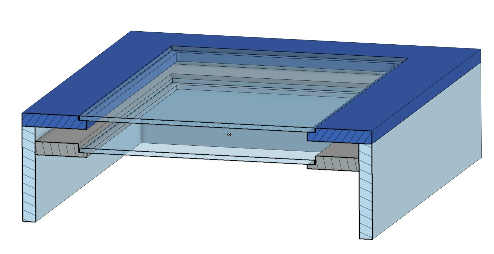{: loading=lazy width="600"}

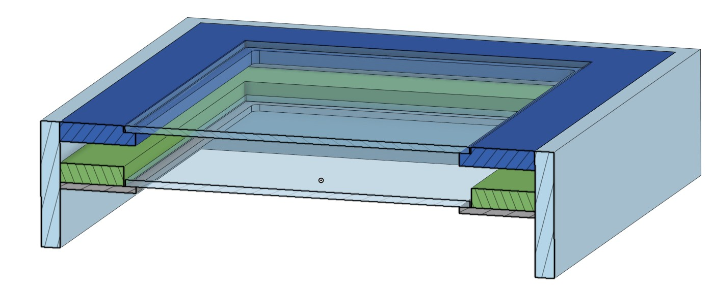{: loading=lazy width="600"}

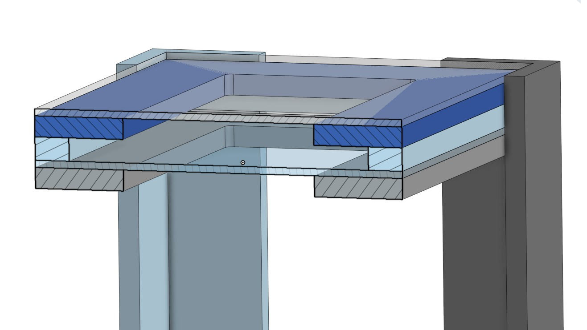{: loading=lazy width="600"}
In this table with larger glass and LED's the edges of the glass have a subtle glow in a dim room.


## Component Assembly

Let's start with assembling the smaller assemblies first.

---

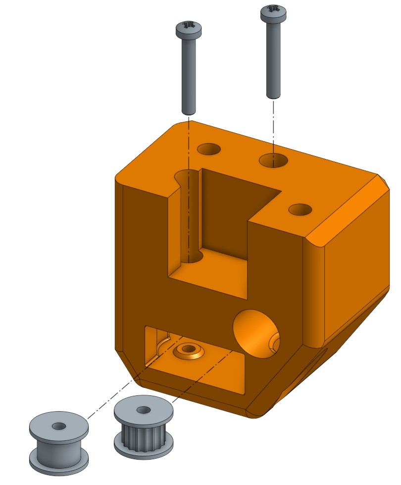{: loading=lazy width="600"}

* Using the CornerMin printed part
* The toothed idler is inserted first in the deeper spot.
* The smooth idler is second.
* Both are secure with an m3, but the screw will not get tight is is lightly threaded directly into the printed part.
* If you prefer a tight hold you can use a drop of glue.

---

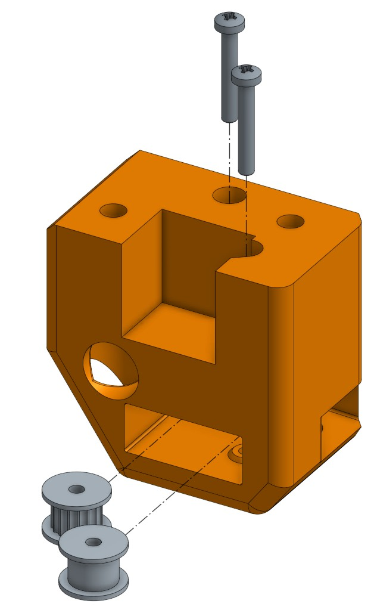{: loading=lazy width="600"}

* Same steps for the CornerMax part.

---

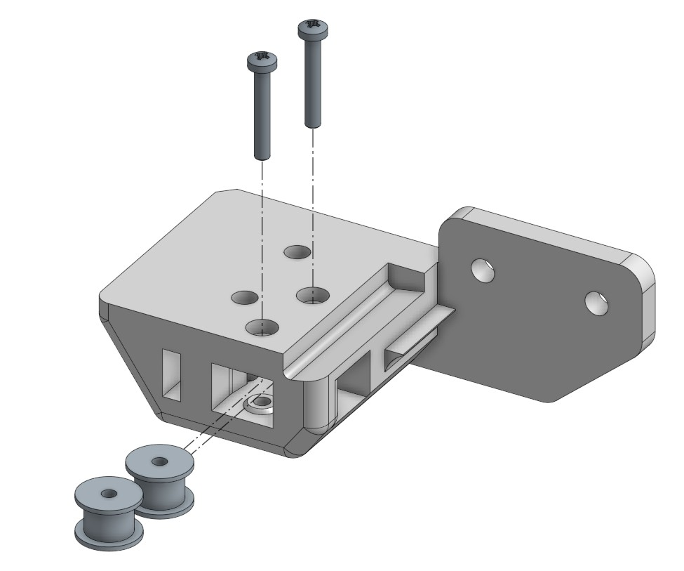{: loading=lazy width="600"}

* Use the M3 screws to secure the smooth idlers.
* Gravity  and the wheel block hold the screws in, they will only lightly thread into the printed part.
* Do this for both Y_Block_Min and Max

---

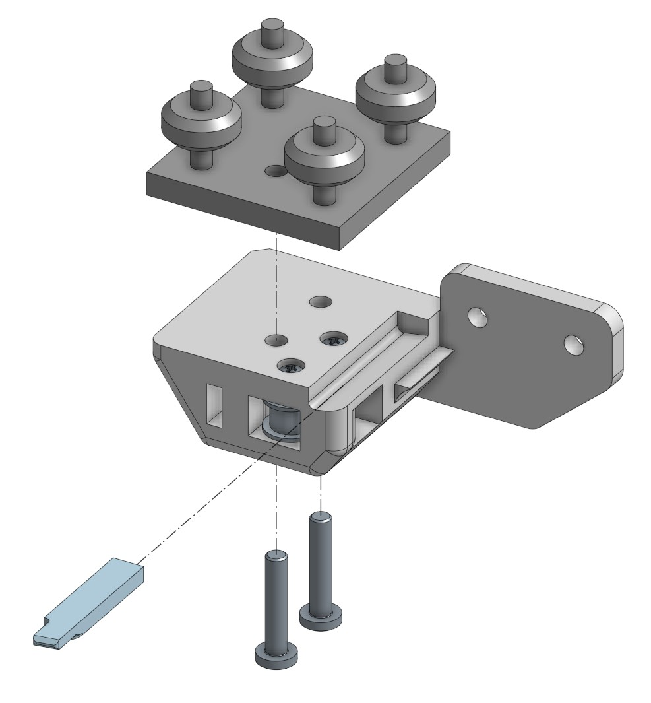{: loading=lazy width="600"}

* Use the M5 screws to secure a 50mm wheel block to the Y_Block assembly.
* Make sure the eccentric wheels are facing out, or away from the large flat tab.
* Do the previous two steps for both Min and Max sides.
* On the Y_Block_Min, make sure to add the Y trigger
* The Y Trigger will get adjusted later but for now make sure it is sticking out about 10mm.

---

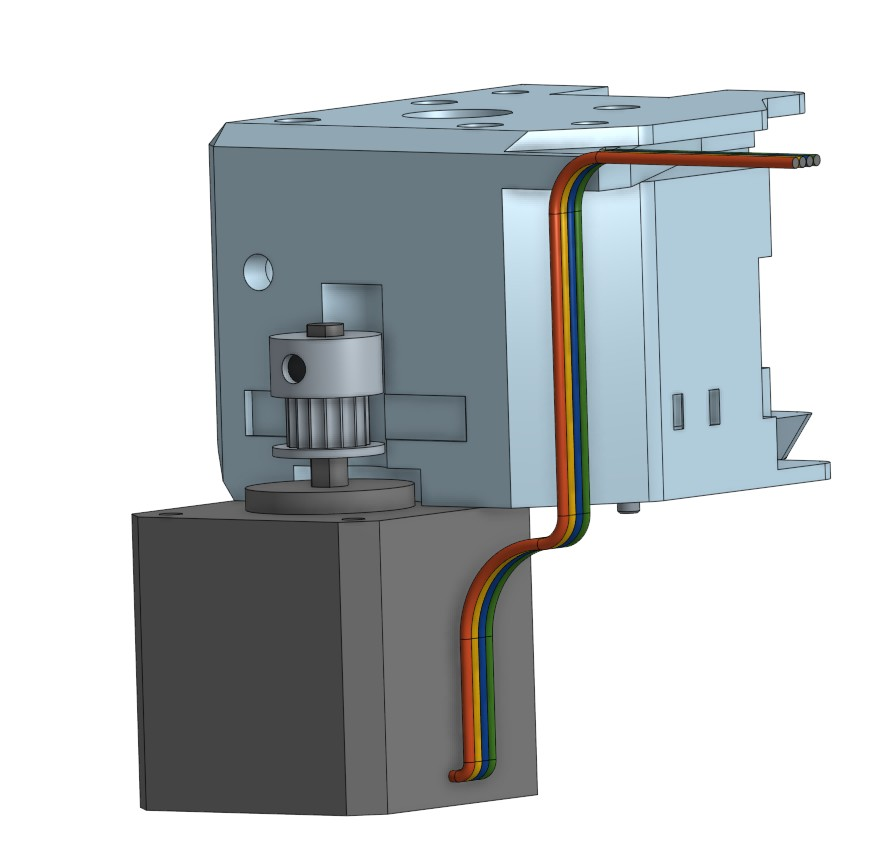{: loading=lazy width="600"}

* Use the guide on the back of both MotorMin and MotorMax to align the pulley to the stepper.
* The pulley can face either direction provided it fits

---

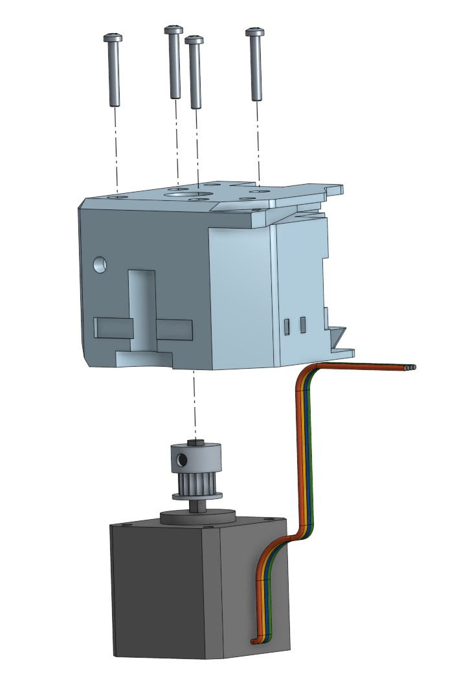{: loading=lazy width="600"}

* Use the M3 screws to secure the stepper to the printed part.
* Make sure the wires faces in, they will get secure with cable ties or similar.

---

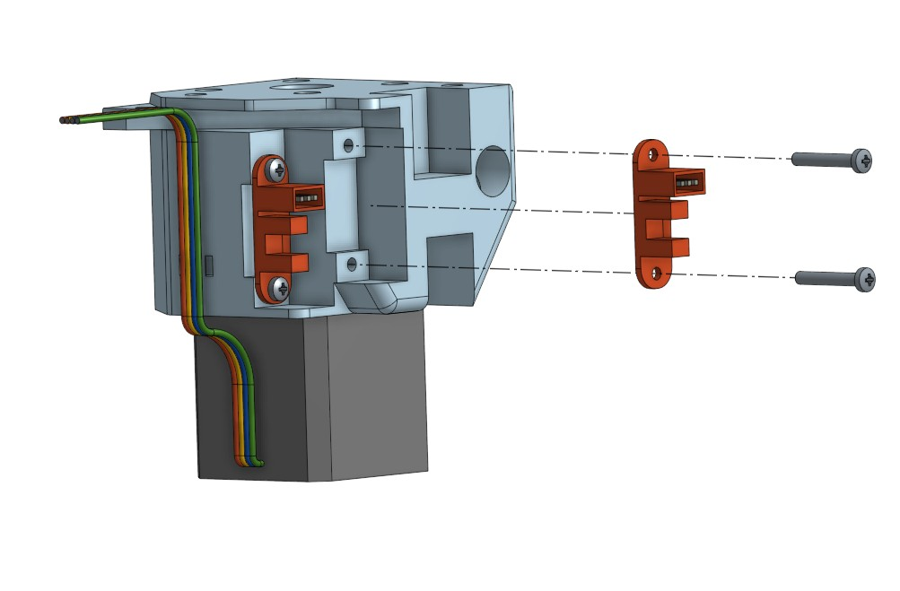{: loading=lazy width="600"}

* On the MotorMin assembly add the two endstops with the plugs facing up.
* Fold the wires and route them in to the wire channel and secure them with the stepper wires. 
* There are wiring pictures later in the [wiring instructions section](#wiring).

---

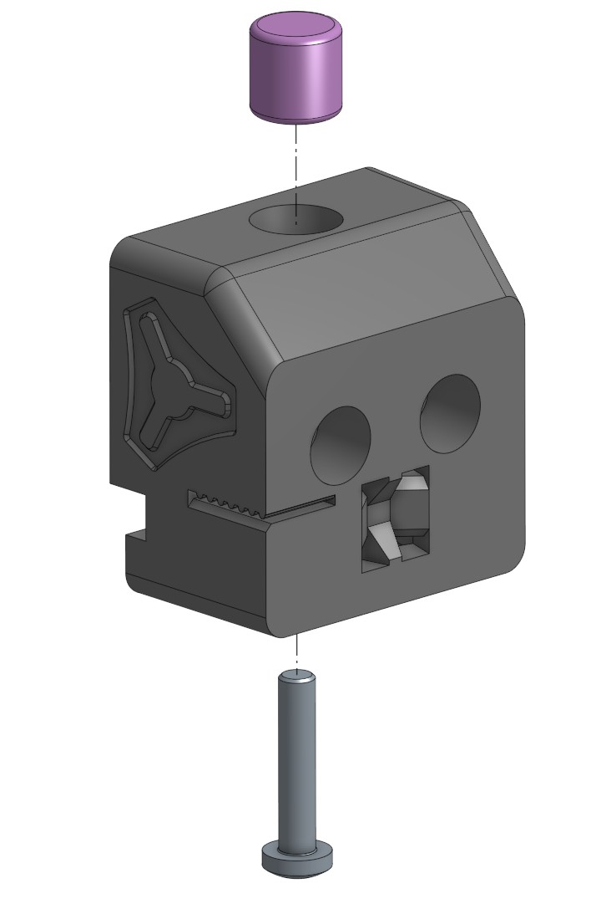{: loading=lazy width="600"}

* Insert the magnet into the top of the core.
* Use an M5 to set the magnet gap after assembly. This gap should be as close to the table bottom as possible without touching. 
* The smaller the gap the better the ball sticks and the faster you can move.

---

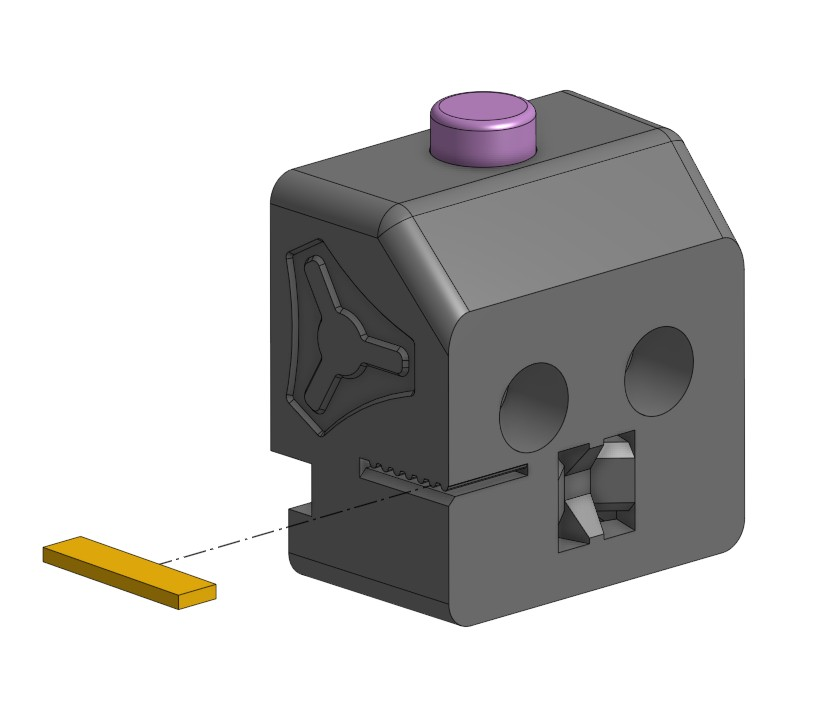{: loading=lazy width="600"}

* Insert a small piece of the gt2 belt here, 35-40mm (1.5"). 
* Do not push it all the way in, just get the bet into the slot.
* This X trigger will get trimmed and angled later. This lets you adjust where the X axis stops, after the Y axis triggers.
* Pushing it further in the slot means the X will trigger further into the corner, the length is dictated by the Y axis.
* You will be able to see this later with the LED indicators on the endstops.

---

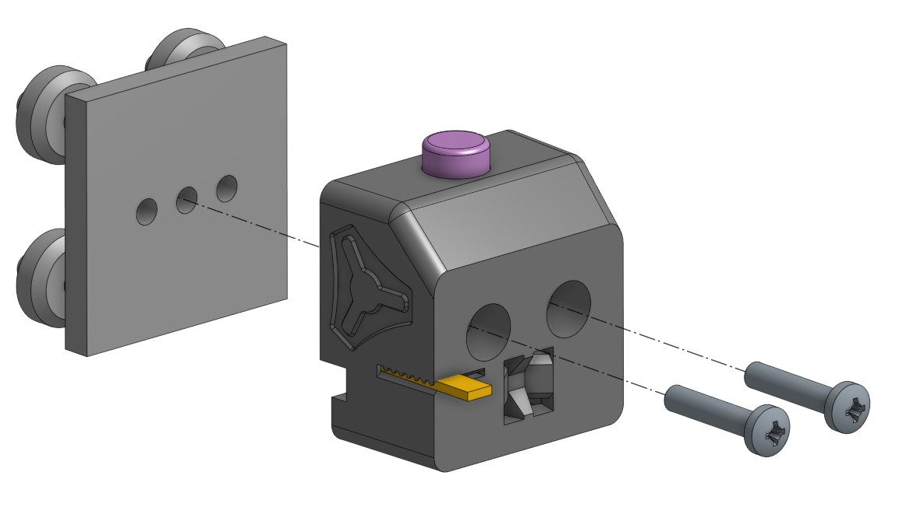{: loading=lazy width="600"}

* Secure the wheel block with the M5 screws, eccentric wheels opposite the magnet.

---

## Final Assembly


{: loading=lazy width="600"}

* S

---


## Wiring

 :smile:.


## Example Starting Gcode

When using Sandify, or any other software you usually need to set the starting or homing Gcode. You can cut and paste what is below and adjust for your specific build if needed. 

For FluidNC/GRBL you can use
```
$HY
$HX
G1 F2000
```

For Marlin it would be
```
G28 Y
G28 X
G1 X1 F2000
```
Here is a Human readable version of that
```
Move the Y axis all the way to the trigger.
Move the X axis until it triggers.
Set the move speed to 2000mm/min (33mm/s). 
```

## ZenXY v2 to ZenXY v3

If you want to use your previous table and retrofit a new machine it is possible. The ZenXY v3 has a slightly smaller footprint so you can use the offset templates when installing the new corner parts to make it easy.

You can use your same control board, steppers, end stops, magnet and ball, the rest of the printed parts and hardware are different.

Parts link - Offset adapter, link

Picture needed

## Adding WLED controlled lighting effects

You can hook up an ESP32 flashed with [WLED](https://kno.wled.ge/) and trigger different patterns with your start and end Gcode, but most just wire it completely separately and choose independent WLED light patterns and playlists.

[Esp32 devkit C in the V1E.com shop](https://www.v1e.com/products/esp32-devkit-c-copy)

The leds get ran as far back as possible to keep them hidden.

Picture needed

## License

If you like our work or want to sell sand tables your support is appreciated. Donation links, [Github Sponsor](https://github.com/sponsors/V1EngineeringInc), PayPal(https://www.paypal.com/donate/?hosted_button_id=LAXN6LWJMB3QS) 

[![CC BY-SA 4.0][cc-by-sa-shield]][cc-by-sa] 

This work is licensed under a
[Creative Commons Attribution-ShareAlike 4.0 International License][cc-by-sa].

[cc-by-sa]: http://creativecommons.org/licenses/by-sa/4.0/
[cc-by-sa-image]: https://licensebuttons.net/l/by-sa/4.0/88x31.png
[cc-by-sa-shield]: https://img.shields.io/badge/License-CC%20BY--SA%204.0-lightgrey.svg
